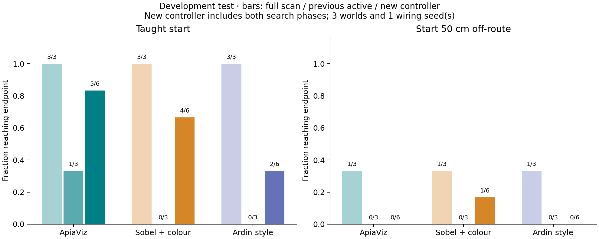
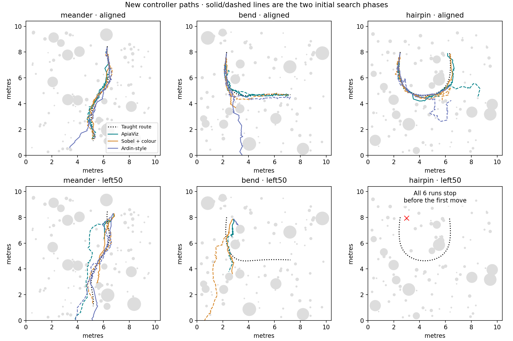
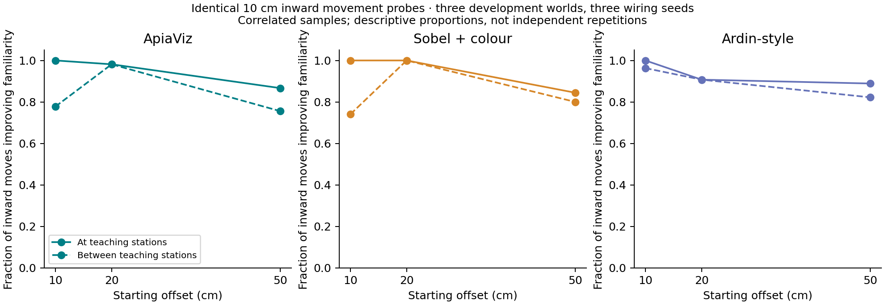

# Familiarity-guided controller

The new controller is implemented separately from the original navigation code.
It uses changes in familiarity during movement, with three behaviours: follow,
cast sideways, and reorient. Its visual encoder, spiking circuit and route memory
remain frozen. The initial implementation retains 10 cm movements.

The controller compares a view before and after moving while facing the same
reference direction. A successful cast can therefore be retained as a movement
direction even when the most familiar viewing direction points along the route.
Repeated improvement permits a short surge. Persistent decline starts another
cast; unsuccessful casts lead to wider physical scans. Occasional exploratory
movements also occur when familiarity stays high. Flat responses eventually
terminate with `uninformative_views`; other unsuccessful trajectories remain
subject to the shared time, movement and observation limits.

Every acquired view and turn is charged to the trial. The policy receives only
familiarity, time, heading and accumulated self-motion. It receives no route,
position, nest direction, obstacle coordinates or notification of an imposed
displacement. The restricted Python interface is an architectural boundary,
not a security sandbox. Collision detection remains in the evaluator; the
controller does not implement obstacle avoidance.

The score scale comes from the spread of pairwise similarities among teaching
codes. It stays fixed throughout a trial, requires no extra calibration images,
and is not interpreted as a probability of being on-route. The previous active
baseline retains its original calibration procedure. No memories are added or
weights changed during navigation.

## Development evaluation

The smoke protocol contains 72 trials: three existing worlds, three front ends,
one wiring seed, aligned and 50 cm displaced starts, and four policy conditions
(exhaustive scanning, the previous active policy, and the new policy with each
of two initial search phases). The two phases are sensitivity checks, not
independent environments. Comparisons average them within the corresponding
world/method/scenario. Source code and parameters are archived before running.

This is development work. It cannot establish statistical significance or
generalization to fresh environments. The larger experiment is gated on useful
aligned-route accuracy and recovery. The teaching-density experiment remains
separate: its controller must be fixed while teaching spacing and resolution
are varied.

All 72 trials completed. The table reports endpoint arrivals, followed in the
last column by sustained returns within 10 cm of the route after displacement.

| Controller | Aligned arrivals | Displaced arrivals | Displaced returns to route |
|---|---:|---:|---:|
| Exhaustive scanning | 9/9 | 3/9 | 3/9 |
| Previous active policy | 1/9 | 0/9 | 1/9 |
| New controller, both search phases | 11/18 | 1/18 | 7/18 |

The new controller improves familiar-route completion over the previous active
policy and can regain the route after some displacements. It still loses that
route or collides too often to replace exhaustive scanning. For ApiaViz alone,
aligned arrivals are 5/6 with the new controller, 1/3 with the previous active
policy and 3/3 with exhaustive scanning. Mean aligned deviation, including
failures, is 17.9 cm, 29.7 cm and 1.59 cm respectively. The improvement over the
old active policy comes with substantially worse accuracy than exhaustive
scanning.

The displaced condition tests one side only. On the hairpin world every policy
chooses a first movement that intersects a rock. Those are retained failures,
not invalid starting positions or evidence about long-range recovery. None of
these controllers has obstacle avoidance. Across all 36 new-controller trials,
17 end in collision, five at the field boundary, two with uninformative views
and 12 at the endpoint. A larger held-out study is not justified yet; the next
development question is how to maintain guidance after a successful cast and
through route bends, with obstacle avoidance evaluated separately.





The [trial table](trials.csv) and [paired comparisons](paired.json) retain every
outcome. For aligned ApiaViz trials, median observations are 219.5 for the new
controller and 988 for exhaustive scanning. These include failures and are not
a demonstration of equivalent navigation at lower sensing cost.

The [audit](audit.json) passes: all 36 original-baseline trials reproduce their
trajectories and sensor events exactly; 2,458 matched-gaze movement comparisons
and the resource accounting for 21,705 observations were checked. The nine
memories were rebuilt and 210 selected query scores were independently
re-encoded without discrepancies. The new controller's 13 focused tests and
15 existing navigation/rendering tests pass.

## Reproduction

Run commands from the repository root with the project Python environment:

```sh
MPLCONFIGDIR=/tmp/apiaviz-mpl .pixi/envs/default/bin/python -m unittest discover -s tests -p 'test_familiarity_controller.py' -v
MPLCONFIGDIR=/tmp/apiaviz-mpl .pixi/envs/default/bin/python -m apiaviz.research.controller_synthetic
MPLCONFIGDIR=/tmp/apiaviz-mpl .pixi/envs/default/bin/python -m apiaviz.research.controller_experiments diagnose
```

Start the saved Blender workers before requesting new positions:

```sh
blender --background --factory-startup --python apiaviz/research/grassland_world.py -- --output apiaviz/output/grassland-smoke --resume
blender --background --factory-startup --python apiaviz/research/grassland_world.py -- --output apiaviz/output/navigation-regime/bend --resume
blender --background --factory-startup --python apiaviz/research/grassland_world.py -- --output apiaviz/output/navigation-regime/hairpin --resume
```

Each worker occupies its terminal. It reuses the saved scene and fills the
existing panorama cache. A `stop` file in its environment directory requests
shutdown; `--resume` removes that marker on the next start.

```sh
MPLCONFIGDIR=/tmp/apiaviz-mpl .pixi/envs/default/bin/python -m apiaviz.research.controller_probe
MPLCONFIGDIR=/tmp/apiaviz-mpl .pixi/envs/default/bin/python -m apiaviz.research.controller_experiments prepare --output apiaviz/output/controller-reproduction
MPLCONFIGDIR=/tmp/apiaviz-mpl .pixi/envs/default/bin/python -m apiaviz.research.controller_experiments run --output apiaviz/output/controller-reproduction
MPLCONFIGDIR=/tmp/apiaviz-mpl .pixi/envs/default/bin/python -m apiaviz.research.controller_report --output apiaviz/output/controller-reproduction --docs docs/controller-reproduction
```

`run` resumes completed trials only when archived source hashes, protocol,
scenes and checkpoints match. `--cache-only` fails immediately if a requested
position is absent. `prepare --full` creates the larger development matrix of
three wiring seeds and all seven existing disturbance scenarios; this is still
development data, not a held-out study. Use a fresh output directory for any
parameter or source change.

The raw traces, calibration values, source snapshot and synthetic outcomes are
stored in `apiaviz/output/familiarity-controller/`. The report audit checks
matched-gaze comparisons, sensing and turning costs, trial provenance and
exact reproduction of the existing baselines. It rebuilds the route memories
and independently re-encodes the first, middle and last query of every trial;
it does not re-encode every saved sensory observation.

## Controlled tests and interpretation

The analytic tests distinguish a useful spatial gradient from a familiar
heading with no spatial information. They also exercise constant score shifts,
score gain with a correspondingly scaled calibration, abrupt appearance-score
changes, gradual drift, broad angular responses, delayed gradients and false
local peaks. They are not rendered lighting experiments. The new policy can
still fail when a directional peak is too broad or a useful gradient is delayed;
these outcomes are retained in the synthetic results.

The 22 analytic trials include both initial search phases. Both phases reach
the endpoint and recover in the useful-gradient field. Removing the temporal
comparison or periodic exploration prevents recovery in that field in the
separate 32-trial analytic ablation. Removing the contrast check does not alter
that success, so these tests do not establish that every component improves
route following. Flat fields and heading-only fields provide no useful evidence
of positional recovery. These are mechanistic checks, not an estimate of
success in natural terrain.

The common rendered probe tests identical poses across encoders and all three
saved wiring seeds. It includes positions halfway between teaching stations.
Pairs intersecting conservative rock geometry are marked invalid by the same
rule for all methods. The resulting proportions describe correlated samples;
they are not independent repetitions or tests of statistical significance.



At positions halfway between teaching stations and 50 cm off-route, moving
10 cm inward increases familiarity in 34/45 valid ApiaViz samples,
36/45 Sobel + colour samples and 37/45 Ardin-style samples. This shows a frequently useful
signal, with exceptions. It neither guarantees a successful sequence of
movements nor answers the separate teaching-density question.

Two illustrative replays use the same ApiaViz wiring seed and initial search
phase: [an aligned start](meander-19-linear_colour-aligned-familiarity-1.mp4)
and [a displaced start](meander-19-linear_colour-left50-familiarity-1.mp4).
They show actual logged observations at four times simulated speed. The view
is held between observations; intermediate camera images are not synthesized.
The first trial reaches the endpoint, while the second ends at a rock.

The design follows the movement-based motivation in the
[implementation plan](../navigation-experiments/CONTROLLER_PLAN.md). It is a
deterministic engineering controller inspired by insect behaviour, not a
validated neural implementation of a motor circuit.
