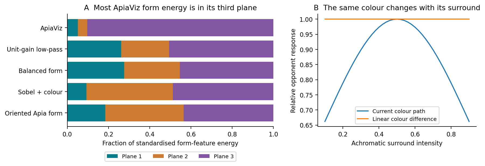
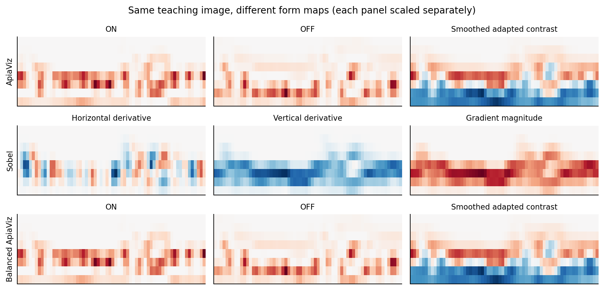
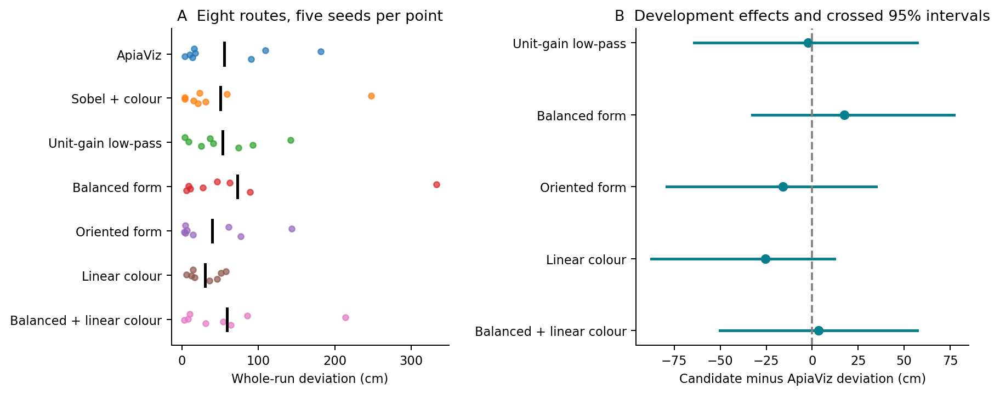
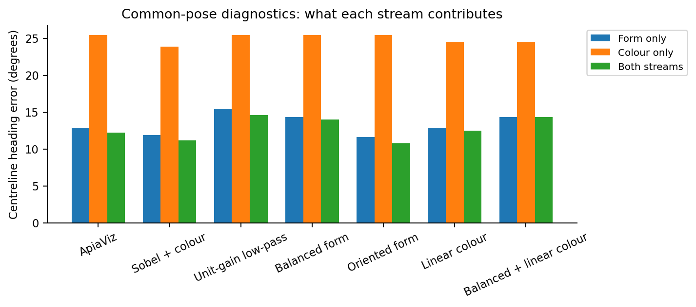

# Why Sobel competes with ApiaViz, and what to improve

29 September 2026 • implementation audit and 280 additional navigation trials

Follow-up: the [separate-and-combined evaluation](../frontend-factorial/report.md)
has now tested the combination. Both single changes reproduce exactly, but
combining them did not improve on either one's mean deviation.

**Sobel's original advantage is small and uncertain, but it exposes useful
differences in the visual representation.** The strongest explanation supported
by the new tests is that explicitly representing oriented edges improves heading
and place discrimination. ApiaViz's colour pathway also introduces a dependence
on surrounding brightness that simple opponency avoids. Neither observation,
on its own, proves why a particular navigation trial succeeds.

Two deterministic changes are worth taking forward. Replacing the form filter
bank with oriented filters, while retaining ApiaViz's spatial averaging,
adaptation and colour pathway, gave **39.3 cm mean deviation and 32/40
completions**. Removing the nonlinearity before colour subtraction gave
**29.9 cm and 29/40 completions**. Original ApiaViz gave 55.2 cm and 29/40;
Sobel plus colour gave 50.4 cm and 29/40.

These are promising development results, not demonstrated general improvements.
The confidence intervals are wide, no candidate comparison survives its
multiple-comparison correction, and the same routes informed the investigation.
Both candidates' mean advantage over Sobel disappears when one difficult route
is omitted. Their advantages over original ApiaViz remain under each
single-route omission, but wiring sensitivity still matters.

## What actually differs

The two methods use identical learning images, frozen random connections,
spiking parameters, template memories and steering. Differences enter before
the Kenyon cells. Neither learns visual filters from examples.

| Stage | Current ApiaViz | Sobel + colour control | Practical consequence |
|---|---|---|---|
| Receptor input | Green and blue | Same green and blue | This comparison is not RGB versus monochrome |
| Spatial averaging | Six neighbouring pixels on an alternating-row hexagonal stencil; centre excluded | Gaussian smoothing of luminance, σ = 1 pixel | Different spatial weighting; the hex operation retains image size |
| Local adaptation | Subtract a 9 × 9 local mean, divide by local brightness plus 0.05, then apply `tanh` to form | No local divisive adaptation | ApiaViz represents local relative contrast rather than a simple derivative of intensity |
| Form maps | Rectified ON and OFF centre–surround responses, plus smoothed adapted contrast | Signed horizontal derivative, signed vertical derivative, gradient magnitude | Sobel explicitly retains edge direction; ApiaViz does not encode it in separate channels |
| Colour maps | Subtract shared local brightness, compress each receptor channel, then subtract and rectify | Rectify raw G−B and B−G | ApiaViz's colour difference depends on context through the nonlinear stage |
| Normalisation | One mean and standard deviation per stream | Identical operation | Individual feature planes are not equalised |
| Projection and spiking | Two populations of 4,000 KCs, ten fixed inputs per cell, finite LIF spike competition | Identical | Representation differences change which cells spike, even with similar activity counts |

The relevant implementations are [the visual modules](../../apiaviz/src/modules.py),
[matched preprocessing controls](../../apiaviz/research/paper_baselines.py),
and [experimental refinements](../../apiaviz/research/frontend_refinements.py).

The Sobel control is stronger than simply thresholding an edge image. It retains
two signed derivatives, edge magnitude and two colour channels. It is also not
the complete Gattaux model: that paper combines filtering with directional
learning, lateralised memories and speed control. Those behavioural mechanisms
must not be attributed to the filter alone.
[Gattaux et al., 2025](https://www.nature.com/articles/s41467-025-62327-3).

## Three input differences, tested rather than assumed

### 1. The dominant smoothed channel is useful, despite its unequal gain

ApiaViz's three form kernels all have unit Euclidean norm. That does not give
them equivalent gains for natural images. The ON and OFF kernels sum to
approximately zero; the smoothing kernel sums to **3.48**. It therefore
amplifies a constant component, whereas the contrast filters reject it.
Subsequent standardisation of the entire stream preserves much of this relative
imbalance. Across the eight routes, 90.3% of standardised form-feature energy
lies in the smoothed adapted channel, with 5.1% and 4.6% in ON and OFF.

*Left: measured contributions of the three form planes, averaged over eight
routes. Apia planes are ON, OFF and smoothed adapted contrast; Sobel/oriented
planes are horizontal derivative, vertical derivative and magnitude. Right:
the central patch keeps G = 0.7 and B = 0.3 while its grey surround changes.
Responses are relative to their value at surround intensity 0.5.*

An obvious hypothesis was that the smoothed channel was overwhelming useful
edge signals. The interventions did **not** support a simple version of that
explanation. Dividing only the smoothing kernel by its sum reduced its energy
share to 50.7%, but barely changed mean navigation deviation: 53.1 cm. Balancing
the pooled form planes by their root-mean-square strength reduced the share to
45.4%, but worsened deviation to 72.8 cm and heading error to 14.0°.

The smoothed signal is locally adapted contrast, not unprocessed brightness.
It contains useful structure. Equalising channels gives weaker responses more
influence without establishing that they contain better information. I would
not adopt channel balancing as the default based on these results.

Gain control remains a defensible computational design principle, but the
denominator and the signals being normalised matter. Our RMS test is an
engineering intervention, not a reproduction of a biological normalisation
circuit. [Heeger, 1992](https://www.cns.nyu.edu/heegerlab/content/publications/Heeger-VisNeurosci1992a.pdf).

### 2. Oriented form features are the clearest positive lead

Sobel's signed derivatives distinguish changes along horizontal and vertical
axes. ApiaViz's centre–surround filter is radially symmetric before rectification.
Its spatial map still contains orientation information, but does not present
that information explicitly to the sparse random projection. With only ten
sampled inputs per KC, directly available directional structure may matter.

To test the filter bank, the `oriented_form` candidate retains ApiaViz's hex
averaging, local adaptation and processed colour. It replaces the complete form
bank with Gaussian smoothing followed by signed x/y derivatives and their
magnitude. This changes the filter family, smoothing and rectification together;
it does not isolate orientation as the only possible causal change.

*A fixed example from the middle of Ant 4's teaching route. Each panel is scaled
separately to show its spatial pattern; colour intensity across panels should
not be interpreted as relative feature strength.*

On common images, centreline heading error fell from **12.19° to 10.75°**, and
the margin favouring the correct tangent over headings at least 20° away rose
from **0.0141 to 0.0186**. Reading the form stream alone gave 11.59° error,
compared with 12.91° for original ApiaViz and 11.88° for Sobel. The average
distance between the selected form-memory index and the probe's route position
also decreased, from about 0.55 m to 0.38 m along the sampled route. These are
descriptive diagnostics, not additional significance tests.

Full navigation completed 32/40 trials, versus 29/40 for both references.
Deviation was lower than original ApiaViz on six of eight route averages.
However, it was lower on only two of five seed averages: some improvements
were large, while other wirings became worse. Early deviation over the first
50 steps was also slightly worse than original ApiaViz. Thus this candidate
improves several relevant measurements without yet establishing robust accuracy.

Insects do have direction-selective visual pathways. However, the experimentally
identified T4/T5 circuits compute motion direction using temporal signals; a
static derivative is not a T4/T5 model. The candidate should be described as
fixed oriented filtering unless temporal circuitry is implemented and tested.
[Maisak et al., 2013](https://www.nature.com/articles/nature12320).

### 3. Colour subtraction and nonlinear compression do not commute

Writing the shared local brightness as μ, current processed opponency is
approximately

`tanh(2(G − μ)) − tanh(2(B − μ))`,

after spatial averaging. It is not simply a scaled `G − B`: μ cannot be cancelled
through the two nonlinearities. Uniform additive illumination still cancels
through the shared local subtraction, provided there is no clipping. Spatially
varying illumination or a change in the surrounding region can change the
opponent response even when the central G−B difference is unchanged.

For the fixed-colour patch in the figure, the response ranges from 0.503 to
0.760 as only the grey surround changes—a 34% reduction from its peak. The
linear difference remains 0.400. This establishes the implementation property,
but should not be mistaken for a measured 34% corruption of route representations.
On actual route images, a smooth common luminance pattern changed the colour
maps by only about 0.24% in relative norm; their centred cosine similarity
remained 0.999996. Under that particular perturbation the effect is small.

The `linear_colour` candidate keeps ApiaViz form processing and hex averaging,
then rectifies the receptor difference without the pre-opponent `tanh`. It
therefore differs from the earlier raw simple-opponent swap, which also removed
hex averaging from colour. The current controlled variant isolates the
processed colour transformation more closely, although removing adaptation and
compression together is not a test of nonlinearity order alone.

Mean deviation fell to 29.9 cm and first-50-step error to 11.8 cm, with 29/40
completions. Darkening the input changed the full model's selected heading by
1.36°, compared with 2.98° for original ApiaViz. The remaining change comes from
the unchanged nonlinear form path and its interaction with memory; the full
model is not perfectly brightness-invariant.

This candidate's improvement over Sobel is heavily influenced by Ant 7. When
that route is omitted, its mean deviation is 4.6 cm worse than Sobel. It is a
promising simplification and illumination control, not a validated replacement.

## Complete results of the fixed follow-up

The matrix was fixed before inspecting candidate outcomes: eight routes × five
wiring seeds × seven conditions. All teaching/probe images and neural weights
were reused from the preceding study. Both references were rerun, rather than
only copied into the table. All 80 reference trajectories, steering scores and
probe outputs reproduced the previous results exactly.

| Input | Completed | Whole-run deviation (cm) | First 50 steps (cm) | Centreline heading error |
|---|---:|---:|---:|---:|
| Original ApiaViz | 29/40 | 55.22 | 16.11 | 12.19° |
| Sobel + colour | 29/40 | 50.39 | 15.49 | 11.19° |
| Unit-gain smoothing channel | 28/40 | 53.10 | 16.33 | 14.56° |
| Balanced form channels | 27/40 | 72.76 | 17.57 | 13.97° |
| **Oriented Apia form** | **32/40** | **39.33** | 16.49 | **10.75°** |
| **Linear Apia colour** | 29/40 | **29.87** | **11.83** | 12.47° |
| Balanced form + linear colour | 28/40 | 58.60 | 17.70 | 14.31° |

Whole-run deviation includes failures and uses distance to taught samples;
first-50-step deviation uses the continuous route polyline. The earlier raw-colour
control had 38.0 cm deviation and 26/40 completions; it was not rerun in this
input-refinement matrix. Consequently, a lower deviation than original ApiaViz
alone is not sufficient to establish superiority over the full baseline set.

*Points average the five seeds within each route. Negative differences favour
the candidate. Crossed 95% intervals resample routes and seeds; all include zero.*

The oriented candidate's difference from original ApiaViz was −15.9 cm, with
a crossed 95% interval of **−79.2 to +34.8 cm** and an exploratory Holm-adjusted
p of **0.156**. For linear colour, the difference was −25.3 cm, interval
**−87.5 to +12.1 cm**, adjusted p **0.813**. Neither candidate was significantly
better than Sobel under the specified correction either. The oriented candidate's
route-only interval excludes zero, but it conditions on the chosen wiring seeds;
the broader crossed interval exposes the substantial wiring uncertainty.

Tests use eight route averages, not 40 independent routes or thousands of
independent steps. Holm correction covers five candidates for each reference
separately. The intervals are unadjusted 95% intervals, and all tests are
exploratory: these routes are known, candidate design followed earlier results,
and only one environment and colour assignment were used. All paired effects,
seed effects and leave-one-route-out sensitivity ranges are in
[statistics.json](statistics.json).

## Why a better local feature does not guarantee a better route

*Each stream is read independently from the same learned views as an offline
diagnostic. The combined model uses the unchanged full memory. Lower error is
better; this does not measure the relative importance of colour in other tasks.*

Form alone discriminates heading substantially better than colour alone in this
world. Colour still improves the original combined model slightly, and may
provide complementary information on difficult routes. Giving both streams
4,000 KCs does not imply that they have equal directional reliability.

The full trajectories can amplify small disagreements. Across the 40 matched
reference pairs, the median first different decision was step 12, and the median
heading difference at that point was only 10°. After that, the models see
different images, encounter different memory matches and can accumulate very
different errors. This observation explains why a small heading-metric change
can accompany a large trajectory difference; it does not assign every failure
to that first decision.

None of the candidate frontends fixes the shared recovery problem. At sideways
probe locations, the fraction of selected turns pointing inward remains about
35%: 35.5% for original ApiaViz, 35.2% for oriented form and 35.9% for linear
colour. All were taught parallel headings across a corridor. Familiar views
therefore do not consistently indicate a corrective turn back towards the route.
This is consistent with the visual-compass limitation examined by Amin and
colleagues. It deserves its own intervention rather than being treated as proof
that a particular visual filter is inadequate.
[Amin et al., 2025](https://journals.plos.org/ploscompbiol/article?id=10.1371/journal.pcbi.1012798).

## Recommended improvements, in order

1. **Take the oriented form candidate into independent validation.** It has the
   most coherent combination of better heading discrimination, more local
   memory matches and higher completion. Keep ApiaViz's local adaptation and
   colour pathway initially. Test the same fixed candidate against all six
   baselines in new worlds, with a predetermined route/seed budget. The current
   result is a reason to validate it, not to declare it superior.
2. **Keep the linear colour variant as a separate candidate and robustness
   control.** It simplifies the pathway, preserves common-channel cancellation
   and reduces mean deviation here. Test local shadows, global gain, sensor noise
   and new colour assignments. Test its combination with oriented form explicitly;
   that combination was not in this matrix. The poor balanced-plus-linear result
   shows why benefits should not be assumed to add.
3. **Test learning that supplies an inward direction.** Compare parallel teaching
   with route-directed or appropriately oscillatory acquisition, using the same
   learning rule for every frontend. Keep this separate from input-only claims.
   No inference-time route coordinates or corrective resets should be introduced.
   Earlier directional-acquisition code is development evidence, not a validated
   solution. Report recovery from lateral displacement alongside tracking error.
4. **Specify filter scales in visual angle.** Current ApiaViz form responses can
   depend on a 15 × 15 input neighbourhood, versus 7 × 7 for the Sobel control.
   At 4° per pixel these cover nominal footprints of about 60° and 28°; the
   wider support includes local normalisation, not just blur. The nominal
   σ = 2.5 surround is also truncated to 5 × 5 pixels, giving an actual discrete
   horizontal standard deviation of only 1.33 pixels. Test scale and kernel
   support deliberately rather than assuming the stated σ describes the
   implemented filter. The oriented candidate has an even wider theoretical
   support, so its improvement does not prove that narrower support is better.
5. **Investigate stream allocation after selecting the frontend.** The weaker
   colour-only directional readout motivates testing fixed form/colour population
   sizes or readout weights while preserving the total neuron budget. This would
   be a separate architecture comparison with matched controls. It should not be
   presented as an input-only improvement, and colour should not be discarded
   based on this one synthetic world.

Sensible anti-aliasing before downsampling is also worth retaining as a design
constraint, but this study does not identify aliasing as the cause of Sobel's
ranking. Work on shift consistency in convolutional networks motivates a
dedicated small-translation test, rather than assuming extra smoothing helps.
[Zhang, 2019](https://proceedings.mlr.press/v97/zhang19a.html).

I would retain the current model as the reference, keep the two promising
variants available explicitly, and prioritise oriented form plus a properly
matched recovery experiment. The evidence does not support simply equalising
every channel, adding more preprocessing stages, or changing the spiking
mechanism to explain away the result.

## Reproducibility

All candidate defaults were fixed in [protocol.json](protocol.json). The
[audit](audit.json) verified saved source, stimulus, checkpoint and dataset
hashes, reconstructed all **34,498 navigation decisions** and **22,400 probe
decisions**, and checked exact reproduction of all **80 reference trials**.
There were no discrepancies. Four new implementation tests and three existing
baseline tests passed. Full data, figures and execution instructions are in
the [study directory](README.md), with additional [research context](literature.md).

Historical frontend behaviour is unchanged. Source comments claiming exact
colour cancellation through the existing nonlinearity were corrected; the
experimental candidates are separate from the production defaults.
