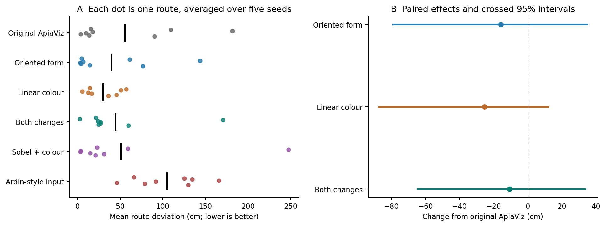
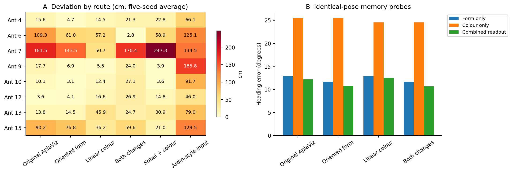

# Testing oriented form and linear colour together

29 September 2026 · 240 matched navigation trials

**Both individual changes remain promising, but combining them did not improve
on either one in this evaluation.** Linear colour produced the lowest mean
deviation, 29.9 cm; oriented form produced the most nest arrivals, 32/40. The
combination gave 44.6 cm and 28/40 arrivals, compared with 55.2 cm and 29/40 for
original ApiaViz. All model variants are available separately, and none has
replaced the original default.

## Results

| Frontend | Mean deviation (cm) | Median trial deviation (cm) | Reached nest | First 50 steps (cm) |
|---|---:|---:|---:|---:|
| Original ApiaViz | 55.22 | 12.58 | 29/40 | 16.11 |
| Oriented form | 39.33 | 4.85 | 32/40 | 16.49 |
| Linear colour | 29.87 | 12.67 | 29/40 | 11.83 |
| Both changes | 44.60 | 7.09 | 28/40 | 16.03 |
| Sobel + colour | 50.39 | 6.34 | 29/40 | 15.49 |
| Ardin-style input | 104.72 | 66.10 | 6/40 | 26.31 |

Lower deviation is better. The original and both separate variants reproduced
their earlier results exactly. Relative to the original, mean deviation fell
by 28.8% with oriented form, 45.9% with linear colour, and 19.2% with both.
Those averages conceal substantial route and wiring sensitivity.

*Left: each dot represents one route averaged over five wiring seeds; black
marks show the overall mean. Right: candidate minus original deviation, with
unadjusted crossed route/seed bootstrap intervals. Negative values favour the
candidate. These intervals describe this development benchmark.*

The combination's advantage over the original was **10.62 cm**, with a paired
95% interval spanning **64.80 cm better to 33.44 cm worse**. It was better on
only three of eight route averages. Ant 6 improved sharply, from 109.3 to
2.8 cm; excluding that route reverses the overall comparison, leaving the
combination 3.08 cm worse than the original. Its average advantage over Sobel
also reverses if either Ant 6 or Ant 7 is omitted.

Against oriented form alone, combining the changes increased mean deviation
by **5.27 cm** (95% interval −38.65 to +44.67 cm). Against linear colour alone,
it increased deviation by **14.72 cm** (−24.35 to +57.27 cm). The combined model
was better on only two of eight route averages in each comparison.

The factorial interaction was **+30.61 cm**, indicating that the combined
improvement was smaller than the sum of the separate improvements. Its crossed
95% interval was −14.42 to +114.25 cm, so the data do not establish a reliable
interaction. No comparison passed the planned multiple-comparison correction.

The separate variants also have different strengths. Oriented form reduced
the median trial mean from 12.58 to 4.85 cm and increased arrivals, but its
90th-percentile trial deviation remained high: 164.9 cm, versus 143.4 cm for
the original. Linear colour left the median nearly unchanged at 12.67 cm while
lowering the 90th percentile to 71.4 cm. Its lower overall mean therefore does
not mean that a typical trial became uniformly more accurate; severe deviations
were smaller in this sample. The advantage of either separate variant over
Sobel disappears when Ant 7 is excluded.

All three candidates had lower mean deviation than the Ardin-style control.
Linear colour improved all eight route averages and all five seed averages
relative to that control. This is a consistent descriptive result for the
matched preprocessing comparison, without establishing superiority to the
complete published Ardin model.

## Why the improvements did not simply add

*Left: route means show where each method succeeds or struggles. Right: heading
error at identical centreline probe poses, reading either stream alone or both
together. Stream-only readouts are diagnostics; navigation always uses both.*

The combined encoder preserves the two intended computations. Its form-only
heading error is exactly the same as oriented form alone (11.59°), and its
colour-only error is exactly the same as linear colour alone (24.53°). These
equalities hold for each route–seed pair, not just their averages. There is no
evidence here that adding the second change accidentally disabled the first.

Reading both streams together gives 10.66° heading error for the combination,
versus 10.75° for oriented form, 12.47° for linear colour and 12.19° for the
original. The slight improvement over oriented form did not translate into
better complete paths. At 320 common centreline probe poses, the combination
was strictly more accurate than both separate variants at seven poses and
strictly less accurate at eight; all three had the same absolute error at 231.
These are descriptive counts, not independent experimental replicates.

The memory compares a joint form-and-colour spike pattern with each stored
view, then selects the most familiar heading. Two feature changes can therefore
alter which stored view wins and which direction is chosen, even when each
stream is unchanged by the combination. Subsequent images depend on those
choices. This provides a plausible explanation for non-additive navigation
outcomes, but the present experiments do not identify the cause of every
failure. Early-path deviation remained almost unchanged for the combination
(16.03 versus 16.11 cm), and the off-route restoring fraction remained about
35.5%, close to the original's 35.5%.

Given mean deviation as the primary objective, **linear colour remains the
leading candidate for further validation**. Oriented form is worth retaining
because of its lower median deviation, stronger form-only heading readout and
more nest arrivals. The combined model is useful as a tested alternative, but
these results do not justify choosing it over either separate change. Independent
environments are the next requirement before promoting any candidate.

## What changed

We tested two fixed changes to the visual frontend, separately and together.
Neither change learns filters or adds trainable parameters. The original
ApiaViz implementation and default settings remain intact.

| Condition | Form processing | Colour processing |
|---|---|---|
| Original ApiaViz | Original centre–surround ON/OFF and smoothed adapted contrast | Original adapted, nonlinear opponency |
| Oriented form | Existing hex sampling and local adaptation, then Gaussian smoothing and horizontal/vertical gradients plus gradient magnitude | Original colour |
| Linear colour | Original form | Hex sampling, then rectified G−B and B−G; no nonlinearity before subtraction |
| Both changes | Oriented form | Linear colour |
| Sobel + colour | Gaussian smoothing and horizontal/vertical gradients plus magnitude, without ApiaViz's hex sampling or local adaptation | Rectified raw G−B and B−G |
| Ardin-style input | Inverted luminance, local histogram equalisation, resizing and normalisation | Same monochrome signal replicated into the second stream |

The oriented filter bank uses a 5 × 5 Gaussian with σ = 1 pixel, followed by
3 × 3 Sobel filters. The combination takes exactly the form stream of the
oriented variant and the colour stream of the linear variant. Unit tests verify
that each constituent stream produces identical currents and spike outputs
when used separately or in the combination.

The word *linear* describes the spectral subtraction before rectification;
this variant still contains rectification, stream normalisation and spiking.
Ardin-style denotes the preprocessing control, not the full published Ardin
network. Every condition uses our shared mushroom-body encoding and learning
procedure, so the experiment tests image processing rather than differences
between learning algorithms.

## Evaluation

Each condition was run on eight routes and five paired wiring seeds, giving
40 trials per condition and 240 in total. All trials were run afresh. The routes
are Ants 4, 6, 7, 9, 10, 12, 13 and 15, Route 2; seeds are 19, 31, 43, 59 and 71.
These routes share one rendered environment with seed 99.

All conditions receive the same saved teaching views and projection weights.
Teaching uses nine lateral views across a ±0.2 m corridor at each route sample.
Rendered images are 18 × 74 RGB; the frontend uses green and blue to produce
three form maps and two colour maps. Each map is pooled to 8 × 64. The resulting
1,536 form values and 1,024 colour values drive two populations of 4,000 spiking
cells through the same fixed sparse connections. Learning stores the binary
patterns of cells that spiked for each taught view.

Spiking parameters, activity control, memory retrieval and steering are
unchanged. At each navigation step, the agent considers 13 headings spanning
±60°, chooses the most familiar and moves 0.1 m. It stops within 0.2 m of the
nest or after 200 steps. There are no corrective resets. This is the project's
open-loop evaluation: movements remain visually guided, but no external
position feedback returns the agent to its taught route.

The primary endpoint is each trial's mean distance to the sampled teaching
route, averaged equally over routes and seeds. Failed trials remain in that
average. We also report nest arrival, deviation over the first 50 steps
(or the full trial if shorter), and heading choices at identical probe poses.
The early-deviation measure uses distance to continuous route segments;
the primary measure uses distance to sampled route points, as in the earlier
experiments. Median trial deviation is the median of the 40 trial means,
not the median distance of individual navigation steps.

## Statistical scope

The paired analysis treats routes as eight clusters and wiring seeds as crossed
repeats. It reports exact sign-flip tests on route averages, crossed route/seed
bootstrap intervals, and sensitivity to omitting each route or seed. The 12
planned contrasts comprise each candidate against each of three references,
the combination against each single change, and the factorial interaction.
They share one Holm correction.

With eight route clusters, even the smallest two-sided exact p-value, 2/256,
cannot survive this 12-test correction at 0.05. The experiment is therefore
useful for estimating effects and checking the combination, but cannot establish
corrected significance. The confidence intervals are unadjusted 95% intervals.
Neither these intervals nor the five wiring seeds represent variation across
independent environments. The routes and individual-variant outcomes were
already known before this follow-up, so it is a development experiment.

The interaction is calculated as combined − oriented − linear + original,
in centimetres of deviation. A negative value indicates a reduction larger than
the sum of the two separate reductions on this scale. This is a behavioural
comparison; it does not demonstrate a cellular interaction.

## Reproduction

All 12 relevant unit tests passed: five frontend-refinement tests, three
baseline tests and four statistical tests. The independent audit reconstructed
all **240 trajectories, 31,733 steering decisions and 19,200 probe decisions**
without an error. All **120 original/Sobel/Ardin-style reference runs** matched
their earlier saved scores, probes and trajectories exactly. A separate
comparison verified **160 exact reruns** covering the original, Sobel and both
individual variants; these two counts overlap and are not additional trials.

The [protocol](protocol.json), [trial data](results.csv),
[paired statistics](statistics.json), and [audit](audit.json) accompany this
report. [The README](README.md) gives commands and model-selection examples.
Raw runs contain the saved trajectories, heading scores, source archives and
checksums for teaching images and wiring checkpoints.
