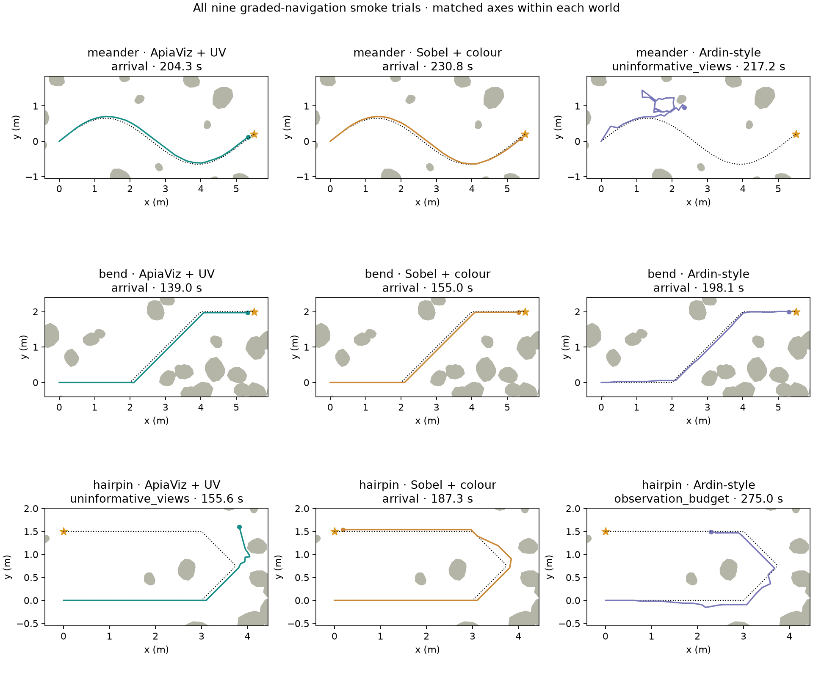
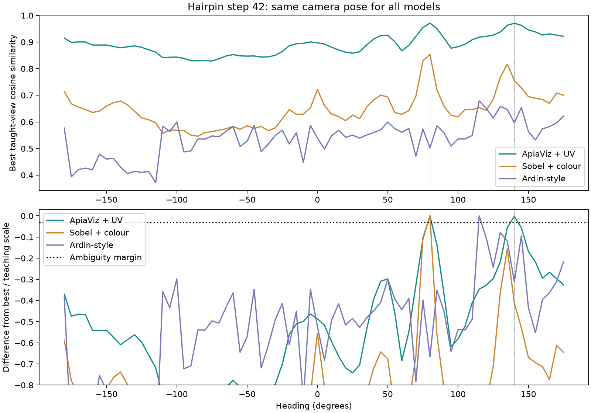

# Graded ApiaViz: nine full-route smoke trials

**Superseded controller:** the user rejected this run's full-circle scanning.
It has been removed from active code. These results/videos retain the historical
behaviour; they are not results for the new, unrun bounded-scan configuration.
See the [rotation audit and remaining confidence failures](../scan-regression-review-v1/README.md).

1 October 2026 (Australia/Brisbane). All nine route trials completed. This is a
bounded development check, not authorization to restart the exhaustive studies.

**Arrivals: graded ApiaViz 2/3, Sobel + colour 3/3, Ardin-style 1/3.**
ApiaViz succeeds in meander and bend but fails the hairpin. Its graded image
advantage has not translated into reliable navigation across all three routes.
Do not restart the exhaustive study yet: the hairpin representation/controller
interaction described below remains unresolved.

| World | Graded ApiaViz + UV | Sobel + colour | Ardin-style |
|---|---|---|---|
| Meander | Arrival, 204.30 s | Arrival, 230.79 s | Ambiguous-view stop, 217.23 s |
| Bend | Arrival, 138.96 s | Arrival, 154.96 s | Arrival, 198.09 s |
| Hairpin | Ambiguous-view stop, 155.58 s | Arrival, 187.26 s | Observation budget, 274.97 s |

There are **zero blocked rock or boundary movements in all nine trials**, and no
corrective route or motor-state resets. Failures are not collision terminations.
This also means the screen does not stress actual blocked-contact recovery;
it cannot validate every go-around or external-displacement case.

[Interactive report and all nine videos](../../apiaviz/output/graded-navigation-smoke-v1/report/index.html)
· [CSV](../../apiaviz/output/graded-navigation-smoke-v1/report/trials.csv)
· [Figures PDF](../../apiaviz/output/graded-navigation-smoke-v1/report/figures.pdf)
· [Compact results and audits](results.json)

Every movie shows UV/blue/green false colours, the co-registered visible view,
an overhead trace and familiarity through time. UV panels in baseline movies
are explanatory displays, not Sobel/Ardin input. The display transfer is fixed,
and the configured sun position is marked when it is in view. All outcomes are
included; playback is accelerated to at most 12 seconds plus a final hold.

| World | ApiaViz video | Sobel video | Ardin video |
|---|---|---|---|
| Meander | [Watch](../../apiaviz/output/graded-navigation-smoke-v1/report/movies/meander-19-apiaviz_uv-aligned-familiarity-1.mp4) | [Watch](../../apiaviz/output/graded-navigation-smoke-v1/report/movies/meander-19-sobel_colour-aligned-familiarity-1.mp4) | [Watch](../../apiaviz/output/graded-navigation-smoke-v1/report/movies/meander-19-ardin_input-aligned-familiarity-1.mp4) |
| Bend | [Watch](../../apiaviz/output/graded-navigation-smoke-v1/report/movies/bend-19-apiaviz_uv-aligned-familiarity-1.mp4) | [Watch](../../apiaviz/output/graded-navigation-smoke-v1/report/movies/bend-19-sobel_colour-aligned-familiarity-1.mp4) | [Watch](../../apiaviz/output/graded-navigation-smoke-v1/report/movies/bend-19-ardin_input-aligned-familiarity-1.mp4) |
| Hairpin | [Watch](../../apiaviz/output/graded-navigation-smoke-v1/report/movies/hairpin-19-apiaviz_uv-aligned-familiarity-1.mp4) | [Watch](../../apiaviz/output/graded-navigation-smoke-v1/report/movies/hairpin-19-sobel_colour-aligned-familiarity-1.mp4) | [Watch](../../apiaviz/output/graded-navigation-smoke-v1/report/movies/hairpin-19-ardin_input-aligned-familiarity-1.mp4) |



## Changes and comparison scope

The prespecified matrix has one aligned release in each of meander, bend and
hairpin, for each of ApiaViz + UV, Sobel + colour and Ardin-style preprocessing.
All use wiring seed 19 and positive search phase. There are nine trials total;
all nine receive camera/overhead movies, including failures. The worlds have
already been inspected and are not held-out environments.

ApiaViz combines the restored angular spatial footprints, linear colour without
oriented form, stable neutral-field filtering, bounded receptor responses,
UV−(blue+green)/2 and blue−green opponency, and continuous nonnegative projected
response strengths. Each form/colour/UV stream is normalized before combination.
The new adapter preserves these amplitudes through cosine template memory and
teaching-only score calibration. The failed slow adaptation candidate is off.
The visual filters/wiring are fixed; memory learns the teaching views.

Sobel and Ardin retain their original visible-only encoders and binary response
identities. All three use maximum cosine template retrieval and the same
teaching-pairwise quantile calibration procedure, evaluated on the representation
actually retained by their memory. This is a joint engineering comparison with
different sensory inputs and representations, not an isolated UV ablation or a
claim that graded neurons should replace biological mushroom-body spikes.

All three share the latest source-informed spectral surfaces, linear retinal
integration before response compression, independent teaching/recall rendering
seeds, continuous image-only avoidance and direction-confirmed exploration.
Reorientation now examines the full circle at 5° spacing for all models. This
incorporates the previously separate panoramic controller control and addresses
the missed-between-samples heading problem. Local tracking checks remain local.
Every observation and turn consumes the existing budget: 360 simulated seconds,
2,600 camera observations and at most 200 macro movements. Arrival conditions
and geometry are unchanged. Exact route retracing is not required.

Swept mesh/body checks reject unsafe movement without terminating navigation.
Rejected commands consume time and are logged. The policy receives camera images
and commanded self-motion, never evaluator geometry or contact signals. No
route snap-back or learned-memory reset is permitted. These aligned trials do
not test external displacement recovery.

Fresh source, protocol, scene, teaching, checkpoint and camera hashes are saved
under `apiaviz/output/graded-navigation-smoke-v1/`. Immutable input caches are
verified and reused from `navigation-fidelity-v1`; prior trials are not reused.
Three worker processes run concurrently, with two Torch threads each.

Commands:

```sh
pixi run test
pixi run python -m apiaviz.research.graded_smoke prepare
pixi run python -m apiaviz.research.graded_smoke run --workers 3
pixi run python scripts/summarize_graded_navigation.py
pixi run python scripts/audit_graded_smoke_ambiguity.py
```

Use a fresh `--output` for another protocol. Do not edit a frozen manifest.
The standard suite passes 195 tests, including exact parity between the new
navigation encoder and the graded image control, amplitude preservation through
memory/scoring, unchanged binary calibration, correct response-cost labels and
matched nine-case budgets. Graded response components are not counted as spikes.

The final audit reconstructs every checkpoint and calibration from the frozen
teaching arrays. Sobel/Ardin encoder, memory, teaching hashes and calibration
exactly match their parent run. ApiaViz's saved memory retains graded amplitudes.
All source-archive, environment, camera, motion, time/view budget and trace checks
pass. All nine movies fully decode, and decoded frame counts match their
sidecars. The coordinator exited successfully; all nine workers completed and
no trial worker remains active. Summary and diagnostic scripts have their own
hashes in their outputs because they were added after the trial source freeze.

In the corresponding positive-phase cases of `navigation-fidelity-v1`, arrivals
were 1/3, 2/3 and 1/3 respectively. This new joint configuration improves ApiaViz
and Sobel by one arrival each. Ardin exchanges its earlier meander success for
bend success. Controller scanning changes alongside the ApiaViz representation,
so the before/after difference cannot be attributed specifically to UV or graded
responses. One seed and three inspected worlds cannot establish superiority.

## Hairpin mechanism diagnostic

The completed ApiaViz hairpin trial provides a more specific failure mechanism
than its `uninformative_views` termination name suggests. It follows the initial
straight and first 45° turn, then at decision 42 sees two strong peaks:

| Viewing direction | Familiarity | Winning taught view |
|---|---:|---:|
| 80° | 0.971265 | Station 40, taught heading 77.96° |
| 140° | 0.970820 | Station 41, taught heading 135° |

These are adjacent teaching views around the turn. Their score gap is 0.000446,
below the controller's ambiguity margin of 0.004569. The directions are 60°
apart, exceeding its 40° separation criterion. Although the best peak easily
passes the contrast threshold, the competing-peak rule rejects it. The policy
casts around its previous 45° reference, leaves the corner and eventually stops
at a second unsupported scan. It has walked 5.2 m, used 155.58 simulated seconds
and 1,346 observations, with **zero blocked movements**. The final nest distance
is 3.82 m: this is not a near-arrival threshold issue.

The cached-image replay reconstructs the original scores within 1e-6. Teaching
indices and their route headings are evaluator-side explanations; they were
never available to the navigating policy. This is evidence that the ambiguity
handling discards useful, locally plausible directional alternatives at this
turn. It does not prove that accepting either peak would complete the route.
The memory takes the best match over all teaching images without retaining their
sequence, so it cannot distinguish consecutive stages of a turn from unrelated
competing matches on its own.

The [same-position replay](ambiguity.json) also tests the frozen Sobel and Ardin
memories on these exact camera views. Sobel prefers 80° and passes the support
test: its gap to the strongest direction more than 40° away is **0.0370**, or
**0.156** after teaching-scale normalization, versus **0.000446 / 0.00293** for
ApiaViz. The common rejection threshold is 0.03 in normalized units. Ardin
supports 115°, which matches a more distant teaching station (67). Passing this
test does not establish a geometrically correct direction.

Thus the measured issue is the interaction between ApiaViz's nearly tied graded
matches and a controller that rejects separated near-ties. Sobel discriminates
the two turn stages more strongly at this position; the failure cannot be
assigned solely to a controller defect independent of representation. This
selected diagnostic does not establish a general advantage for any model.



A justified next mechanism test would retain competing headings and resolve
them through subsequent camera observations and commanded movement, rather than
immediately returning to a cast about the old heading. That is a proposed
controller experiment, not a change to this frozen nine-trial run.
