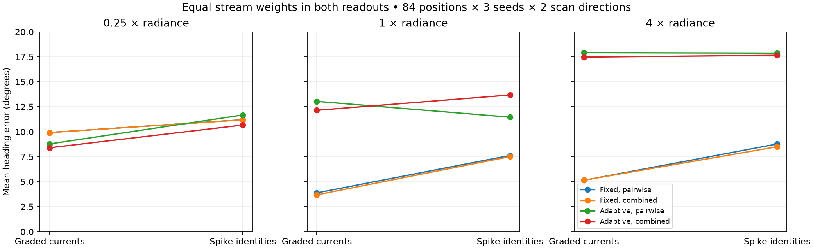
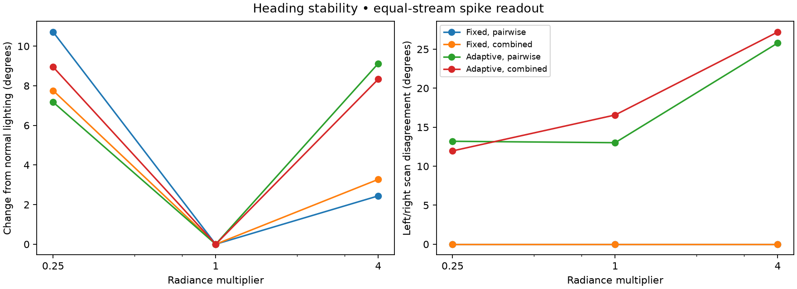
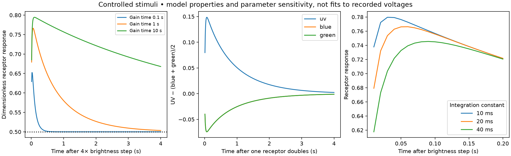

# Graded adaptation and UV opponency: completed controls

1 October 2026. Within-ApiaViz image experiments, separate from all navigation trials.

**Graded response strengths improve mean heading retrieval in these controls.
The tested slow adaptation mechanism does not provide a general improvement.**
The proposed opponent axes make smaller, inconsistent changes. A follow-up
isolates much of the adaptation failure to the slow gain history, which causes
leftward and rightward scans of the same position to produce different answers.
These results do not establish improved destination arrival or superiority over
Sobel/Ardin; those models were not changed or given UV.

## Main results

All four conditions below share the same restored angular spatial filtering,
continuous front-end operations, teaching poses, 4000/4000/2000-cell wiring and
memory comparison rule. Only adaptation, opponent axes and readout vary.
Both primary readouts give each stream equal norm before concatenation, so their
comparison does not confound amplitudes with different stream weights.

| Receptor response / opponent axes | Normal light, graded | Normal light, spike identities | Quarter light, graded | Quarter light, spike identities | Fourfold light, graded | Fourfold light, spike identities |
|---|---:|---:|---:|---:|---:|---:|
| Fixed / pairwise | **3.88°** | 7.63° | 9.92° | 11.20° | **5.14°** | 8.77° |
| Fixed / combined | **3.68°** | 7.51° | 9.92° | 11.19° | **5.15°** | 8.50° |
| Adaptive / pairwise | 13.04° | 11.45° | 8.78° | 11.67° | 17.91° | 17.87° |
| Adaptive / combined | 12.14° | 13.67° | 8.40° | 10.67° | 17.47° | 17.65° |

Values are mean absolute heading errors at 84 fixed positions × three wirings ×
two scan directions: 504 correlated decisions per entry. They are not arrival
rates, independent trials or statistical evidence across 504 environments.
The positions include 21 taught positions, 21 between-station positions and
42 positions displaced 20 cm sideways. Route distance is diagnostic only;
the objective remains useful direction and destination arrival, not exact retracing.



The graded advantage is not universal. For fixed response and pairwise opponency
under normal lighting, graded/spike heading errors by world are **5.57/4.31°**
in meander, **1.19/2.74°** in bend and **4.88/15.83°** in hairpin. Thus the pooled
improvement is driven especially by hairpin, while meander slightly favours spikes.

The production-style binary readout, which concatenates active cells without
first equalizing stream norms, is also retained. With the same fixed angular
front end, its normal-light error is **5.86°** for pairwise and **6.42°** for
combined opponency. The graded values remain 3.88°/3.68°, so the measured benefit
is not solely a stream-weighting effect. The original production encoder, with
its old spatial filters, gives 9.10° on the same full-circle scan grid as a
separate reference; this comparison changes more than the readout.

## What UV adds

With fixed response and graded readout, excluding the UV stream gives **4.78°**
mean error under normal lighting. Including UV gives **3.88°** with existing
pairwise opponents and **3.68°** with combined opponents. The exact same visible
currents are retained in these ablations. With the equal-stream spike readout,
the corresponding values are **6.22° without UV**, **7.63° with pairwise UV** and
**7.51° with combined UV**.

This is a concrete example of useful UV information in continuous responses that
the current binary-identity readout does not exploit consistently. It does not
show that insect mushroom bodies should be nonspiking. Our binary readout keeps
only cell identity, discarding response magnitude and spike timing; biological
spike codes can carry more than that. A graded readout is an information-retention
control, not a claimed physiological replacement for the whole network.

Changing the opponent axes alone has a small normal-light effect with fixed
response: 3.88→3.68° graded and 7.63→7.51° spike-based. It is not uniformly helpful
with adaptation or changed illumination. Both axis pairs span the same two
chromatic differences before rectification, so this intervention rearranges
their representation; it does not create new sensory information.

## Why this adaptation candidate failed

The model's gain depends on recent brightness. A view encountered early in a scan
is therefore encoded under a different state from the same view encountered late
in the reverse scan. The memory was acquired during a route traversal, with yet
another exposure history. We deliberately preserve these histories rather than
resetting adaptation independently for every query heading.

With normal lighting and the equal-stream spike readout, mean selected-heading
disagreement between scan directions is **13.02°** for adaptive pairwise and
**16.57°** for adaptive combined opponency. Both fixed-response controls give zero.
Fourfold lighting raises the adaptive disagreement to **25.79°** and **27.20°**
respectively. This sensitivity is visible without any locomotion or contact.



A separately frozen follow-up keeps the fast 20 ms integration but replaces the
slow gain state with the **current** retinal mean. It uses all 84 positions,
three wirings and both scan directions, under normal light only.

| Pairwise control, normal light | Graded heading error | Spike heading error | Spike scan-direction disagreement |
|---|---:|---:|---:|
| Fixed response, no temporal states | 3.88° | 7.63° | 0.00° |
| Fast integration only, fixed gain | 4.81° | 7.68° | 5.00° |
| Fast integration + slow gain history | 13.04° | 11.45° | 13.02° |
| Fast integration + instantaneous gain | 6.15° | 5.54° | 1.11° |

Removing slow gain history substantially reduces scan dependence, supporting it
as a mechanism of the failure. Instantaneous gain is a diagnostic counterfactual,
not a validated biological adaptation model or a proposed production default.
It also worsens graded retrieval relative to the fixed-response reference.
The [follow-up results](history.json) include combined opponency and all readouts.
This follow-up does not test changed lighting or prove that every effect is
caused only by the gain state; fast integration has its own smaller effect.

## What was implemented and how it relates to physiology

The opt-in [graded UV module](../../apiaviz/research/graded_uv.py) accepts images
and elapsed time only. It has no route, pose, nest, geometry or collision inputs.
Its response uses a fast irradiance state `Z` and a slow retinal-mean background
state `A`, independently for UV, blue and green:

```
Z ← Q + (Z − Q) exp(−dt / 0.02 seconds)
A ← mean_retina(Q) + (A − mean_retina(Q)) exp(−dt / 1 second)
response = Z / (Z + max(A, 0.0001))
```

`Q` is the existing linear relative receptor radiance. The fixed-response
comparison remains `Q/(Q+1)`. The updates are exact for the declared linear
states under held input; the resulting ratio is dimensionless, not measured
membrane voltage. The slow gain is a **broad-field receptor-class approximation**,
not adaptation local to each individual photoreceptor. Absolute gains, noise and
local physiology have not been fitted.

The pairwise axes are UV−blue and UV−green. The combined axes are
UV−(blue+green)/2 and blue−green. Each is split into positive and negative maps.
Both retain the same three UV spatial maps, pooling, seeded projection, standardization
and LIF circuit. All spatial filters now use the earlier angular footprints,
including UV; a common stable DC subtraction prevents numerical contrast on
neutral uniform fields. These shared changes are not part of the factorial
adaptation/opponency effects and remain separate from historical production.

The physiological motivation is real but limited. Intracellular
[bumblebee measurements](https://doi.org/10.1371/journal.pone.0025989) show
adaptation and receptor-class differences in response timing. The published
impulse half-widths are **not** interchangeable with our time constants; the
20 ms integration and 1 s gain constants are explicit engineering hypotheses.
[Honeybee anterior-optic-tract recordings](https://doi.org/10.1371/journal.pone.0310282)
show UV-versus-blue/green opponency with spatial and temporal structure. They do
not calibrate these equal opponent coefficients, specify mushroom-body inputs,
or establish equivalent processing in the simulated ant species.

## Controlled stimuli

Brightness steps at 0.25×, 1× and 4× excitation test integration constants of
10/20/40 ms and gain constants of 0.1/1/10 s, with no winner selection. At the
primary setting, a 4× brightness step produces a response of 0.756 at 100 ms,
settling to 0.503 at 4 s, against a baseline of 0.5. Quarter brightness produces
0.215 at 100 ms and 0.487 at 4 s. A doubling of UV excitation gives positive
UV-versus-blue/green output; blue or green increments give negative output.
Common brightness scaling at equilibrium preserves the spatial response in
the tested patterned field exactly in float64.



These are checks of the model's intended mathematical behaviour, not fits to
physiological voltage traces. The stimuli directly manipulate receptor excitation,
so they are not calibrated monochromatic-light experiments. Parameter sensitivity
was checked on these stimuli; the navigation-image matrix uses the fixed primary
constants only. The slow model's negative result is not a test of every possible
adaptation law.

## Acquisition, readout and verification

The main matrix uses the previous 84 verified probe positions and raw arrays,
with independent teaching/recall render seeds. Teaching images are presented in
route order, held one second per 10 cm segment; the initial state is explicitly
equilibrated to the first teaching image. Each query scan starts from equilibrium
at the same-position initial-world-heading image, then applies the illumination
change and visits 72 headings in one direction. The opposite direction is tested
separately. Neither initialization nor heading choice uses the local route tangent.

Each view is held for 50 ms plus the nominal time to turn 5° at 180°/s: **5.6 s**
per scan. This snapshot-and-hold exposure schedule does not render images during
the turns and is not a full locomotion/time-budget experiment. Dimming/brightening
multiplies all linear receptor channels together; it does not simulate different
sun directions, spectra, clouds or shadows. Those require separate rendering.

There are **37,044 main records**, including the original-model reference, and
**12,096 follow-up records**. Repeated axes, wirings, directions and positions are
correlated. Raw per-heading scores, exposure-state diagnostics, memory hashes,
encoder fingerprints, source archive and frozen protocols remain under
`apiaviz/output/graded-uv-controls-v1/` and `apiaviz/output/graded-uv-history-v1/`.
The [compact main results](results.json) and [history results](history.json)
retain all worlds, conditions and readouts.

All 84 raw frames pass checksum and cache-contract validation. The input and
teaching hashes match the prior image controls. All frozen source, model and
memory checks pass, and both jobs have completed. The standard suite passes
**191 tests**, including seven new checks for causal prefixes, independent batch
histories, exposure subdivision, steady scale invariance, opponent sign,
neutral-field silence and preservation of visible codes under opponent changes.

Reproduce with fresh paths:

```sh
pixi run python scripts/test_graded_uv_controls.py --output apiaviz/output/graded-uv-controls-FRESH
pixi run python scripts/summarize_graded_uv.py --study apiaviz/output/graded-uv-controls-FRESH --output apiaviz/output/graded-uv-report-FRESH
pixi run python scripts/graded_uv_report_figures.py --report apiaviz/output/graded-uv-report-FRESH
pixi run python scripts/test_graded_uv_history.py --source apiaviz/output/visual-response-controls-v1 --output apiaviz/output/graded-uv-history-FRESH
pixi run python scripts/summarize_graded_uv_history.py --study apiaviz/output/graded-uv-history-FRESH --output apiaviz/output/graded-uv-report-FRESH/history.json
pixi run test
```

No trial defaults, collision handling, arrival radius, Sobel or Ardin processing
were changed. No cancelled or paused navigation study was restarted. A sensible
next validation is a richer memory readout that preserves response strength or
spike timing, with explicit score calibration and full-route budget checks.
These image results alone do not authorize a claim of better navigation.
