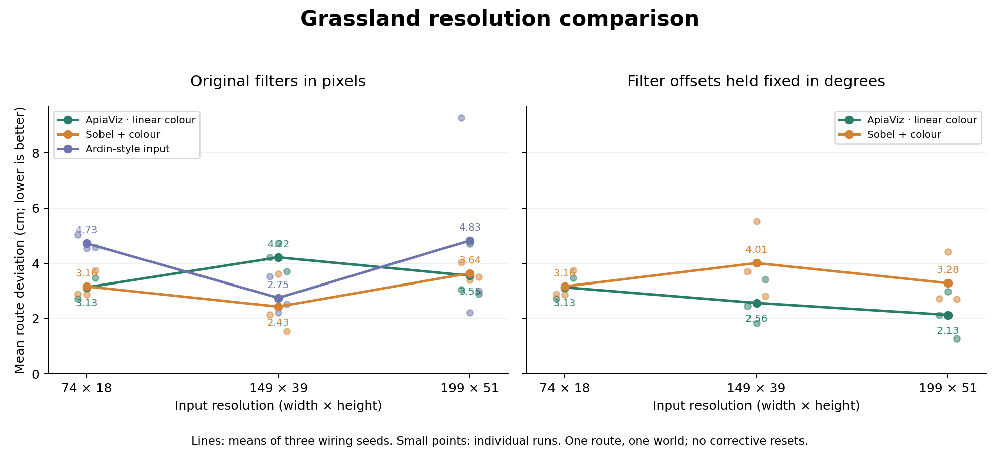
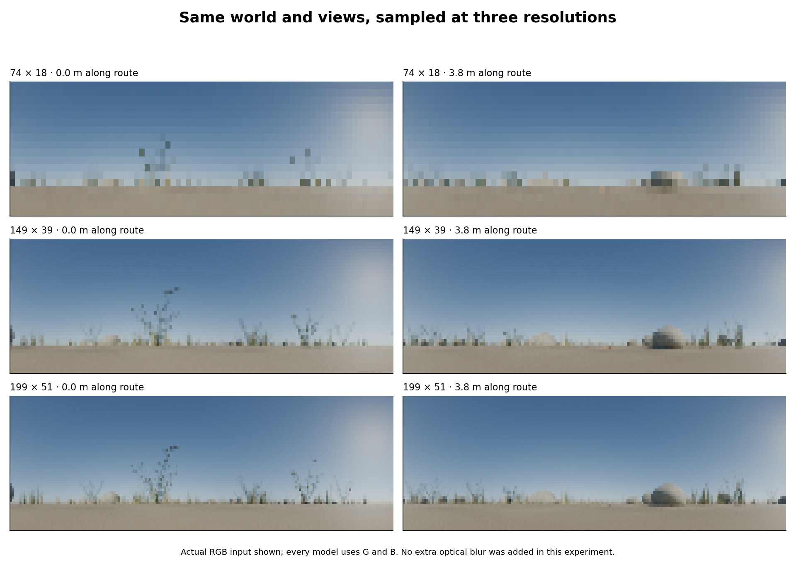

# Grassland input-resolution comparison

**Follow-up qualification (29 September 2026):** a no-vision agent that keeps its
starting heading also reaches the endpoint on this route, with 26.80 cm mean
deviation. Arrival alone is therefore not evidence of visual guidance here;
the much smaller deviations below remain informative. See the
[training and movement audit](../navigation-regime/README.md).

**39/39 runs reached the nest.** The experiment uses the saved
10.4 × 10.3 m grassland and its 7.7 m taught route. All three front ends received
the same teaching poses and shared wiring seeds (19, 31, 43). Only sensory sampling
and the explicitly identified spatial-filter control varied. The
[protocol](protocol.json) was saved before the new navigation outcomes were inspected.



## Main finding

Finer input helped ApiaViz when its spatial filter offsets were retained in
degrees. At 199 × 51, that condition gave **2.13 cm** mean
deviation, compared with **3.13 cm** at 74 × 18: a descriptive
reduction of **32.0%**, with improvement in **3/3 seeds**.
Distance to the continuous route line also improved, from
2.00 to 1.60 cm.

Simply raising ApiaViz's input resolution with the original pixel-sized kernels
gave 4.22 cm at 149 × 39 and
3.55 cm at 199 × 51. These results
support treating sampling density and filter scale as separate design choices.
The angular control changes several spatial stages together; it does not identify
one stage as the cause, and includes a numerical interpolation approximation.

The strongest Sobel result in this grid was
2.43 cm. Thus the
best tested ApiaViz setting has a small numerical advantage on this route, not
evidence of a large or general superiority. Comparing the best settings after
examining the grid is exploratory. Every method reached the nest in every run.

## Input-only change: original filter sizes in pixels

The numbers below are mean route deviation across three seeds; parentheses give
nest arrivals. Lower deviation is better. Every step of a failed run is included.

| Input | ApiaViz linear colour | Sobel + colour | Ardin-style input |
|---|---:|---:|---:|
| 74 × 18 | 3.13 cm (3/3) | 3.16 cm (3/3) | 4.73 cm (3/3) |
| 149 × 39 | 4.22 cm (3/3) | 2.43 cm (3/3) | 2.75 cm (3/3) |
| 199 × 51 | 3.55 cm (3/3) | 3.64 cm (3/3) | 4.83 cm (3/3) |

At 74 × 18 the adjacent ray centres are 4.055° horizontally and 4.412° vertically.
At 149 × 39 they are 2.000° and 1.974°; at 199 × 51, 1.495° and 1.500°.
This condition uses the existing frontend code without altering its pixel-sized
filters. Thus finer sampling also makes each filter cover a smaller visual angle.

## Filter-scale control

| Input | ApiaViz, fixed degrees | Sobel, fixed degrees |
|---|---:|---:|
| 74 × 18 | 3.13 cm (3/3) | 3.16 cm (3/3) |
| 149 × 39 | 2.56 cm (3/3) | 4.01 cm (3/3) |
| 199 × 51 | 2.13 cm (3/3) | 3.28 cm (3/3) |

This control preserves the original spatial tap offsets **in visual degrees**
for ApiaViz's hex neighbourhood, adaptation window and contrast bank, and for
Sobel's Gaussian and derivative filters. Original tap weights, gains and
nonlinearities are retained. Fractional pixel offsets use bilinear interpolation;
the hex row phase is anchored to the reference angular rows. Reflected boundaries
are retained. This is a numerical control on the discrete operators, not a newly
calibrated biological eye. Its interpolation and staggered-grid approximation
should be considered when interpreting differences.

The 74 × 18 reference is shared between tables, so there are **39 unique trials**:
27 input-resolution trials plus 12 higher-resolution angular controls. Ardin-style
preprocessing retains its original 10 × 36 reduction and default native-resolution
CLAHE. It has no separately altered spatial-filter condition here. It is the
adapted preprocessing baseline, not the complete original Ardin spiking model.



## What remained fixed

Each run stored spike codes for the same **693 teaching views**, at 77 route
stations spaced 10 cm apart, with nine lateral views per station over ±20 cm.
The memory was rebuilt from the corresponding resolution's images for every
method. The visual backbone and projection wiring were never trained.

All methods retained 8 × 64 pooling per feature plane, 8,000 spiking cells, the
same saved projection checkpoint within seed, and the previous LIF/inhibition and
normalized spike-overlap memory settings. Navigation used 13 scan headings over
±60°, 10 cm steps, a 20 cm endpoint radius and a 200-step limit, with no corrective
resets or online memory updates. The controller receives no route coordinates.

The renderer, lighting, eye height and field of view were unchanged. Images were
sampled from the same 720 × 152 panoramas, and only newly visited positions were
rendered. No receptor acceptance-angle blur was added: this is a sampling and
filter-scale experiment, **not a full simulation of honeybee retinal optics**.

## Reproducibility and interpretation limits

All nine 74 × 18 runs reproduced the previous smoke-test memories, trajectories
and scan scores exactly. An independent cache-only replay reproduced all
**39 runs, 2962 decisions and 38506 scan scores**.
Teaching images at all resolutions were reconstructed exactly from the cache.
Analytic direction fields, physical compass markers from the smoke test and a
direct fractional-sampling reference validate the renderer mapping and angular
filter implementation. See [audit.json](audit.json).

The primary deviation is distance to the nearest taught route point. The
[results CSV](results.csv) also includes the secondary distance to the continuous
route line, maximum deviation, final nest distance, steps and sparsity.
[summary.json](summary.json) gives individual-seed results and paired changes
against 74 × 18 and between the two filter-scale conditions. These are descriptive
effects, not significance tests: three wiring seeds on one previously inspected
route cannot establish a terrain-wide ranking or a biological optimum.
The 199 × 51 Ardin-style result is especially seed-sensitive: one seed had
9.28 cm mean deviation while the others had 2.22 and 2.99 cm. Its aggregate should
not be read as a uniform loss of accuracy at finer resolution.

The 10° steering increments and the common 8 × 64 feature pooling still limit the
system, even with finer input. A benefit at higher resolution would not isolate
retinal acuity unless optical blur and receptive-field scaling were also addressed;
absence of a benefit would not establish that the honeybee-resolution concern was
mistaken. No settings were selected or changed after seeing these results.

## Files and rerunning

Run data: [`apiaviz/output/grassland-resolution`](../../apiaviz/output/grassland-resolution).
Reusable scene and panorama cache:
[`apiaviz/output/grassland-smoke`](../../apiaviz/output/grassland-smoke).
The run directory contains three teaching banks, every decision trace, a source
archive, checkpoint/image/scene hashes, and a manifest of all cached positions
used by these runs. No original model or evaluation default was changed.

```sh
# In one terminal: resume the saved scene; render only cache misses.
blender --background --factory-startup --python apiaviz/research/grassland_world.py -- \
  --output apiaviz/output/grassland-smoke --resume

# In another: use a new output directory for a fresh run.
.pixi/envs/default/bin/python -m apiaviz.research.grassland_resolution prepare \
  --output apiaviz/output/grassland-resolution-repeat
.pixi/envs/default/bin/python -m apiaviz.research.grassland_resolution run \
  --output apiaviz/output/grassland-resolution-repeat

# Replay and regenerate this report from cached views, without Blender.
MPLCONFIGDIR=/tmp/apiaviz-mpl .pixi/envs/default/bin/python -m apiaviz.research.resolution_report
```
