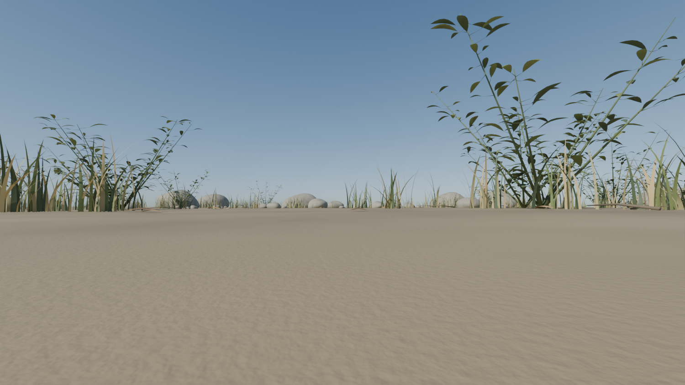
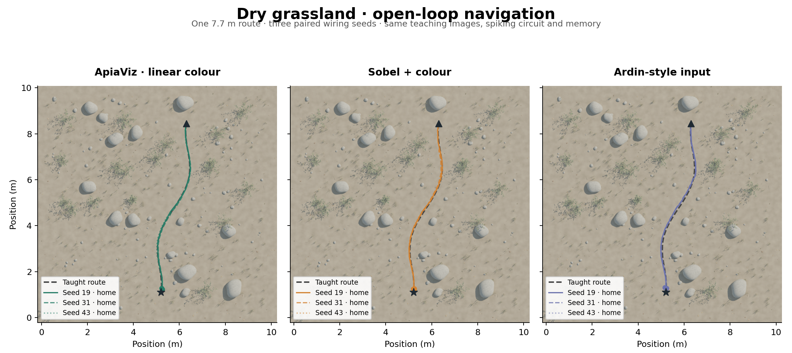
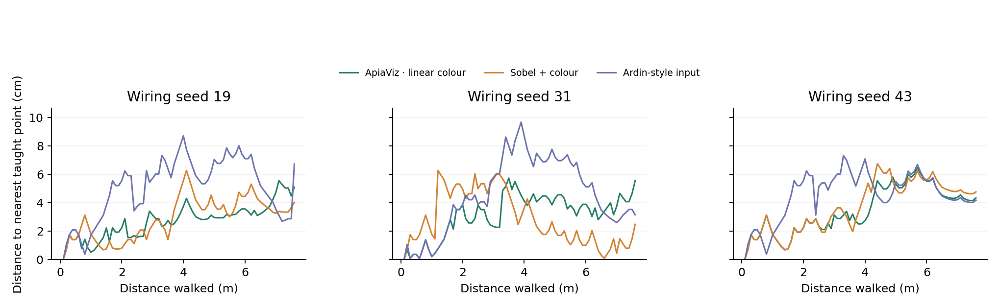
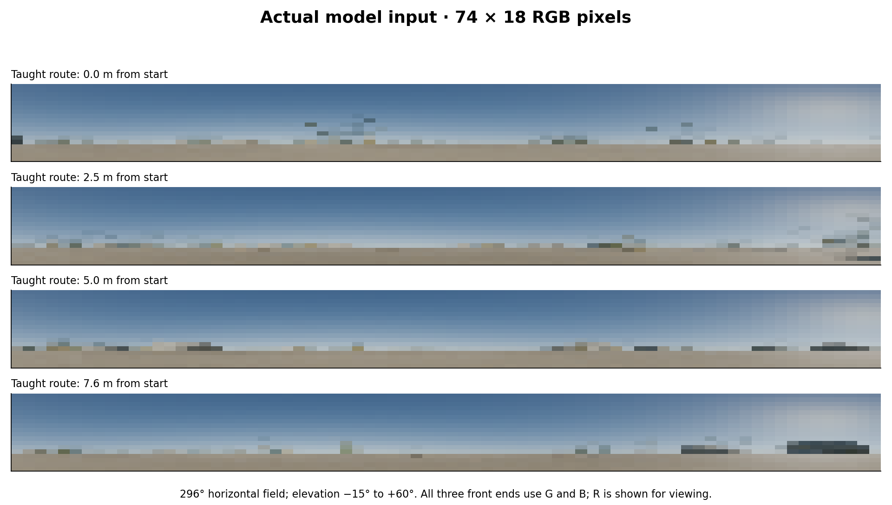

# Dry-grassland navigation smoke test

**Follow-up qualification (29 September 2026):** a no-vision agent that keeps its
starting heading also reaches the endpoint on this route, with 26.80 cm mean
deviation. Arrival alone is therefore not evidence of visual guidance here;
the much smaller deviations below remain informative. See the
[training and movement audit](../navigation-regime/README.md).

The generated grassland has the original landmark field's exact horizontal bounds:
**10.401 × 10.317 m** (x: -0.159 to 10.243; y: -0.228 to 10.090).
It contains curved grass, leafy scrub and solid limestone rocks on mildly uneven
ground. A fixed sun at azimuth 35°, elevation 38° casts shadows. The 7.7 m route
and object placement were fixed before any navigation outcomes were examined.





| Method | Reached nest | Mean route deviation | Per-seed deviation (19 / 31 / 43) |
|---|---:|---:|---:|
| ApiaViz · linear colour | 3/3 | 3.13 cm | 2.72 / 3.19 / 3.48 cm |
| Sobel + colour | 3/3 | 3.16 cm | 2.89 / 2.87 / 3.74 cm |
| Ardin-style input | 3/3 | 4.73 cm | 5.04 / 4.55 / 4.58 cm |

Deviation is the whole-trajectory mean distance to the nearest taught route point,
including every step of failures, averaged equally across wiring seeds. It uses
the same definition as the previous study. Continuous-polyline distances and
all per-run outcomes are also in [results.csv](results.csv). Lower is better.



## What was held constant

All methods received the same **693 teaching images**: 77 route stations at
10 cm intervals, each with nine lateral views spanning ±20 cm. Route training
stores spike patterns in the existing normalized-overlap memory; it does not
optimize the visual backbone. Each seed used identical projection weights across
methods, 8,000 spiking cells, the existing inhibition rule and the same memory.

ApiaViz uses the selected **linear-colour** variant with its original form pathway.
The Sobel baseline uses smoothed luminance gradients plus simple opponent colour.
Ardin-style input uses inverted luminance, CLAHE, 10 × 36 downsampling and L2
normalization before the common encoder. This is a comparison of preprocessing,
not a reproduction of the complete Ardin 2016 neural network.

Navigation starts at the first route pose. At each 10 cm step the ant scans 13
headings over ±60°, chooses the most familiar image and moves. There are no
corrective resets, route coordinates in the steering input, or online memory
updates. The ant stops within 20 cm of the endpoint or after 200 steps. As in the
previous benchmark, movement is a 2D kinematic model with no obstacle avoidance.
The teaching corridor is kept free of substantial obstacles, without colouring
or marking a trail. Ground height is ray-cast from the mesh for a 10 mm eye height.



## Rendering and checks

Cycles renders a **720 × 152 RGB panorama** at each position, using a fixed seed,
32 samples, AgX colour rendering and no denoising. Every scanned heading is sampled
from that same panorama at the previous renderer's **74 × 18 endpoint-inclusive
ray grid** (296° horizontally, elevations +60° to −15°). All front ends use the
same G/B channels. This rendering adapter is new; it has been tested with physical
cardinal-direction markers and an analytic azimuth/elevation field.

The audit reconstructed all teaching inputs from cached panoramas, rebuilt all
memories and replayed all **9 trajectories**, reproducing
**684 decisions / 8892 scan scores exactly**.
This replay required no Blender rendering. See [audit.json](audit.json).

## Interpretation

All nine runs reached the nest in 76 steps (7.6 m walked, ending within the
20 cm stopping radius). ApiaViz and Sobel + colour were effectively tied on the
primary endpoint: 3.13 versus 3.16 cm. Ardin-style preprocessing had a higher mean
deviation of 4.73 cm. The secondary distance to the continuous route line was
2.00, 2.51 and 3.73 cm respectively; unlike the primary measure, it is not affected
by the 10 cm gaps between taught points.

This is an integration smoke test on **one route in one world**, with three
wiring seeds. It can reveal gross failures and seed sensitivity, but it cannot
establish a reliable ranking across natural terrain or statistical superiority.
No parameters or routes were changed in response to these results. Shadows and
sun direction were held fixed between teaching and recall. A change-of-lighting
experiment has not been run.

The rendered input is dominated by sky, with much of the vegetation compressed
into a few rows near the horizon at 74 × 18 resolution. That is worth examining
before interpreting a small performance gap: this route under fixed illumination
may simply be easy for all three methods. These runs do not isolate the
contributions of landmarks, shading and the directional sky gradient.
The [honeybee acuity note](acuity.md) compares this input grid with measured
receptor spacing. A [39-run resolution follow-up](../grassland-resolution/README.md)
now tests finer inputs and controls for angular filter scale.

## Saved environment and reuse

The scene, protocol and panorama cache are stored at
[`apiaviz/output/grassland-smoke`](../../apiaviz/output/grassland-smoke).
The directory includes `grassland.blend`, `world.json`, `protocol.json`,
`panoramas/` and `panorama-manifest.json`. Run artifacts include the training bank,
encoder checkpoints, decision traces, source archive and file hashes. These large
files are retained locally under the repository's ignored output directory.

To replay this smoke test in a new output directory using the saved images:

```sh
.pixi/envs/default/bin/python -m apiaviz.research.grassland_smoke run \
  --environment apiaviz/output/grassland-smoke \
  --output apiaviz/output/grassland-replay
```

For a future run that visits new positions, start the renderer in a separate terminal:

```sh
blender --background --factory-startup --python apiaviz/research/grassland_world.py -- \
  --output apiaviz/output/grassland-smoke --resume
```

The renderer loads the saved geometry and fills only missing panorama entries.
The cache belongs to this exact scene and lighting configuration; a different sun
or terrain needs its own cache. Original worlds and evaluation defaults are unchanged.
