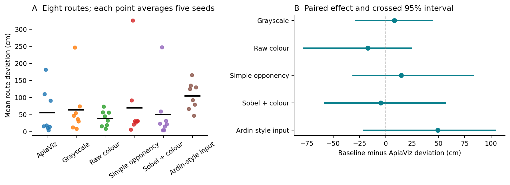
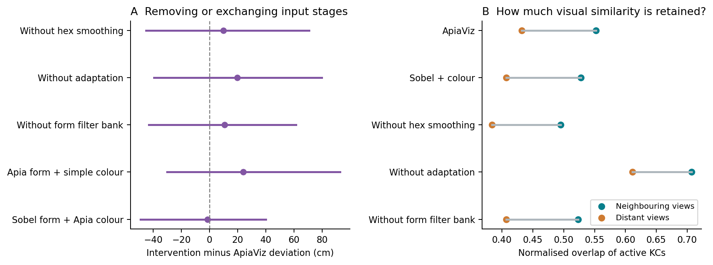
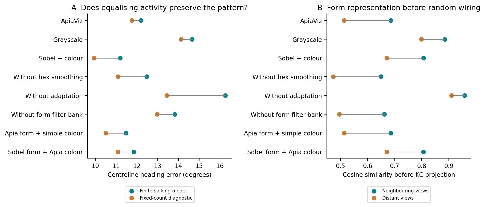
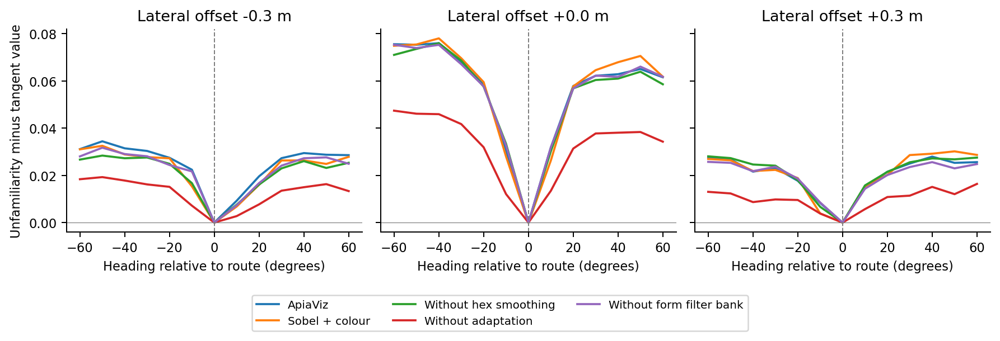

# Visual preprocessing, sparse codes and navigation accuracy

Research report • 29 September 2026

**The four-route pilot's accuracy advantage did not replicate in the expanded
study.** Across eight additional routes and five new wiring seeds, ApiaViz's mean
route deviation was 55.2 cm, compared with 50.4 cm for Sobel plus colour and
38.0 cm for raw colour. None of its five baseline comparisons was statistically
significant after correction for multiple comparisons. These results do not
establish equivalence either: uncertainty remains wide.

There is a useful mechanistic finding. Local adaptation makes different places
less visually alike before the random neural projection, and its removal worsens
heading discrimination. However, this does not establish that the complete
ApiaViz frontend improves navigation over simpler processing. The current
evidence supports studying the representation and its interaction with steering;
it does not support a paper claiming generally superior navigation accuracy.

The [three-page illustrated note](mechanism-report.pdf) summarises this report.
The [literature review](literature.md), [complete result table](results-table.md),
[trial data](results.csv) and [reproduction instructions](README.md) provide the
supporting detail.

## A matched experiment

We ran **440 complete navigation trials**: 11 input-processing conditions on
eight routes, each repeated with five fixed wiring seeds. The six baselines
were ApiaViz, grayscale, raw green/blue colour, simple colour opponency, Sobel
plus colour, and Ardin-style input. Five interventions removed spatial
averaging, local adaptation or the form filter bank, or exchanged the colour
pathways between ApiaViz and Sobel. Each condition therefore has 40 trials.

All conditions learned from exactly the same images and used the same random
connections for each seed, the same spiking parameters, memory rule and steering
policy. Learning stored nine lateral views spanning ±20 cm every 10 cm along
the route, all facing along its local tangent. The visual filters and neural
connections were fixed; route acquisition created the memories. There was no
condition-specific fitting or calibration.

Five feature maps were pooled to 8 × 64 pixels and standardised within two
streams. Fixed signed projections supplied 8,000 leaky integrate-and-fire
Kenyon cells, split equally between form and colour. Each cell received ten
inputs. A view lasted 50 ms; spikes had 1 ms timing resolution and inhibition
arrived 1 ms after its trigger. The memory stored binary spike identities and
retrieval measured normalised overlap with stored patterns. This is a functional
spiking KC representation with a full template memory, not a complete spiking
model of the entire visual–mushroom-body pathway.

At each step the agent compared 13 headings spanning ±60°, selected the most
familiar, and moved 10 cm. Arrival within 20 cm of the nest counted as completion;
otherwise a run stopped after 200 steps. No corrective resets were allowed.
This is the project's “open-loop” condition: movement receives visual feedback
but no external position correction.

The additional cases were Ants 4, 6, 7, 9, 10, 12, 13 and 15, Route 2, with
wiring seeds 19, 31, 43, 59 and 71. Routes were approximately 8 m long in one
grassland geometry with a fixed synthetic colour assignment. The four routes
in the matched pilot were excluded from this analysis. Other earlier project
experiments have examined this route collection, so it is not a pristine test
set. The [protocol](protocol.json) fixed the new matrix, comparisons and stopping
rule before these outcomes were inspected; it was not an external preregistration.

Ardin-style input reproduces the sequence of inversion, local histogram
equalisation, downsampling and normalisation inside our shared model. It is
not a reproduction of the original Ardin network. Similarly, Sobel plus colour
is an input control, not the complete navigation system of Gattaux et al.
This distinction allows the comparison to isolate input processing.
[Ardin et al., 2016](https://journals.plos.org/ploscompbiol/article?id=10.1371/journal.pcbi.1004683);
[Gattaux et al., 2025](https://www.nature.com/articles/s41467-025-62327-3).

## Navigation results and statistical uncertainty

The primary endpoint was each run's mean distance to the nearest taught route
sample, including failed runs. We averaged the five seeds within each route,
then compared methods using eight paired route differences. Positive differences
in the table favour ApiaViz.

| Input | Completed | Mean deviation (cm) | Input − ApiaViz (cm) | Crossed 95% interval (cm) | Adjusted p |
|---|---:|---:|---:|---:|---:|
| ApiaViz | 29/40 | 55.2 | — | — | — |
| Grayscale | 25/40 | 63.4 | +8.2 | −28.5 to +43.9 | 1.000 |
| Raw colour | 26/40 | 38.0 | −17.2 | −77.9 to +23.8 | 1.000 |
| Simple opponency | 27/40 | 69.9 | +14.7 | −31.4 to +83.2 | 1.000 |
| Sobel + colour | 29/40 | 50.4 | −4.8 | −58.2 to +56.2 | 1.000 |
| Ardin-style input | 6/40 | 104.7 | +49.5 | −21.2 to +104.3 | 0.195 |

*Each point in the left panel is a route averaged over five seeds; black bars
show the overall means. The right panel resamples both route and seed axes.
All intervals include zero.*

Two-sided exact sign-flip tests enumerated all 256 sign assignments of the eight
route differences. Their interpretation requires exchangeable signs under the
null (for example, independent symmetric route effects), conditional on the
chosen seeds. We applied Holm correction across the five baseline comparisons.
The Ardin-style comparison has an unadjusted p of 0.039, but an adjusted p of
0.195; it does **not** meet the specified significance criterion.

The intervals above use 20,000 crossed bootstrap resamples of routes and seeds.
Route-only intervals, conditional on the five seeds, are also saved in
[statistics.json](statistics.json). The displayed intervals are unadjusted 95%
intervals, not simultaneous family-wise bounds. With eight routes and five seeds
they are approximate, and the crossed bootstrap can be conservative. Shared
world geometry limits inference beyond this benchmark. We did not count steps,
images or the 40 route–seed combinations as 40 independent routes.
[Kulkarni et al., 2022](https://journals.plos.org/ploscompbiol/article?id=10.1371/journal.pcbi.1010061);
[Owen, 2007](https://arxiv.org/abs/0712.1111).

The ranking changes with the wiring seed. Sobel minus ApiaViz deviation, averaged
over routes, was −10.7, +51.0, +25.3, −23.8 and −65.9 cm for the five seeds.
Repeating an identical deterministic seed would simply repeat its answer; these
different fixed wirings expose architectural sensitivity.

Long excursions strongly affect the mean, but they do not fully explain away
the result. The prespecified first-50-step continuous-route error was 16.1 cm
for ApiaViz, 15.5 cm for Sobel and 13.9 cm for raw colour. Analyses using the
continuous route polyline or the within-run median deviation also produced no
significant baseline comparison after correction. Among successful runs alone,
mean deviation was 10.5 cm for ApiaViz and 8.4 cm for Sobel; those are different
subsets and are descriptive, not a fair paired estimate of a treatment effect.

## What the component tests establish

Every intervention was tested during full navigation as well as on identical
probe images. None had a significant navigation effect after correction across
the five intervention comparisons.

| Intervention | Completed | Mean deviation (cm) | Difference from ApiaViz (cm) | Adjusted p |
|---|---:|---:|---:|---:|
| Remove hexagonal averaging | 23/40 | 65.1 | +9.9 | 1.000 |
| Remove local adaptation | 24/40 | 74.9 | +19.6 | 0.719 |
| Remove form filter bank | 24/40 | 66.0 | +10.8 | 1.000 |
| Apia form + simple colour | 23/40 | 79.2 | +24.0 | 0.117 |
| Sobel form + Apia colour | 26/40 | 53.8 | −1.5 | 1.000 |

*Left: navigation effects with crossed 95% intervals. Right: overlap between
the cells activated by neighbouring or distant teaching views. Overlap describes
the representation; a larger value is not inherently better.*

**Local adaptation changes what the form pathway represents.** Before the
random projection, removing adaptation raised mean similarity between distant
views from 0.513 to 0.910. The effective dimensionality of the centred form
representation fell from 25.8 to 9.9. This measure describes how many directions
of variation the features contain, rather than simply how many pixels they use.
After spike generation, distant-view overlap rose from 0.432 to 0.611.
Centreline heading error increased from 12.2° to 16.3°, and the mean familiarity
margin separating the correct heading from competing headings changed from
+0.0141 to −0.0016. These are descriptive component effects on the sampled views,
not separately confirmed population-level hypotheses.

This supports a concrete explanation: adaptation reduces a common visual
component that otherwise makes different locations look alike to the memory.
It is consistent with research relating visual similarity to KC recruitment,
although that work used different memory dynamics.
[Jesusanmi et al., 2024](https://www.frontiersin.org/journals/physiology/articles/10.3389/fphys.2024.1379977/full).

**Spatial averaging and processed colour trade distinctness for tolerance.**
Removing hexagonal averaging reduced neighbouring-view KC overlap from 0.552
to 0.495, but also reduced distant-view overlap from 0.432 to 0.384. The processed
colour stream made neighbouring feature vectors more similar than simple
opponency (0.803 versus 0.713), while also making distant views more similar
(0.731 versus 0.635). It therefore preserves continuity at some cost to
discrimination. Neither increased similarity nor increased dimensionality alone
predicts better navigation.

**The current form pathway is not mainly an edge detector.** Approximately 90%
of the squared magnitude of its standardised form features lay in the smoothed,
locally adapted channel; approximately 5% lay in each ON/OFF contrast channel.
This is a description of input magnitude, not a measurement of each channel's
causal contribution. The `no_dog` intervention removes the entire filter bank,
including that smoothed channel. It cannot establish a specific benefit of
centre–surround inhibition. A clean follow-up would remove or exchange those
channels separately.

**Processed colour is not a general improvement by itself.** Exchanging simple
colour for ApiaViz colour changed mean deviation by −24.0 cm with Apia form,
but by +3.4 cm with Sobel form. The estimated interaction was 27.4 cm with a
crossed interval of −27.1 to +91.8 cm. This is an uncertain, exploratory
interaction, not evidence that colour alone supplies the pilot advantage.

## Sparsity, illumination and the steering problem

We rendered eight intermediate positions per route, halfway between teaching
samples. Each was tested at five lateral offsets with the same heading scan,
both clean and darkened to 60% brightness. This gives 35,200 probe decisions
over the 440 conditions. Shared images prevent different travelled paths from
confounding these representation measurements.

*The fixed-count diagnostic selects exactly 200 of 4,000 cells per stream.
It is an offline control and also removes finite spike-time binning. The right
panel measures feature similarity before any random KC connections.*

Mean active fractions were 4.92% for ApiaViz and 5.08% for Sobel; all baseline
means lay between 4.92% and 5.72%. In an additional **440 offline conditions**,
we selected exactly the strongest 5% of continuous drives in each stream.
ApiaViz's centreline heading error was then 11.8°, Sobel's 9.9°, and ApiaViz
without adaptation's 13.4°. Thus differences in heading discrimination persist
with equal activity counts, but ApiaViz still does not beat Sobel. This control
changes temporal selection as well as count and is not a full navigation rerun.
It supports examining *which* cells fire, without isolating spike count as the
only causal variable.

Global darkening also does not favour ApiaViz over simple controls. Mean change
in selected heading was 3.0° for ApiaViz, 23.3° without adaptation, and about
0.01° for Sobel or raw colour. All methods share within-view standardisation,
which already cancels uniform positive gain for linear or homogeneous input
processing. Adaptation stabilises this particular nonlinear ApiaViz pipeline;
these data do not establish superior illumination invariance.

*Lower values indicate greater familiarity relative to the route's tangent
heading. Curves average every sampled route and seed. At both lateral offsets,
the average preference remains near the route direction. Such averages can hide
individual mistakes and do not by themselves measure recovery.*

At the off-route probes, ApiaViz selected inward, parallel and outward turns
35.5%, 39.7% and 24.8% of the time. Sobel gave 35.1%, 40.9% and 24.0%. There
were no silent decisions in these probes. Thus both models frequently recognised
the forward route direction without turning back towards it. This is consistent
with the geometry of learning parallel views across a corridor, and with the
visual-compass limitations described by Amin and colleagues. It is a plausible
explanation for weak recovery, not a completed causal demonstration that the
controller alone determines the navigation ranking.
[Amin et al., 2025](https://journals.plos.org/ploscompbiol/article?id=10.1371/journal.pcbi.1012798).

## What to pursue next

The broader project remains viable: a fixed visual frontend and explicit sparse
spiking KCs can navigate without corrective resets. The narrower claim that
ApiaViz is a generally more accurate input to mushroom bodies is not supported
by this study. Stronger wording would exceed the evidence.

The most useful next experiment is a matched test of **learning geometry and
restoring steering**. Compare parallel teaching with views directed back towards
the route, keeping the same rule for every frontend. Earlier development code
already contains directional acquisition; its outcomes must be treated as
development evidence. Fix the selection procedure on development cases, then
test all preprocessing methods on new world layouts and colour assignments
with a predetermined seed and sample budget. Do not optimise ApiaViz on these
eight routes and then present them as an unseen validation set.

In parallel, isolate the smoothed adapted channel from ON/OFF contrast channels.
That would test the strongest representation finding more precisely. It should
precede a broad claim about edge filtering, biological circuitry, or all methods
of imposing sparsity. This experiment compares particular implementations at
one selected operating regime, not every possible sparsity level.

Finally, independent worlds are more valuable for a general navigation claim
than repeating the same deterministic trial. The observed seed and route
variation can inform a prospective sample-size calculation, but collecting
more cases only until a favourable p-value appears would invalidate the intended
test. [Colas et al., 2018](https://arxiv.org/abs/1806.08295).

## Verification and limitations

The [audit](audit.json) reconstructed all **61,091 navigation decisions**, all
440 trajectories and endpoint summaries, and all **35,200 probe decisions**.
Stored source archives, datasets, neural checkpoints and shared teaching/probe
images passed their hash checks. There were no discrepancies. This independently
checks decisions and movement from saved scores; it does not rerun every neural
calculation from scratch.

The accelerated renderer exactly matched 120 sampled original-renderer images
and all four prior ApiaViz trajectories and steering scores. A further check
compared an original-renderer image at the largest-excursion query of every new
trial: all 440 matched pixel-for-pixel. See
[initial validation](renderer-validation.json) and
[study-view validation](study-image-validation.json).

Remaining limits include a single synthetic world and colour assignment, only
eight route identities and five wiring seeds, previously selected ApiaViz neural
parameters, and a full template memory rather than a compact learned mushroom-body
output circuit. The Ardin-style and Sobel conditions isolate image processing;
they should not be used to claim failure of the original published systems.
