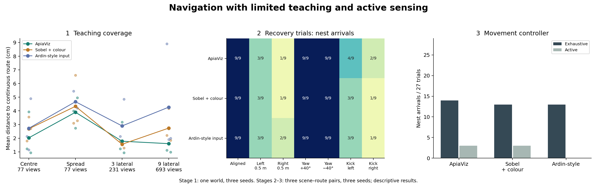
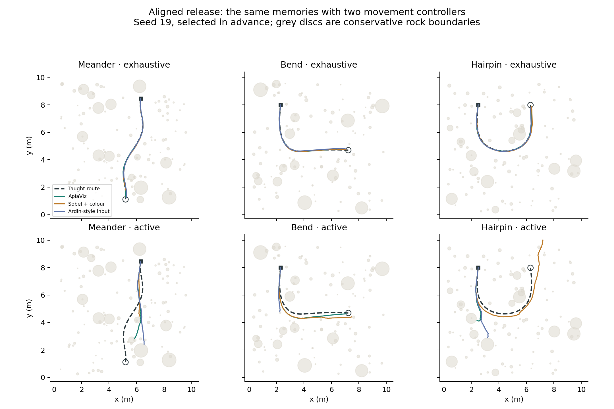

# Teaching, recovery and active-sensing experiments

Read the [interpretation and main findings](INTERPRETATION.md) for the research
assessment, including the [post hoc confidence diagnostic](confidence.png).

The next controller is described in the [development plan](CONTROLLER_PLAN.md)
and [implementation notes](../familiarity-controller/README.md). Its development
results are separate from the experiments reported below.

Three experiments were executed in order, with the [protocol](protocol.json)
saved before their outcomes: 36 teaching trials, 189 recovery trials and 162
controller trials. All methods use 199 × 51 images, the same stored wiring seeds
(19, 31, 43), 8,000 spiking cells and normalized spike-pattern retrieval. ApiaViz
and Sobel retain filter offsets in degrees; Ardin-style preprocessing retains its
10 × 36 reduction. Only the explicitly tested factors change.



**1. Teaching coverage.** These trials use the original meandering route and
unchanged scan-and-step evaluator. Values below are means over three wiring
seeds, measuring distance to the continuous route line. The historical distance
to sampled route stations is also retained in [stage1.csv](stage1.csv).

| Memory bank | Views | ApiaViz | Sobel + colour | Ardin-style |
|---|---|---|---|---|
| centre | 77 | 2.03 cm | 2.69 cm | 2.73 cm |
| spread_equal | 77 | 3.90 cm | 4.33 cm | 4.67 cm |
| corridor3 | 231 | 1.78 cm | 1.56 cm | 2.90 cm |
| corridor9 | 693 | 1.60 cm | 2.74 cm | 4.27 cm |

`centre` stores one forward-facing view at each of 77 stations. `spread_equal`
also stores 77 views, choosing one of the nine lateral offsets at each station
in a fixed repeating cycle. It tests coverage at equal memory count, but does
not represent a naturally walked path. The 231- and 693-view banks use three
and nine lateral offsets at every station. Coverage and count both change in
those comparisons. Each bank is built identically for all front ends.

**2. Recovery.** The memory choice was fixed in advance to a single centreline
traversal, independently of stage 1 results. The existing world is supplemented
by two independently seeded grasslands with bent and hairpin routes. They
contain 77 and 91 teaching stations respectively; the original contains 77.
Each cell below is arrivals across three worlds and three wiring seeds.

| Release / disturbance | ApiaViz | Sobel + colour | Ardin-style |
|---|---|---|---|
| aligned | 9/9 | 9/9 | 9/9 |
| left50 | 3/9 | 3/9 | 3/9 |
| right50 | 1/9 | 1/9 | 2/9 |
| yaw_left40 | 9/9 | 9/9 | 9/9 |
| yaw_right40 | 9/9 | 9/9 | 9/9 |
| kick_left50 | 4/9 | 3/9 | 3/9 |
| kick_right50 | 2/9 | 1/9 | 1/9 |

Lateral releases are ±0.5 m, beyond the old ±0.2 m teaching corridor. Heading
errors are tested separately at ±40°. Kicks displace the agent by 0.5 m before
movement step 36, along the normal at the route's midpoint. The kick is applied
to the agent's current position; it does not reset it onto the taught route.
Displacement distance is excluded from walked distance. Recovery requires three
consecutive post-movement positions within 0.1 m of the continuous route line.
Recovery counts, distances and elapsed times are retained in the CSV and summary.

These trials stop at the field boundary or conservative rock-disc collisions,
as well as at the endpoint or the 200-step limit. The taught paths and displaced
starting positions were checked for rock intersections before evaluation.
This collision rule was added for stages 2–3 and is shared by all methods; stage
1 retains the historical evaluator. It is not a complete obstacle-avoidance or
contact model, and does not model collisions with individual grass blades.
Some imposed mid-route displacements can land in rocks; those outcomes are
reported separately and count as failures of the complete trial, rather than
being silently excluded. They are not interpretable as failures of visual
recovery. The summary includes a post hoc sensitivity analysis removing each
affected world/seed/scenario from **all** methods (and both controllers in stage
3), keeping the remaining comparison paired. This conditional analysis does
not replace the complete trial counts. No heading or endpoint direction is supplied to the
controller. Geometry is used only for teaching and evaluation.

**3. Active sensing.** Both controllers use the centreline memories and the same
aligned, left-offset and right-kick scenarios, paired within world and seed.
They have identical upper limits of 360 simulated seconds, 2,600 observations
and 200 movement steps. Each image costs 50 ms, translation is 0.1 m/s, and
stationary rotation is limited to 180°/s. These values define this experiment;
they are not fitted biological measurements. Stage 2 logs the same nominal
costs but imposes no time cap.

| Method | Exhaustive arrivals | Active arrivals | Views/m, exhaustive | Views/m, active |
|---|---|---|---|---|
| ApiaViz | 14/27 | 3/27 | 130.0 | 12.9 |
| Sobel + colour | 13/27 | 3/27 | 130.0 | 11.4 |
| Ardin-style input | 13/27 | 0/27 | 130.0 | 11.0 |

Views/m is the median over trials with movement, including failures. Reduced
sensing is not evidence of efficiency if navigation fails. The summary also
compares observation count and time within pairs where both controllers arrive.

Exhaustive control physically visits thirteen orientations over ±60° before
choosing a heading, paying for its full yaw excursion and return. Active control
observes the current heading once, then alternates left and right turns with
amplitude `2 + 28 × (1 − confidence)²` degrees. After three consecutive low-
confidence views it may scan four additional orientations (±30°, ±60°), with
at least six movement steps between scan bouts. Every queried orientation is
physically visited and charged. It cannot inspect unseen candidate views or
consult the route coordinates. Parameters were not tuned after seeing failures.
This compares two complete control policies: scan frequency, angular sampling
and movement oscillations all differ. It does not isolate scan frequency alone.

Confidence uses the median leave-one-out overlap of taught codes and the median
overlap of ±60° rotations at up to twelve teaching stations, with a minimum
normalization range of 0.05. These additional 24 calibration views are the same
poses across methods; they are not added to the route memory. The calibration
is shared across controller conditions within each method, seed and world.

The movement model remains deliberately limited: finite-rate stationary turns
and straight 10 cm translations, independent static spiking windows, and no
continuous head/body dynamics or optic-flow control. It tests the consequence
of reducing compulsory scans, not a complete ant or honeybee motor system.



**Interpretation limits.** There are only three scene–route pairs; the original
world has already informed development. Seeds and multiple releases are matched
technical repeats, not independent environments. Results are exploratory and
do not establish statistical superiority. Whole-run deviation includes failed
trials but can be low when a run stops early; interpret it alongside arrival,
recovery, path length and termination reason. Arriving at the nest does not by
itself imply recovery of the taught route. The new routes were prescribed before
evaluation and defeat straight walking even without the rock collision rule.

The memory stores separate spike templates, so these experiments still do not
test a compressed mushroom-body output circuit. “Ardin-style” denotes the input
processing control, not the full Ardin neural model. Navigation uses sensory
feedback without external corrective resets.

**Verification and files.** [audit.json](audit.json) describes exact replay of
all actions and timing from recorded observations, reconstruction of every
memory, independent re-encoding of first/middle/last sensory queries in every
trial, and exact reproduction of the nine earlier full-bank reference trials.
It does not claim to re-encode every recorded sensory observation.
[summary.json](summary.json) contains all grouped results, per-world outcomes and
paired controller comparisons. Full records are in [stage1.csv](stage1.csv),
[stage2.csv](stage2.csv) and [stage3.csv](stage3.csv).
Package and platform versions are recorded in [runtime.json](runtime.json).

Scenes, panorama caches, traces, calibration records and source archives are
retained under `apiaviz/output/navigation-regime/`; the original world's new
panoramas extend its existing cache. Training and evaluation defaults elsewhere
in the repository remain unchanged.

```sh
MPLCONFIGDIR=/tmp/apiaviz-mpl .pixi/envs/default/bin/python \
  -m apiaviz.research.regime_report --audit
```
