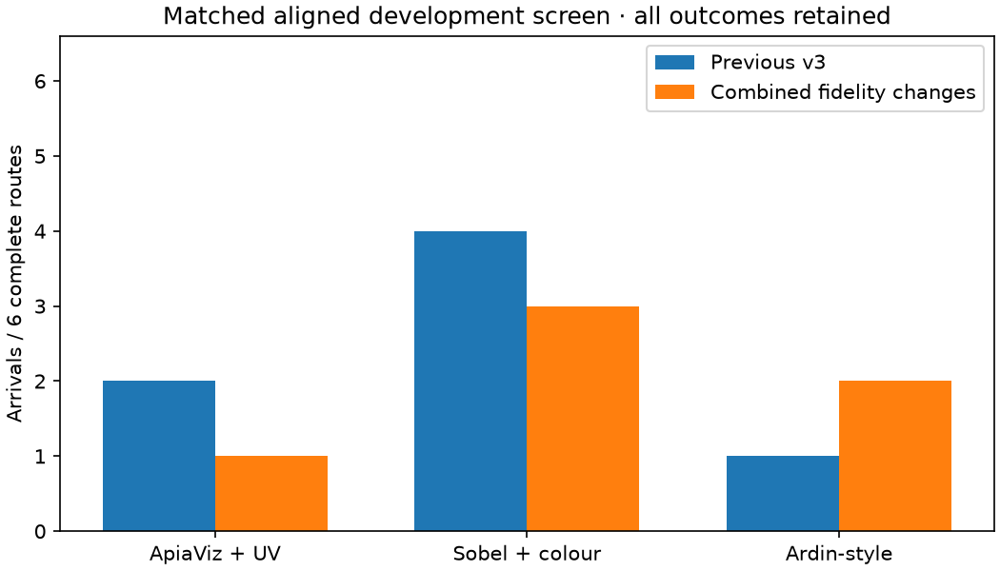
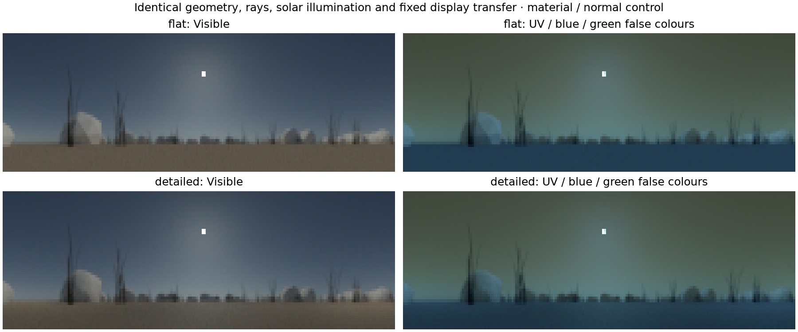
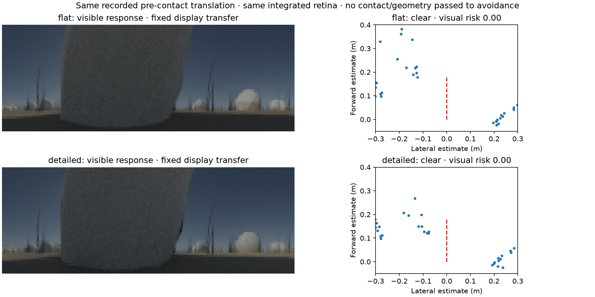
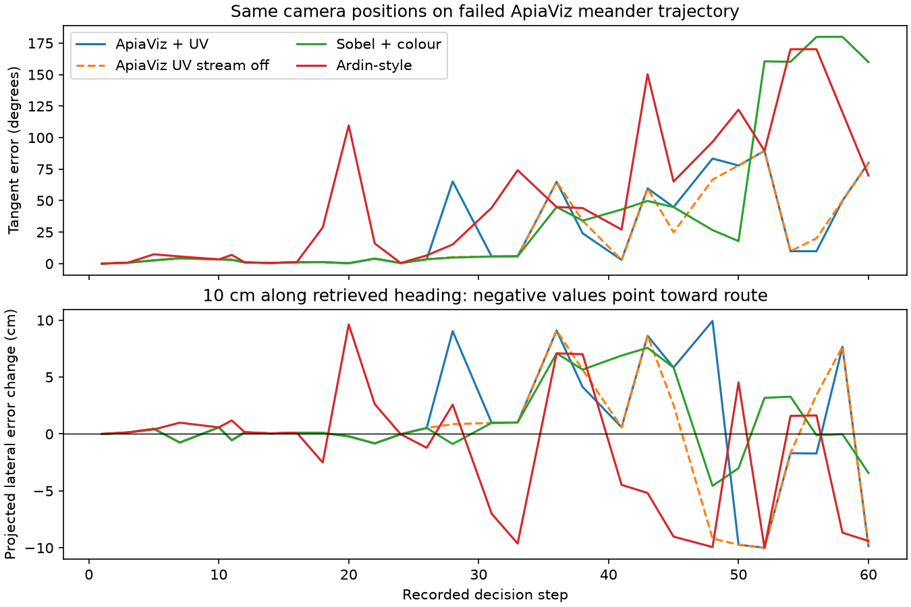
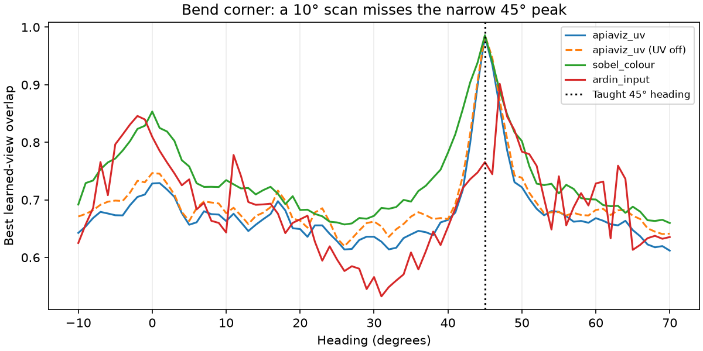

# Surface, retina and directional-control improvements

1 October 2026. Versioned engineering validation, separate from all earlier runs.

This implements the three priorities from the [same-position diagnosis](../sun-matched-audit/README.md):
preserve more scene detail, use one retinal acquisition convention, and check
directional evidence before casting. All three models receive the same camera
and controller revisions; only ApiaViz receives UV. Historical variants remain
available. No model parameters or thresholds are selected to favour ApiaViz.

## Completed route outcomes

All **18/18** scheduled routes completed. The joint change does **not** establish
better navigation and fails the four-of-six arrival gate for every model.

| Model | Previous v3 arrivals | New arrivals | Previous rock rejections | New rock rejections | New observations, all six routes |
|---|---:|---:|---:|---:|---:|
| ApiaViz + UV | 2/6 | **1/6** | 24 | 54 | 10,432 |
| Sobel + colour | 4/6 | **3/6** | 22 | 4 | 8,013 |
| Ardin-style | 1/6 | **2/6** | 159 | 241 | 9,491 |

All 12 unsuccessful routes terminate at their normal time budget. All 18 traces
pass swept-mesh/body safety, placement, time/view/movement accounting, no-reset,
checkpoint, teaching-image and raw-cache provenance checks. A rock rejection is
a prevented proposed movement, not an actual penetration or a unique encounter.
There are also 215/246/135 field-boundary rejections for ApiaViz/Sobel/Ardin;
these must not be counted as rock contacts. Contact signals remain evaluator-only.

Both ApiaViz hairpin trials fail with **zero blocked proposals**. Their lateral
error exceeds 20 cm at step 55, while their first cast occurs at step 144.
Both pass within **23.34 cm** of the nest, just outside the unchanged 20 cm
arrival radius, before moving away again. This is a near miss with persistent
lateral offset; the threshold is not widened to turn it into a success.
The failed meander exceeds 20 cm at step 29 and first casts at step 77. These
failures cannot be explained solely by contact handling or premature casting.
The diagnostics below identify narrow angular peaks, early local-scan stopping,
weak inward recovery and a remaining frontal-flow blind spot.

This is a negative development result. Keep it separate from earlier protocols
and from the subsequent panoramic scan-only control. It does not justify a new
378-trial study or a claim of UV benefit. The changed components are versioned
options; the historical default experiment is not silently replaced.



The [verified numeric record](results.json) includes all 18 rows, physical
rejection causes, costs, teaching-bank reconstruction checks, renderer checks
and artifact hashes. Both UV and visible teaching arrays reconstruct exactly
at the first and middle station in each world. All **16 selected movies** decode
successfully and match their trace and video hashes. The local
[interactive report](../../apiaviz/output/navigation-fidelity-v1/report/index.html)
contains the movies, all trajectories, CSV/JSON statistics and PDF/SVG/PNG figures.
All navigation workers, render workers and the coordinator have exited.



## Surface detail

The trial builder itself had disabled bump detail and leaf transmission, in
addition to the exporter's material simplification. The new opt-in
`source-informed-surfaces-v1` restores the earlier terrain material settings:
soil/rock/grass noise scales 4/17/25 per metre, bump distances 0.65/0.5/0.04 mm,
grass roughness 0.62, and the leaf mixture setting 0.13. Soil and rock roughness
remain 0.85. The exporter retains those source parameters, linear RGB ramp
endpoints and smooth vertex normals.

The spectral renderer uses the source ramp's luminance contrast to modulate
the archived material proxy spectrum by a common scalar at every wavelength.
The scalar lies between the darker/brighter source-luminance ratio and one.
The proxy is therefore the **bright envelope**, not the spatial-average
reflectance. This is a declared synthetic spatial assumption, not new measured
UV reflectance data or spectral upsampling of the RGB colours. The empirical
curves, calibration file and wavelength range are unchanged.

World-anchored cubic value noise replaces Blender's Noise implementation; the
number of octaves and spatial scale come from the source nodes. It is not a
pixel-exact shader conversion. Bump gradients perturb the shading frame; they
do not displace the collision surface. Principled/Thin Principled scattering
uses the source roughness and a diffuse transmission fraction derived from the
leaf mixture. This approximates the original Blender mixture; it does not
establish calibrated spectral BRDF or BTDF parameters. The renderer mechanics
are documented by [Mitsuba](https://mitsuba.readthedocs.io/en/stable/src/generated/plugins_bsdfs.html).

All three regenerated worlds contain **39,362 triangles**, with vertices and
face indices exactly equal to their old counterparts. Normals are finite and
unit length. Collision geometry is re-exported against each new scene hash;
the swept 5 mm body and block-and-continue rules are unchanged.

The renderer check compares three poses with the old flat material model and
the new surface model, using identical rays, samples and sun. All six raw
six-band renders are finite and nonnegative. Analytical noise gradients agree
with finite differences within 0.000024. Tests confirm that spatial modulation
preserves spectral shape, leaves have nonzero transmission, and rocks have zero
transmission. These checks validate implementation, not empirical habitat fidelity.

A separate four-image check uses the last successful 2 cm, matched-gaze
translation before the first historical bend rock rejection. With the same
new retinal sampling on both material controls, frontal gray-level standard
deviation increases from 0.924 to 1.159, but both yield 54 supported flow columns
and **zero frontal risk**. The estimator still calls the blocked approach clear.
Surface detail alone therefore does **not** repair this known perception error.
Safe movement rejection and the existing image-stagnation recovery remain
necessary. This is one prespecified diagnostic, not a circumnavigation test.



The [numeric result](surface-contact.json) retains the inferred points and image
diagnostics. Reproduce with `scripts/uv_mitsuba/render_surface_contact_probe.py`
in the spectral Pixi environment, then `scripts/analyze_surface_contact_probe.py`
in the main environment; both accept fresh output paths. Geometry is used to
select/label the diagnostic, never supplied to the avoidance policy.

## A common retinal footprint

`solid-angle-box-before-response-v1` integrates the **linear** panorama over
each receptor cell before response compression. Both paths use the same
199 × 51 angular centres and cell boundaries. Integration accounts for
solid angle through the sine of the elevation bounds and wraps continuously
in azimuth. It integrates the piecewise-constant rendered pixels exactly;
it does not claim to reconstruct unresolved detail in the source panorama.

The declared acceptance function is a rectangular box, not a measured insect
point-spread function. It replaces point/bilinear sampling with a consistent,
explicit finite footprint. ApiaViz receives raw integrated UV/B/G and applies
its existing `x/(x+1)` response. Sobel, Ardin and shared avoidance receive only
integrated visible bands, followed by the identical response. Their spectral
sensitivity curves still differ; this is not an isolated frontend comparison.

Teaching, recall, avoidance and movie generation use the same acquisition
dispatcher. New teaching views and memories are generated; old banks cannot
be silently reused. Tests cover constant radiance, periodic wrap, solid-angle
quadrature, conservation of a small bright source's integrated signal during
yaw, identical responses for identical bands, and complete exclusion of UV
values from the visible path.

Movies and previews now use a fixed display transfer after response compression.
The UV false-colour panel uses the encoder's half-response of one. Movies mark
the configured solar direction when it lies inside the camera view. This is
an annotation, not a rendered enlargement, occlusion claim, or policy input.
No display transformation is used by a model.

## Directional evidence before casting

Both serial and parallel trial entry points dispatch the explicit
`direction-before-cast-v1` revision to `ConfirmedExplorationController` and
the previously tested coherent avoidance integration. Sustained decline and
scheduled exploration invoke the existing paid directional scan. Supported
directions continue route following; unsupported scans retain the bounded
casting fallback and original uninformative-view termination rule. The
periodic schedule advances on a successful check, avoiding repeated checks on
every subsequent step.

There is no reset of learned memory or route position. Physics/contact data
remain evaluator-only. Every observation and turn is charged. An exhausted
observation budget stops the check without issuing a blind movement. Tests
exercise both search phases, reference-view continuity, accounting, historical
dispatch preservation and identical controller selection for all three models.

## Bounded validation

The new protocol schedules **18 complete aligned-route trials**: three worlds,
three models, seed 19 and both phases. Each retains the original 200-movement,
360-second and 2,600-observation ceilings. Teaching and recall use distinct
Monte Carlo seeds. A four-of-six arrival gate applies equally to every model.
No larger study starts automatically, even if the gate passes.

This jointly changes acquisition, materials and control. Its outcome cannot
identify the separate contribution of each change or establish a UV advantage.
These are previously inspected development worlds. External displacement
recovery and independent environments need separate validation.

The new commands are:

```sh
pixi run validate-fidelity prepare --output apiaviz/output/navigation-fidelity-FRESH
pixi run validate-fidelity run --output apiaviz/output/navigation-fidelity-FRESH --workers 6
```

Preparation requires a new output directory. Completed frozen results can be
verified with `pixi run validate-fidelity assess --output PATH`. The earlier
`pixi run environments` default remains the historical protocol; it has not
been silently redefined as a new 378-trial experiment.

Reproduce the separate renderer check after preparation:

```sh
pixi run --manifest-path scripts/uv_mitsuba/pixi.toml --locked python scripts/uv_mitsuba/validate_surface_detail.py --geometry apiaviz/output/navigation-fidelity-FRESH/worlds/meander/geometry --output apiaviz/output/surface-check-FRESH
pixi run test
```

The standard suite passes **181 tests** (177 at the main protocol freeze, plus
four for the separate panoramic option). The frozen main output is
`apiaviz/output/navigation-fidelity-v1/`.

## Direction retrieval versus route recovery

A retrospective check examines the first 60 decisions of the failed negative-phase
ApiaViz meander trial. At its 29 recorded scan positions, a full 36-heading search
reconstructs the local choices early in the route. Initial lateral error grows
from below a millimetre to roughly 5 cm by decision 22 even though the selected
headings are within 4.3 degrees of the nearest teaching tangent. A wider scan
alone would not change these early choices. Once farther away, some global peaks
match distant teaching stations; familiarity does not uniquely locate the animal.

The same cached images were then evaluated with all three models and an explicit
ApiaViz UV-stream ablation, using each corresponding newly taught memory. At the
14 positions at least 10 cm from the route, a hypothetical 10 cm step along the
best full-scan heading reduces geometric route distance in **5/14** cases for
ApiaViz + UV, **5/14** for ApiaViz with UV disabled, **5/14** for Sobel and **9/14**
for Ardin-style. These are geometric projections, not executed movements or
collision checks. The route is used only for offline scoring.

Across all 29 positions, UV changes five retrieved headings relative to the
ablation: two improve tangent error and three worsen it. ApiaViz + UV nevertheless
retrieves within 20 degrees of the tangent at 19/29 positions, versus Sobel's
18/29 and Ardin's 13/29. This illustrates why tangent agreement and recovery
must be measured separately. The evidence supports investigating attraction
back toward the route and ambiguous view matches; it does not establish a
universal model ranking or show that removing UV improves navigation.

The [matched-position data](matched-views.json) record all outcomes, source hashes
and limitations. Reproduce the two stages with `scripts/audit_fidelity_directions.py`
and `scripts/audit_fidelity_matched_views.py`, each with a fresh `--output` path.
These diagnostic positions come from one failed development trajectory, so they
are correlated and selected by that trajectory. They are not independent trials.



## Explicit panoramic confirmation option

The corner audit exposes a further limitation of the adaptive scan used in the
18-case matrix: it can declare a direction supported after seeing only the
local 40-degree window. At bend decision 24, a stronger 50-degree heading exists
outside that window. At hairpin decision 54, a stronger 170-degree heading lies
outside the window centred on the old 140-degree course. In both cases, the
adaptive scan stops before acquiring that evidence.

`PanoramicConfirmationController` is a separate development option. It inherits
the checked-casting controller and sets `scan_extents=(180.,)`, so reorientation
must acquire the complete heading circle. Routine tracking checks stay local.
The existing contrast/ambiguity criteria, scan spacing, reference continuity and
sensor budgets remain unchanged. Partial scans cannot confirm a direction when
the budget expires. This option was added after freezing the main matrix and is
**not represented by its 18 arrival outcomes**. It is not enabled by default.

The [paid replay](panoramic-check.json) uses the two recorded images, all three
models and both phases, for 24 scans in 12 adaptive/panoramic pairs. All models choose
50 degrees with panoramic confirmation at the bend. ApiaViz changes from 10 to
50 degrees; Sobel and Ardin change from 0 to 50 degrees. At the hairpin ApiaViz
changes from 140 to 170 degrees; Sobel retains 170 and Ardin retains 160 degrees.
Each panoramic scan costs 36 views and 3.744 seconds including rotations, versus
5 views / 0.583 seconds for the prematurely accepted ApiaViz local peaks. The
route is not available to the controller, and no movement is executed in this
diagnostic. Subsequent movement, obstacle interactions and full-route costs are
therefore unvalidated. Do not combine this replay with the arrival results.

Four additional unit tests cover hidden stronger directions, global ambiguity,
budget exhaustion and unchanged local tracking in both phases. Reproduce the
recorded-image replay with:

```sh
pixi run python scripts/validate_panoramic_confirmation.py --output apiaviz/output/panoramic-check-FRESH.json
```

The [finer angular diagnostic](corner-sampling.json) also limits what panoramic
confirmation alone can fix. At the taught bend corner `(2, 0)`, independent
recall at the taught 45-degree heading gives ApiaViz overlap **0.984**. The
40- and 50-degree headings available on its 10-degree scan grid give only
**0.665** and **0.722**; straight ahead gives **0.729**. Thus even the full
10-degree grid initially prefers the old course. With UV disabled these values
are 0.986, 0.667, 0.739 and 0.747 respectively. Sobel also has this ordering
(0.986, 0.782, 0.802 and 0.854). Ardin's exact-corner 45-degree response is weaker
than its old straight-ahead match. This is a shared sampling/representation
limitation, not evidence of missing UV data.

The next controller validation needs to test angular resolution and spatial
route recovery explicitly, charging the additional views and turns. Changing
resolution may reveal a peak but does not guarantee inward steering off route.
No such change is hidden in the main matrix or promoted on the strength of this
one selected corner. Reproduce the full one-degree diagnostic sweep with
`scripts/audit_corner_sampling.py --output PATH` in the main Pixi environment.



The final record and figures can be reproduced after all diagnostics complete
with `pixi run python scripts/summarize_navigation_fidelity.py --output PATH`.
Use a fresh directory and copy the three diagnostic JSON inputs (`matched-views`,
`corner-sampling` and `panoramic-check`) into it first. Existing `results.json`
is never overwritten. Large raw arrays, Blender scenes and movies remain local
under the ignored experiment directory.
