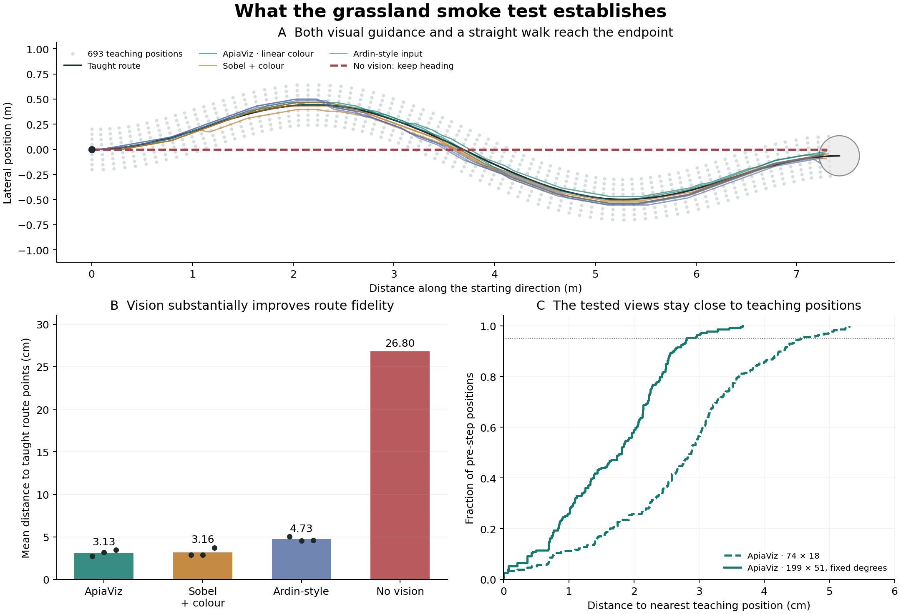

# What the grassland navigation task currently tests

Audit and research note, 29 September 2026.

The three proposed experiments have now been run in order. See the
[results and interpretation](../navigation-experiments/INTERPRETATION.md) and
[full experimental report](../navigation-experiments/README.md).

The current experiment measures accurate retracing of a densely taught route
under favourable conditions. It gives useful information about visual
preprocessing, but nest arrival is too easy to establish robust navigation here.
The scan-and-step controller is a modelling abstraction with some biological
motivation; its compulsory, exhaustive scans should not be presented as a faithful
account of normal insect movement.



**A control that changes the interpretation.** An agent that ignores images and
keeps its initial heading reaches the endpoint in 73 steps, without a reset. It
finishes 13.8 cm from the endpoint, inside the existing 20 cm stopping radius.
Its mean distance to the taught route points is 26.80 cm, and its maximum is
50.03 cm. The initial heading is −98°; the direct bearing to the endpoint is
−98.50°. The route bends around an almost straight start-to-end direction.

This new control uses the existing evaluator and its existing tie rule. The
scorer receives no images, memory, route coordinates or endpoint direction; it
returns identical scores for every candidate. The evaluator alone uses the
endpoint to stop, exactly as it does for the visual methods. Repeating this
deterministic control across projection seeds would give no independent evidence.

At the common 74 × 18 input, ApiaViz, Sobel + colour and Ardin-style input have
mean deviations of 3.13, 3.16 and 4.73 cm respectively, averaged over the three
wiring seeds. Their much better route fidelity remains informative. Their nest
arrivals, however, do not distinguish visual navigation from simply walking
straight. The null control should have accompanied the original smoke test.
The top and lower-left panels show the common-resolution comparison; the
lower-right panel additionally shows the previously tested fine-resolution
ApiaViz condition. That condition was not chosen independently of the earlier
results and is descriptive here.

**Why teaching and recall are forgiving.** The backbone is untrained; “training”
here means acquiring route memories. The system receives 77 stations at 10 cm
spacing, each with nine lateral views at 5 cm spacing across ±20 cm: 693 images.
Every lateral view faces along the route tangent. These poses are an artificial
sampling grid, rather than observations collected during one actual traversal.
Recall begins at the exact first taught position and heading, in the same scene,
lighting and eye height. There is no wind, movement noise or online disturbance.

Across all 39 saved runs, every pre-step query position remained within 20 cm of
the continuous route line. For ApiaViz at 199 × 51 with filters fixed in degrees,
95% of query positions were within 2.81 cm of a teaching position; the median was
1.81 cm. These are distances between camera positions, not a claim that images
were identical. At those nearest teaching positions, the median difference
between the agent's current heading and the teaching heading was 4°.
The corresponding 74 × 18 position-distance median and 95th percentile were
2.88 and 4.55 cm.

Close agreement with teaching poses is partly the consequence of successful
route following. It does not by itself prove that the dense bank caused success.
Together with the aligned start and unchanged environment, it shows that these
runs scarcely test recovery beyond the acquisition corridor. Comparing a
centreline-only bank with the corridor bank is still needed to measure how much
assistance the extra teaching views provide.

The readout stores every taught binary spike pattern separately and returns the
best normalized overlap. It has no forgetting or interference from consolidation
into a limited set of output synapses. Thirteen headings against 693 templates
implies 9,009 template comparisons per movement decision. This is an algorithmic
count, not an estimate of biological synaptic cost. The spiking sensory code does
not make this readout a simulated spiking MB output neuron.

The original Ardin study instead used plastic Kenyon-cell-to-output connections,
alongside a separate perfect-memory benchmark. It taught views along routes at
10 cm intervals and used ±60° scans followed by 10 cm steps, replacing agents on
the route after deviations above 20 cm. Our experiment removes those corrective
resets, adds a lateral teaching bank, and uses template retrieval. “Ardin-style
input” therefore identifies the preprocessing control, not a reproduction of
the complete original model. [Ardin et al., 2016](https://journals.plos.org/ploscompbiol/article?id=10.1371/journal.pcbi.1004683).

Higher fidelity may make landmarks more distinctive, but that is an untested
explanation here. All nine low-resolution grassland runs already reached the
nest. Raising resolution did not create the arrival ceiling, and we have not
isolated the effects of geometry, texture, shading and teaching density.

**Which parts of scanning have biological support?** Ants do sometimes stop and
turn to inspect their surroundings. High-speed recordings of *Melophorus bagoti*
link more extensive scanning to uncertainty, including altered surroundings and
conflicting navigation cues. This supports occasional, context-dependent scanning.
It does not establish an exhaustive scan after every fixed distance travelled.
[Wystrach et al., 2014](https://doi.org/10.1007/s00359-014-0900-8).

Our controller receives thirteen perfectly sampled headings over ±60° at each
position, chooses the best, turns instantaneously and advances exactly 10 cm.
There is no simulated cost for turning or observing, and no head/body distinction.
In the fine-resolution ApiaViz condition, 75.3% of actions retain the previous
heading, but every action still evaluates all thirteen views. Each static input
has a separate 50 ms spiking encoding window. If those windows were interpreted
as sequential observations, they would require 0.65 seconds per decision before
movement or turning. That is conditional arithmetic, not elapsed time measured
by our current simulation or a proposed biological timing parameter.

Biological movement need not look smoothly interpolated. Experiments find
intrinsic lateral oscillations in ants, with visual cues modulating their
amplitude. This offers a basis for a deterministic controller that samples left
and right while advancing. [Clément et al., 2023](https://doi.org/10.1016/j.cub.2022.11.059).
Honeybees approaching and leaving a feeder show rapid head/body turns separated
by straighter flight and stabilized gaze. A realistic bee controller would need
to distinguish these movements, rather than simply add pixels to a ground-level
walking agent. [Boeddeker et al., 2010](https://doi.org/10.1098/rspb.2009.2326).

Learning behaviour also matters. Desert ants perform brief lookbacks along
developing routes, suggesting structured acquisition of return-facing views.
This supports exploring memories gathered through actual movement, without
assuming that a perfectly aligned nine-view grid represents natural learning.
[Freas and Cheng, 2025](https://researchers.mq.edu.au/en/publications/visual-learning-route-formation-and-the-choreography-of-looking-b/).

A particularly relevant modelling study distinguishes recovering a familiar
heading from converging onto a route: orientation matching can produce parallel
travel after displacement. It tests oscillatory learning, familiarity-modulated
movement and cast-and-surge strategies. Its cast-and-surge implementation still
uses scans; it should not be described as a ready-made scan-free solution.
[Amin et al., 2025](https://journals.plos.org/ploscompbiol/article?id=10.1371/journal.pcbi.1012798).

**A sequence of experiments that separates the causes.** Keep the present scene,
cache and controller as a regression reference. Test acquisition first, then
movement, with all preprocessing methods receiving the same treatment in every
comparison. Avoid changing memory architecture at the same time.

| Question | Controlled comparison | Main measurement |
|---|---|---|
| Does the dense teaching bank conceal weaknesses? | One centreline traversal (77 views) versus the current 693 views, with the existing controller. Add matched 77-view subsets spread across the corridor to distinguish coverage from count. | Whole-run route deviation, failure and recovery outside taught positions |
| Can the agent return to the route? | Predeclared releases at ±0.25, ±0.5 and ±1 m, crossed with heading offsets, plus a mid-route displacement. Keep the same memory. | Recovery distance/time, subsequent route fidelity and arrival |
| Does accuracy depend on exhaustive scans? | Existing controller versus a controller using the currently experienced view and limited, uncertainty-triggered scans, with the same acquisition bank. | Accuracy at matched sensory/time budgets; observations and scans per metre |
| Does the result extend beyond this route? | Several independently generated worlds, each with multiple routes containing substantial bends and its own prescribed acquisition traversal. Include no-vision controls. | Paired method differences across worlds/routes, not just projection seeds |

The 77-versus-693 comparison intentionally changes both coverage and memory
budget; its result alone cannot identify which matters. Matched-budget subsets
address that ambiguity but remain artificial acquisition controls. A subsequent
experiment should acquire views along physically traversed paths. Do not require
zero-shot recognition of a completely unlearned world: each evaluation route
still needs its own prescribed familiarization. Hold out evaluation worlds from
controller and preprocessing parameter selection.

For the movement controller, my recommendation is forward progress with a small
deterministic left/right oscillation, modulated by familiarity. Use recent,
actually observed views to detect deteriorating familiarity; permit a physical
scan when necessary and charge its observation and rotation time. A single
familiarity value does not identify left versus right. The controller must obtain
that information through movement, temporal comparison or a separately justified
directional circuit. It must not consult unobserved candidate views, route
coordinates, or the nest bearing. Familiarity scales differ across front ends,
so calibration must be specified on development data and frozen for evaluation.
Continuous spiking state is a further explicit design choice: independent
50 ms image encodings do not already provide it.

Use finite turn rates and account for elapsed time before interpreting this as
animal behaviour. For now, an ant-inspired walking assay with clearly labelled
sensory sampling is more defensible than claiming a honeybee flight model. A
bee assay would additionally require flight height, speed, gaze and motion cues
appropriate to its task. Adding a home vector during recall would also change
the question and could obscure the contribution of the visual backbone.

Measure distance to the continuous route line alongside the historical
nearest-station metric: at centimetre-scale errors, 10 cm station spacing affects
the latter. Include every step before failure, report failures separately, and
measure convergence after displacement. Treat independent worlds/routes as the
units supporting generalization; wiring seeds measure sensitivity within them.
No significance claim follows from the present one-route audit.

The research opportunity remains worthwhile: ask whether ApiaViz supplies useful
familiarity information under limited experience and realistic opportunities to
look around. Current results support accurate familiar-route retracing. They do
not yet establish that broader claim, or rule it out.

Finally, the project's “open-loop” label means navigation without externally
imposed route resets. In control terminology this is visually closed-loop: each
action changes the next observation. “Unassisted visual route following” is a
clearer description for a broad readership.

**Reproduction.** The [audit script](../../apiaviz/research/navigation_regime_audit.py)
runs the no-vision control and analyses the saved 39 trajectories, without new
rendering or retraining. [audit.json](audit.json) contains all 13 condition-group
summaries, pooled pose-distance data and input hashes;
[no-vision-trajectory.json](no-vision-trajectory.json) records the new control.
The original results and navigation defaults are unchanged.

```sh
MPLCONFIGDIR=/tmp/apiaviz-mpl .pixi/envs/default/bin/python \
  -m apiaviz.research.navigation_regime_audit
```
