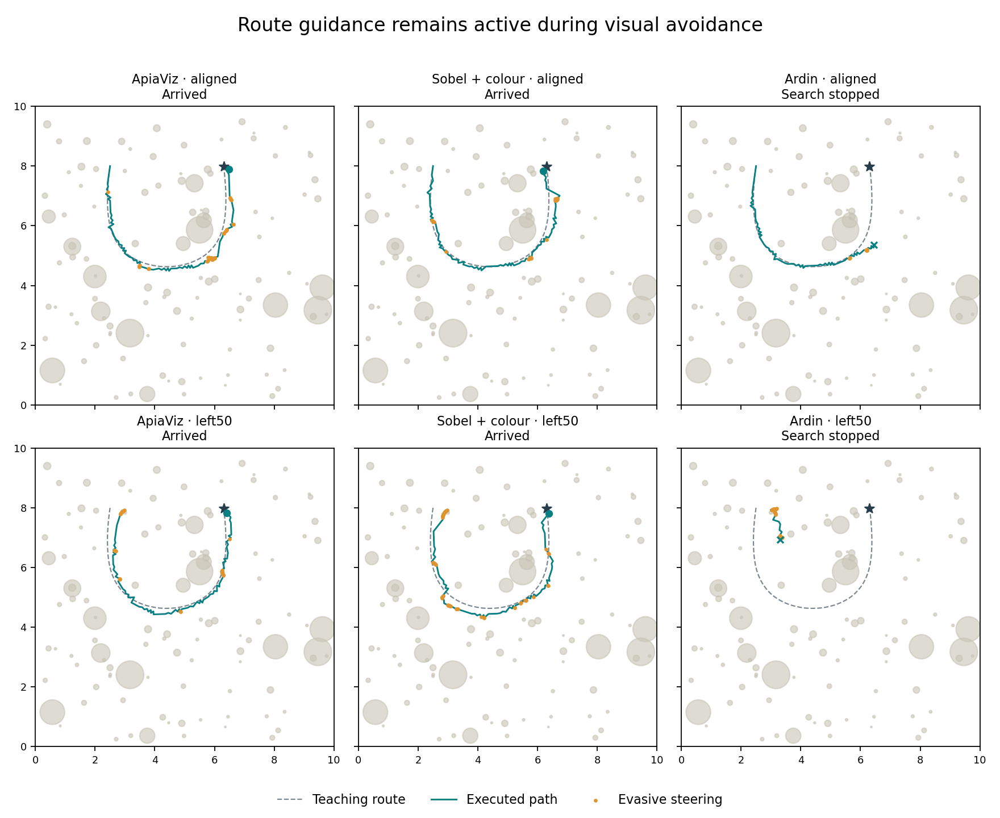

# Keeping route guidance active during obstacle avoidance

The ant now continues to use visual familiarity while steering around an obstacle. It retains its remembered route direction, search phase and progress through a cast. There is no navigator restart or separate waiting period before route guidance resumes.

[Watch the aligned ApiaViz run](apiaviz-aligned.mp4) · [Watch the displaced ApiaViz run](apiaviz-displaced.mp4)



## What changed

The previous implementation treated an evasive movement as invalidating the before/after familiarity comparison. That was too strong: when both images are taken at the same viewing direction, their difference remains useful evidence about the movement actually made. A detour changes the action that produced the observation; it does not erase the observation.

The corrected integration keeps that visual evidence and the existing controller state. It records every commanded substep and their net direction, so a comparison is attributed to the actual combined navigation/avoidance movement. The net-direction calculation is an accounting measure; route steering still comes from the unchanged familiarity policy. Its cast counter advances normally, including during evasive movements.

The obstacle reflex itself is unchanged: it estimates nearby surfaces from consecutive 199 × 51 RGB images, with no depth buffer, obstacle coordinates, labels or contact sensor. The same teaching images, encoder parameters, mushroom-body memories, collision rules and budgets are retained. All extra camera observations and turns are charged.

## Paired development results

| Input | Release | Extra sampling, no evasion | Previous restart | Pause and reacquire | Continuous guidance |
|---|---|---|---|---|---|
| ApiaViz | aligned | Arrived | Time limit | Search stopped | Arrived |
| ApiaViz | left50 | Collision | Time limit | Left field | Arrived |
| Sobel + colour | aligned | Arrived | Time limit | Collision | Arrived |
| Sobel + colour | left50 | Collision | Time limit | Time limit | Arrived |
| Ardin | aligned | Search stopped | Time limit | Arrived | Search stopped |
| Ardin | left50 | Collision | Search stopped | Search stopped | Search stopped |

Arrivals across the six hairpin trials: sampling control **2/6**, previous restart **0/6**, pause/reacquire **1/6**, continuous guidance **4/6**.

The sampling control reproduced the original aligned trajectories to numerical precision, with the same outcomes. Extra sampling alone therefore did not cause the earlier loss of arrivals under these budgets. The steering/handoff interaction mattered. The pause/reacquire alternative was frozen first; the continuous variant was added after its first trial failed. All completed outcomes are retained.

| Continuous-guidance trial | Mean deviation (cm) | Path (m) | Time (s) | Camera observations | Scan bouts |
|---|---:|---:|---:|---:|---:|
| ApiaViz / aligned | 11.4 | 11.70 | 230.6 | 1033 | 25 |
| ApiaViz / left50 | 13.2 | 11.30 | 215.7 | 948 | 18 |
| Sobel + colour / aligned | 8.8 | 11.80 | 226.2 | 962 | 16 |
| Sobel + colour / left50 | 16.4 | 11.20 | 215.7 | 956 | 22 |
| Ardin / aligned | 6.0 | 8.50 | 189.1 | 927 | 22 |
| Ardin / left50 | 75.8 | 1.80 | 52.8 | 233 | 3 |

Deviation is weighted by executed substep length and includes failed trials. A short failed trajectory is not comparable to successful completion simply because its mean deviation is small.

## Additional environment

After the hairpin ApiaViz successes, the unchanged controller was checked on aligned and displaced releases in the existing meander world. This is an additional development-world check, not a held-out benchmark or a new comparison between frontends.

| ApiaViz release | Original controller | Continuous guidance | Mean deviation (cm) |
|---|---|---|---:|
| aligned | Arrived | Left field | 20.9 |
| left50 | Collision | Arrived | 14.9 |

## Interpretation and limits

This is a more coherent functional interaction between visual guidance and obstacle avoidance. It is not a validated neural implementation of ant motor control. Rotations remain finite-rate, stationary turns between short translations. The videos show actual acquired images at four times simulation speed, held between observations; the overhead map is for display only.

A [recent ant-navigation modelling study](https://journals.plos.org/ploscompbiol/article?id=10.1371/journal.pcbi.1012798) supports considering visual direction choice together with exploratory movements. It does not validate these specific motor rules. These runs use one wiring seed and one initial search phase. Broader paired tests across seeds, phases, routes, releases and lighting are still required; no statistical-significance or general-robustness claim is made. Dense 10 cm teaching is unchanged.

Eight new interaction tests and eight existing avoidance tests passed. Independent audits check frozen sources, identical training/memory hashes, collision-free executed segments, all movement/view costs, and the match between logged motor commands and familiarity comparisons. No route coordinates, endpoint bearing or collision feedback enter either policy. The earlier 181-trial study remains separate.

## Reproduce

With the saved hairpin renderer running:

```sh
python -m apiaviz.research.motor_feedback prepare --output apiaviz/output/my-continuous-run
python -m apiaviz.research.motor_feedback run --output apiaviz/output/my-continuous-run
python -m apiaviz.research.motor_feedback report --output apiaviz/output/my-continuous-run
python -m apiaviz.research.route_avoidance_audit --output apiaviz/output/my-continuous-run
python -m unittest discover -s tests -p test_route_avoidance.py -v
```

Use `route_avoidance_experiments prepare --mode sampling_control` or `--mode detour` with separate output directories to reproduce the two new controls. Exact protocols and complete traces are stored in the experiment directories named in `results.json`.
