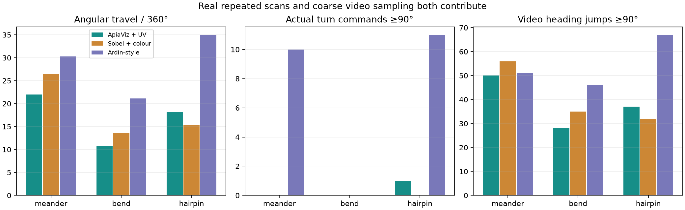
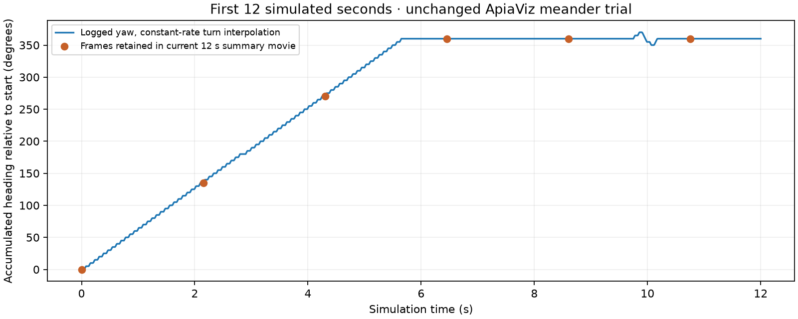

# Excessive scanning: investigation and withdrawal

1 October 2026. Requested after the user saw unnatural large turns in the latest
nine videos. The [independent-review handoff](../HANDOFF_NEXT_AGENT.md) was written
first. The user then explicitly required removal of full-circle scanning.

**The main regression was introduced by the agent's controller change, not by a
requirement of UV sensing.** The latest smoke protocol replaced progressive
±20°, ±60°, ±180° searches with mandatory ±180° searches and halved the angular
spacing from 10° to 5°. This made every broad reorientation a whole-body rotation
through the heading circle, including when the forward image already matched
the memory very well. It was an inappropriate solution to missed narrow peaks.

The videos additionally compress complete trials into 96 sampled frames. This
turns sequences of small, time-accounted rotations into apparent huge jumps.
Both the real scanning behaviour and its presentation need attention. Smoothing
a movie alone would conceal the excessive scanning rather than fix it.

## What is now removed, and what remains unresolved

The active `FamiliarityController` defaults to progressive **±20° then ±60°**
searches. Settings now reject any scan extent above 60°; the special full-circle
acceptance branch is gone. The withdrawn `PanoramicConfirmationController`
constructor raises an explicit error for stale callers. Historical implementations
remain in frozen source archives rather than being silently reinterpreted.

The graded trial factory now proposes `graded-navigation-smoke-v2-bounded`,
uses the bounded search with 5° spacing, and defaults to a fresh output directory.
**No new route trial or environment preparation was launched.** Existing v1
results/videos remain records of the rejected spinning behaviour, not results
for the bounded configuration. Graded vision, UV, memory and physics were not
changed by this removal.

**Validation is not fully green:** after removal, 199 tests ran; **195 passed
and four failed**. The tests enforcing the scan bounds, withdrawn-controller
error, budget handling, local tracking and new protocol pass. Four existing
synthetic navigation checks now fail because the confidence rule relies on
the ability to widen the scan. Their assertions have not been weakened:

- `test_aligned_route_is_not_stopped_for_lack_of_positive_gradient`
- `test_recovery_uses_spatial_signal_for_both_search_phases`
- `test_unannounced_displacement_can_be_recovered_from_observations`
- `test_sampling_control_retains_navigation_and_accounts_extra_views`

For the useful synthetic signal `0.6*exp(-y²/1.2) + 0.3*cos(heading)` and teaching
scale 0.3, a bounded ±60° scan at the correct heading has normalized peak-minus-
median contrast **1 − cos(30°) = 0.133975**, below the unchanged threshold 0.15.
The old whole-circle scan gives much higher contrast. The bounded controller
therefore incorrectly calls this broad useful signal uninformative and stops.
This exposes a dependence of the confidence rule on scan extent; it does not
justify reinstating full-circle scans. Thresholds were not quietly retuned to
make the tests pass. Confidence/search integration is the next unresolved task.

The bounds refer to viewing directions around the scan's reference heading.
They do not cap every avoidance or reference-return motor command at 60° or
establish biological locomotion. Multiple bounded sweeps still accumulate angular
travel, and the evaluator still uses stationary turns between translations.

## Measured turning in all nine v1 trials

Angular travel below is the sum of absolute logged turn angles divided by 360°,
not necessarily the number of uninterrupted circular turns. The commanded-turn
and travel-heading columns distinguish looking around from changing the walking
direction. All source/input hashes and per-trial values are in [results.json](results.json).

| World / model | Equivalent revolutions | Full-circle scans | Single turn commands ≥90° | Walking-heading changes ≥90° | Movie jumps ≥90° |
|---|---:|---:|---:|---:|---:|
| Meander / ApiaViz | 22.0 | 21 | 0 | 0 | 50 |
| Meander / Sobel | 26.4 | 26 | 0 | 0 | 56 |
| Meander / Ardin | 30.3 | 20 | 10 | 7 | 51 |
| Bend / ApiaViz | 10.8 | 9 | 0 | 0 | 28 |
| Bend / Sobel | 13.6 | 12 | 0 | 0 | 35 |
| Bend / Ardin | 21.1 | 20 | 0 | 0 | 46 |
| Hairpin / ApiaViz | 18.1 | 13 | 1 | 1 | 37 |
| Hairpin / Sobel | 15.3 | 12 | 0 | 0 | 32 |
| Hairpin / Ardin | 35.0 | 28 | 11 | 11 | 67 |



ApiaViz's successful meander run never issues a single turn greater than 20°,
yet its movie jumps by as much as 140° between displayed frames. This does not
mean the ant actually starts walking backwards. It physically scans while
stationary, then resumes forward translation. There are genuine large movement
changes in the failed Ardin cases and one in ApiaViz hairpin, so not every large
turn can be dismissed as a display issue.

The preceding same-world, same-phase `navigation-fidelity-v1` Sobel meander run
used **6.3 equivalent revolutions / 12.7 turning seconds / zero full-circle scans**.
The new Sobel run uses **26.4 / 52.9 / 26**, with exactly the same visual encoder,
memory and teaching images. Both arrive, but arrival alone hides this behavioural
regression. Conversely, some prior failed trials had greater angular travel than
the new ones; comparisons of totals must account for different durations and paths.

## Controlled scan replay: same scores, different scan settings

We replayed **161 recorded stationary full-scan score tables**: 43 ApiaViz, 50
Sobel and 68 Ardin. All candidate scans start facing the prior route reference,
use only already recorded scores, and charge observations, turns and a return
to the chosen heading. They do not move or produce new arrival results.

| Model | Full-circle 5°: mean views / angular travel | Progressive 5°: mean views / angular travel | Same selected heading |
|---|---:|---:|---:|
| ApiaViz | 72.26 / 365.47° | 9.00 / 79.42° | 38/43 |
| Sobel | 72.28 / 366.90° | 9.32 / 83.20° | 43/50 |
| Ardin | 72.10 / 409.56° | 13.66 / 123.24° | 38/68 |

These historical progressive counterfactuals still permitted a ±180° final
fallback; they were computed **before** the user's subsequent instruction to
remove it entirely. They isolate the mandatory-circle regression, but are not
claimed as tests of the newly bounded implementation.

At the initial ApiaViz meander view, full-circle scanning requires **73 views,
360° of rotation and 5.65 s** to select the already-forward direction. Progressive
5° scanning chooses the same heading with **9 views, 80° and 0.894 s**. Returning
to 10° spacing alone still requires a full revolution; removing mandatory global
search is the larger motor change.

Not all progressive decisions are equivalent. In the saved ApiaViz bend decision
22, the global best is 45° but progressive 5° scanning accepts 5°. At hairpin
decision 32 it accepts −15° instead of the stronger 45° direction. At decision
42 it accepts 50° locally while the full-circle scores expose the 80°/140° tie.
These are exactly why a naive rollback cannot be advertised as a navigation fix.
Bounded search needs a principled way to extend/check a locally plausible peak
and use sequential evidence without perpetual rotations.

Changing local spacing from 10° to 5° changes the median-based contrast and can
change the support decision. In the selected tables, 9 ApiaViz cases switch from
supported at 10° to rejected at 5°, versus 6 in the opposite direction. The
corresponding counts are 1/10 for Sobel and 2/17 for Ardin. The effect is mixed;
it is not evidence that finer sampling universally causes more scanning.

A smaller numerical issue also exists: float set keys can treat equivalent
−180°/+180° endpoints as different headings, giving 73 rather than 72 views for
some scan origins. This wastes an observation but does not explain whole-body
rotations. The active bounded search no longer requests those full-circle endpoints.

## Why the videos exaggerate the turns

The report uses 8 fps and at most 12 seconds for an entire trajectory. ApiaViz
meander is 204.3 simulated seconds: approximately **17× speed**, with **2.15
simulated seconds between displayed frames**. A 5° turn costs 0.0278 s followed
by a 0.05 s observation. Many such steps disappear between movie frames.

`make_movie` assigns the ant marker the last acquired view's heading. It does
not interpolate turn events, and it samples the path only at recorded movement
endpoints. The whole-body yaw is shared with camera yaw in the current simulator;
there is no independent head-turning model that could make these scans harmless
gaze shifts while the body continues smoothly.



[Watch the unchanged first 12 simulated seconds at 1× speed and 30 fps](../../apiaviz/output/scan-regression-review-v1/meander-first-12s-realtime.mp4).
This diagnostic interpolates logged constant-rate yaw and charged translations,
holds the actual acquired camera images between observations, and makes the real
stationary revolution visible. It is **not a corrected navigation trial** or an
attempt to hide the rotations. All 361 frames decode and the source trace/movie
checksums are recorded in its [provenance](../../apiaviz/output/scan-regression-review-v1/provenance.json).

Historical presentation also differed: `navigation_video.py` held the illustrated
body orientation fixed during candidate-view scans and animated motion separately.
`route_navigation_video.py` used a circular position marker without body orientation
and 4× playback at 12 fps. Those differences could explain part of the user's
earlier visual impression. The exact earlier reference videos are not identified,
and their complete raw pre-UV traces are absent on this workstation. Do not claim
an exact before/after biological motor comparison from those illustrations.

## Handoff priorities and reproducibility

1. Keep full-circle scanning withdrawn. Resolve the bounded confidence failure
   without reinstating it or silently relaxing tests.
2. Separate fine angular sensing from motor search extent, confidence calculation
   and exploration cadence. A 296° panoramic sensor already acquires a broad
   retinal image; any proposal to infer multiple orientations from one exposure
   must validate actual field of view, retinal transformation and information cost.
3. Test angular travel, excursions, reversals, scan frequency, time spent stationary
   and useful travel before declaring movement repaired. Arrival audits alone
   missed the regression. No thresholds for "biological" movement have been fitted.
4. Keep faithful slow diagnostic movies alongside accelerated overviews. Never
   replace body yaw with travel direction to cosmetically hide active scanning.
5. Only then consider a fresh bounded trial protocol, retaining all failures and
   separate provenance. The current graded-v2 protocol is unrun and has known
   confidence failures in synthetic tests.

Analysis source was preserved **before removal** at
`apiaviz/output/scan-regression-analysis-v1/source.zip`, with hashes in its
`manifest.json`. The original trial source is separately preserved in
`graded-navigation-smoke-v1/source.zip`. Current code intentionally rejects their
full-circle settings, so reproduce historical analysis from the archived code,
not by editing frozen manifests to match the new controller.

The analysis commands used before withdrawal were:

```sh
pixi run python scripts/audit_scanning_regression.py
pixi run python scripts/replay_scan_timing.py
```

For a repeat, extract the analysis source to a fresh directory, make the existing
`docs/uv-calibration` available at that extracted root, and invoke those archived
scripts using the project Pixi Python, explicit absolute `--study`/`--parent`
paths and a fresh `--output`. No renderer is needed. Main audit output stores
18 input-trace hashes; source archives retain the exact versions used.

Removal verification: `pixi run test`, log `/private/tmp/bounded-scan-tests.log`.
No study coordinator, renderer or trial worker was launched by this investigation.

## Completed bounded rerun diagnosis

The user subsequently ran `graded-navigation-smoke-v2-bounded`. All nine trials
completed; each model arrived in **one of three**. ApiaViz and Sobel succeed on
meander, Ardin on bend. The agent supplied this command despite the four known
behavioural failures above. Giving a diagnostic caveat did not make that an
adequately validated controller change.

The [complete audit](../bounded-scan-failure-audit-v1/results.json) verifies both
source archives against their frozen manifests, both protocols, 18 input traces,
all nine current checkpoints, and unchanged encoder/memory/teaching fingerprints.
The archived source differences are `familiarity_controller.py`, `graded_smoke.py`
and the withdrawn `panoramic_confirmation.py`. Spectral acquisition, representation,
learned memories, physics and avoidance are unchanged between these two studies.

The first wrong choice is directly visible, before trajectories diverge:

| Scene / decision | Model | Bounded run chooses | Stronger saved match | Complete ±60° control |
|---|---|---:|---:|---:|
| Bend / 22 | ApiaViz | 5° (0.94955) | 45° (0.99427) | 45°, supported |
| Bend / 22 | Sobel | 0° (0.81123) | 45° (0.89133) | 45°, supported |
| Bend / 22 | Ardin | 5° (0.74709) | 45° (0.94900) | 45°, supported |
| Hairpin / 32 | ApiaViz | −15° (0.91692) | 45° (0.99370) | 45°, supported |
| Hairpin / 32 | Sobel | 0° (0.71462) | 45° (0.88170) | 45°, supported |

Scores are cosine familiarity, not probabilities; compare headings within each
model. All five decisions occur at equal saved positions, and shared heading
scores agree within 1e-6 between studies. The bounded controller accepts a local
peak within its initial ±20° sweep, so it never looks toward the stronger match
at 45°. The restricted replay calls the unchanged controller with extent 60°,
using only previously recorded scores inside that range. It selects 45° in all
five cases. No circle scan, new exposure, new rendering or route/nest coordinate
is used by the replay policy. Position equality is evaluator-side verification.
This does **not** establish that a new whole-route trial would arrive, nor justify
forcing a large sweep on every movement. Ardin's bend run eventually arrives
despite the same initial missed turn.

The confidence defect is additional, not a complete explanation of the failed
trials. ApiaViz bend and hairpin eventually terminate on low-contrast scans
(0.1044 and 0.1026 against 0.15), after earlier edge/ambiguity rejections and route
departure. Both have zero blocked proposals. Their first wrong corner decisions
were actually labelled **supported**. Therefore simply lowering the confidence
threshold cannot be presented as the fix: it could make premature acceptance
more frequent. Separately, the simple smooth-heading tests still reproduce false
`uninformative_views` on useful fields because the median contrast depends on
angular coverage. The targeted suite has 10/13 passing, with the same aligned,
lateral-recovery and displacement failures. Tests were not weakened.

Physical turning also remains broken outside `_scan`. Sobel bend has **179 actual
turn commands of at least 90°**, with maximum 180°, and 102 changes of at least
90° between consecutive locomotion commands. Of its 120 blocked movements, two
are rock contact and **118 are field boundary**. Ardin meander has 106 blocks
(two rock, 104 boundary); Ardin hairpin has 59 rock blocks. The protected physics
keeps rejecting these movements and the runs continue to their normal budgets.

`VisualStallRecovery.moved` releases recovery after 6 cm of commanded movements
whose images changed. `CoherentAvoidance.choose` handles an active recovery before
its ordinary passing-side entry logic. When no entry direction was established,
release can immediately return to the old route command. In the saved Sobel bend
trace there are repeated retreat/return sequences at the boundary: the camera
detects stagnation, the animal turns away, recovery releases, and route following
points back into the same boundary. Fifteen recovery exits change the following
locomotion heading by 180°. These are real motor decisions, independently of the
accelerated movie. The boundary is not necessarily a visible physical barrier;
its recovery logs must not be described as successful rock perception.

The repair therefore needs distinct behavioural checks: corner acquisition within
bounded gaze, confidence that does not change merely because the sampling extent
changes, and sustained visually guided recovery without repeated retreat/return.
Full-circle search is still withdrawn. Fixed-pose success is only a diagnostic;
do not promote another trial protocol until the existing behavioural failures and
the saved corner/recovery cases have been addressed. No production policy or
historical result was changed during this audit.

Reproduce using fresh output (the default preserves the recorded audit):

```sh
pixi run python scripts/audit_bounded_scan_failures.py --output /private/tmp/bounded-scan-audit-FRESH
pixi run python -m unittest discover -s tests -p test_familiarity_controller.py -v
```

The first command verifies recorded data and bounded decisions; the second
currently reproduces the three known familiarity-controller failures.
