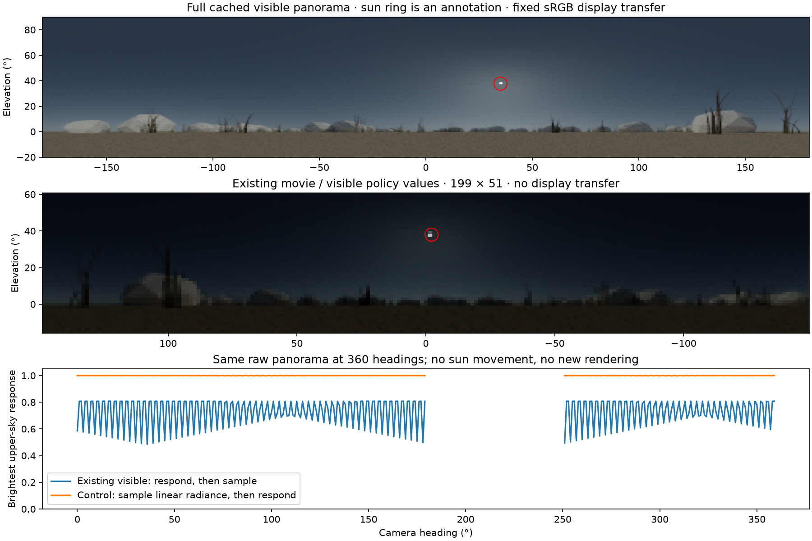
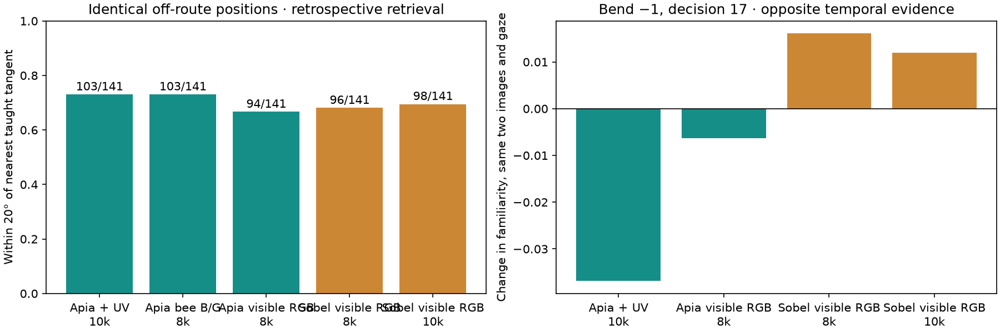

# Sun visibility and the ApiaViz/Sobel gap

1 October 2026. Cache-only investigation; no new navigation trials or renders.

The earlier report did not adequately distinguish a useful visual representation
from a controller that uses it effectively. It also understated how much the
spectral migration changed the appearance and surface detail of the scenes.
This audit checks those issues directly rather than treating arrival counts as
an explanation of the underlying mechanism.

## The sun is present, but its presentation and sampling are poor



All nine checked acquisitions contain their brightest visible source at azimuth
34.875°, elevation 37.674°, consistent with the configured 35°/38° sun and the
480 × 144 panorama's pixel centres. This is measured from raw numeric arrays,
not inferred from the scene configuration. The disk becomes a tiny bright mark
in the 199 × 51 policy image. Its azimuth can also lie outside that image's
296° field of view. The upper picture applies a fixed, explicitly labelled
sRGB display transfer after the fixed response. The middle picture retains the
values used by the existing visible policy/movie. Red rings are annotations;
neither rings nor display transforms are model inputs.

The existing movie displays the bounded camera response directly, with no
display transfer, making the landscape look much darker than the earlier AgX
Blender presentation. Its UV false-colour panel also uses a different display
half-response (0.2) from the encoder's response (1). It is not an image of the
actual encoded UV values. These are presentation differences, not evidence
that illumination was turned off.

There is also a scientific sampling mismatch. Visible input applies the response
before retinal interpolation; ApiaViz applies it afterwards. Holding the raw
panorama fixed and varying camera heading through 360 one-degree increments,
the brightest upper-sky visible response ranges from **0.485 to 0.808** while
the sun is safely inside the field of view. Sampling linear radiance first and
then applying exactly the same visible response gives **0.997 to 1.000**.
All nine checked positions give the same ranges because they use the same sky
and recall sampling seed. This is one replicated deterministic sky condition,
not nine independent validations of the atmosphere. The sweep excludes headings
within 3° of the field's solar boundary. Neither order establishes a calibrated
compound-eye acceptance function; angular integration still needs validation.

The comparison does **not** show that dimming of the sun explains ApiaViz's lower
arrival count. ApiaViz already uses the latter ordering. The mismatch must be
controlled before attributing changes to the frontend alone.

Source/history checks also distinguish two renderer paths:

- `terrain_concepts.setup_light_camera` uses a Blender directional SUN and sky,
  but explicitly sets `sun_disc=False`. Illumination and a visible solar disk
  are different settings.
- `scripts/uv_mitsuba/render.py` uses native spectral `sunsky`; the raw arrays
  demonstrate that its solar source is visible. The recent controller fixes
  did not remove it.
- Current trials provide intensity only. They do not supply polarization or a
  dedicated solar compass to ApiaViz. The optional polarization prototype is
  separate and uncalibrated.

## A real loss of scene detail during the spectral migration

`scripts/uv_mitsuba/export_scene.py` exports evaluated triangle geometry grouped
by material. It does not export the Blender shader graph. The spectral renderer
replaces every group with a two-sided diffuse surface and a spatially uniform
measured proxy spectrum. Consequently the procedural colour variation, shader
bump normals, roughness response and leaf translucency from
`terrain_concepts.material` are absent from the spectral trial images. Several
previously distinct material groups also share a proxy spectrum.

This is a real fidelity reduction relative to the earlier Blender appearance,
although it was an explicit prototype simplification, not a recent deletion of
the ApiaViz neural stages. It was insufficiently validated before navigation
was built on it. The previous rock audit already shows smooth frontal rock
surfaces with inadequate optical-flow evidence. Removing texture is a plausible
contributor to that limitation; its causal effect has not been isolated with
matched material renders. It cannot alone explain the model ranking because
all three methods share this geometry/material renderer and visible avoidance.

The appropriate repair is a versioned spectral material/export extension with
documented geometry, normal/texture and transmission assumptions, checked
against the prior scene. Simply colouring the scientific arrays like the old
PNG would not restore the lost surface information or justify invented UV
reflectance variation.

## What the same-position comparison actually says

The audit uses both models' completed v3 trajectories: all three worlds and
both phases, first 20 macro endpoints, every tenth later endpoint and the final
endpoint. Each representation sees every selected position at the same 36
headings. There are 352 records and **248 distinct positions**, after deduplicating
world, the camera's canonical position and nearest teaching station. No new
images are rendered. All teaching banks are retained, with learning repeated
only for explicitly labelled diagnostic encoders.

| Representation | Within 20° of route tangent, ≤5 cm from route | Within 20°, farther from route |
|---|---:|---:|
| Trial ApiaViz + UV, 10k KCs | 107/107 | 103/141 |
| Same ApiaViz, visible streams only, 8k KCs | 107/107 | 103/141 |
| UV stream only, 2k KCs | 104/107 | 69/141 |
| ApiaViz linear colour on baseline RGB, 8k KCs | 107/107 | 94/141 |
| Sobel on the identical RGB, 8k KCs | 107/107 | 96/141 |
| Trial Sobel on baseline RGB, 10k KCs | 107/107 | 98/141 |

The two 8k RGB controls share exact projection matrices, population allocation,
latency circuit, images and teaching memory procedure. Sobel receives no UV
input. The remaining comparisons deliberately expose sensory and allocation
differences and are not isolated frontend comparisons.

Adding UV helps four off-route positions and hurts four relative to reading
ApiaViz's visible streams alone; 99 succeed under both and 34 under neither.
Thus this diagnostic does not demonstrate a net UV benefit. It also contradicts
the simple explanation that ApiaViz's lower arrival count is caused by worse
angular retrieval everywhere. These are correlated development observations,
not independent trials or held-out evidence. Correct route tangent is only an
orientation diagnostic: it is not necessarily the inward direction needed to
recover from a lateral displacement.



## Where the policies first disagree

The second audit locates the first state/movement disagreement for all six
world/phase pairs. For each pair, the two positions used for the temporal
comparison are identical between models. Re-encoding reproduces all 12 logged
before/after familiarity pairs within 0.000002. This is direct evidence from
the inputs that produced the decisions, not an attribution from later paths.

The clearest example is bend, phase −1, decision 17:

| Readout on the same two positions and gaze | Familiarity change |
|---|---:|
| Trial ApiaViz + UV | −0.03688 |
| Its visible streams alone | −0.02895 |
| ApiaViz linear colour on baseline RGB, 8k | −0.00636 |
| Sobel on the identical RGB, 8k | +0.01611 |
| Trial Sobel, 10k | +0.01198 |

The sign disagreement persists with identical RGB and identical wiring, so
neither UV input nor KC count alone explains it. Separate-stream readouts
implicate the form response: matched-RGB ApiaViz form changes by −0.01567 while
Sobel form changes by +0.02963. UV-only familiarity falls by −0.06355 in the
trial input. Stream-only maxima may select different stored views, so these
numbers must not be summed as additive contributions to the joint score.

The ant is only **3.42 cm from the taught route** at this decision. A full angular
check of the same cached image selects the correct 0° tangent with a supported
peak under both models. However, the controller is casting, having forced
exploration at movement 12. It acts on the temporal change: ApiaViz commands a
100° reversal, from +40° to −60°; Sobel continues +40°. The meander phase −1
pair similarly first diverges during casting at decision 17. These branch
differences subsequently change the images acquired and all later comparisons.
Neither the sign of familiarity change nor Sobel's eventual arrival proves that
an individual cast points towards the route.

This identifies a concrete controller/representation interaction. The policy
assumes familiarity changes are reliable progress signals, despite a changing
best matching view and different spatial responses. Its forced cast can ignore
a useful direction that is present in memory. The previous selected meander
control, which charges for a directional check before scheduled casting,
reaches the nest in both phases with the **same encoder and memory**. That is
interventional evidence for this mechanism in meander; it is not validation
across all worlds or after rock avoidance.

The preferred linear-colour ApiaViz implementation, hex sampling, local
adaptation, ON/OFF/low-pass form and seeded spiking projections are still present.
The earlier original/oriented/linear variants remain available. Reviewing
`c0a4ba0..HEAD` shows no removal of those original numerical backbone operations
in `modules.py`; the UV class explicitly uses the preferred linear-colour
variant. The earlier 29 September result favoured linear colour for mean route
deviation, but had 29/40 arrivals for both linear ApiaViz and Sobel. It did not
establish that adding UV must increase arrival rate in these different scenes.

## Consequences for the next validation

The next comparison needs the same confirmed-exploration controller for every
model, a common retinal response/integration convention, and a scene-fidelity
check before expanding the matrix. Surface detail and camera-only avoidance
need their own matched tests. UV should then be evaluated through paired on/off
controls on complete routes and displacement recovery. Angular retrieval alone
is insufficient, and the existing arrival results do not establish a UV benefit.
No model has been changed or selected here to obtain a preferred ranking.

## Reproduction and verification

```sh
pixi run python scripts/audit_sun_and_matched_views.py --output apiaviz/output/sun-matched-audit-FRESH
pixi run python scripts/audit_first_divergence.py --output apiaviz/output/sun-matched-audit-FRESH/first-divergence.json
pixi run python scripts/summarize_sun_matched_audit.py --source apiaviz/output/sun-matched-audit-FRESH --output docs/sun-matched-audit-FRESH
pixi run test
```

Use fresh paths. The completed raw diagnostic is
`apiaviz/output/sun-matched-audit-v2/`; v1 stopped on a missing cache entry before
writing results and is not a completed analysis. The corrected runner uses the
independent acquisition cache for the nine solar probes. No trial, frozen
protocol, teaching image, model checkpoint or old movie was overwritten.

[summary.json](summary.json) contains deduplicated results, solar sweeps, all six
first disagreements and hashes. The full diagnostic retains all 352 angular
score curves and source archive. The presentation corrects the diagnostic
figure's horizontal axis after its photograph flip; this affects annotations
only. All **278 input hashes** were verified, matched RGB wiring was asserted
equal, and the standard **168 tests pass** (8.87 seconds). The camera-only
information boundary and production model/controller defaults are unchanged.
