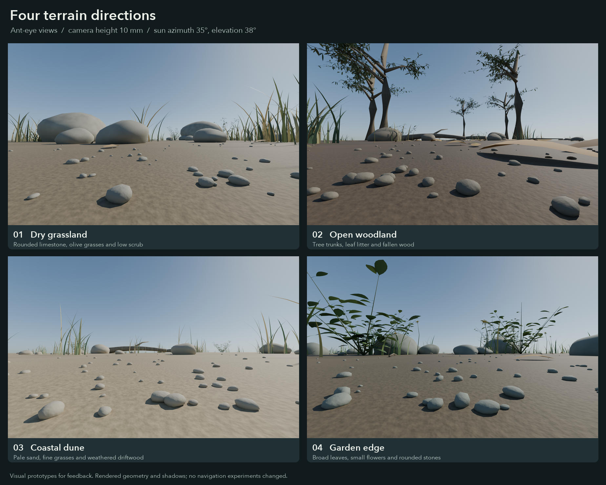

# Terrain concepts for feedback

Four procedural 3D environments, rendered from a camera **10 mm above the
ground**. These are visual proposals; they have not replaced the Ardin world
or been used in a navigation evaluation.



| Concept | Main view | Navigation panorama | Main ingredients |
|---|---|---|---|
| 01 · Dry grassland | [PNG](01-grassland.png) | [PNG](01-grassland-panorama.png) | Rounded limestone, olive/straw grasses and low scrub |
| 02 · Open woodland | [PNG](02-woodland.png) | [PNG](02-woodland-panorama.png) | Trunks, branching canopies, curled leaf litter and fallen wood |
| 03 · Coastal dune | [PNG](03-dune.png) | [PNG](03-dune-panorama.png) | Pale sand, fine dune grasses, pebbles and weathered driftwood |
| 04 · Garden edge | [PNG](04-garden.png) | [PNG](04-garden-panorama.png) | Broad green leaves, small ivory/yellow flowers and rounded stones |

The main images are **1800 × 1125 perspective views**, with a 100° horizontal
field of view, intended for inspecting the terrain. The **1776 × 450 panoramas**
use the current navigation system's 296° horizontal field and elevations from
−15° to +60°. Neither export is the model's 74 × 18 sensory input. They are
viewing renders for choosing a terrain direction before integration.

## Geometry, colour and light

The scenes use solid, smoothly deformed stones; curved, tapered grass blades;
folded leaves; attached stems and twigs; branches and trunks; fine ground grains;
and a gently uneven ground surface. Material colour and small-scale bump vary
with 3D position. The colours are earth, stone, bark and foliage palettes, with
ivory/yellow flowers in the garden scene. No random purple landmark colouring
is used.

All four share an explicit sun at **azimuth 35° and elevation 38°**, with the
same intensity and angular diameter. Azimuth is measured counterclockwise from
world +X; the camera faces +Y and +Z is up. The sky model uses the same sun
direction. Illumination includes cast shadows, contact shadows, sky light and
indirect light from the path tracer. Leaf materials include a small translucent
component. Depth of field is disabled so blurring does not hide distant visual
landmarks.

The images are rendered from actual geometry using Blender Cycles. No generated
background pictures, external asset packs or photographs are used. The
materials are procedural RGB approximations, not measured spectral reflectances.

Geometry is seeded independently of lighting. Each scene has an editable
`.blend` file and a JSON sidecar with its seed, camera and lighting settings.
Changing the sun can therefore leave the terrain and material assignments
fixed. A sun-direction navigation experiment has **not** been run here.

## Reproduce

From the repository root, using the installed Blender 5.2.2:

```sh
blender --background --factory-startup --python apiaviz/research/terrain_concepts.py -- --scene all --panorama
.pixi/envs/default/bin/python docs/terrain-concepts/build_comparison.py
```

Use `--scene grassland`, `woodland`, `dune` or `garden` for a single concept.
`--draft` produces smaller inspection renders. The current script selects the
Metal device when available, with a CPU fallback. On this Mac Blender needs
access to Metal outside the execution sandbox, even when run headlessly.

The initial drafts are excluded from the gallery. [The export manifest](manifest.json)
records the final PNG dimensions and file hashes, editable scenes, renderer
source hash and the common lighting settings.
