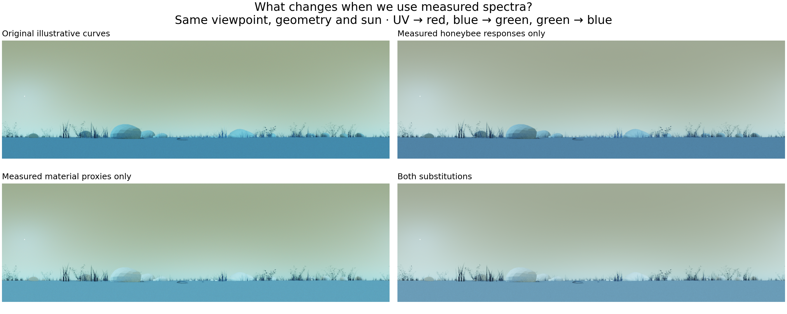
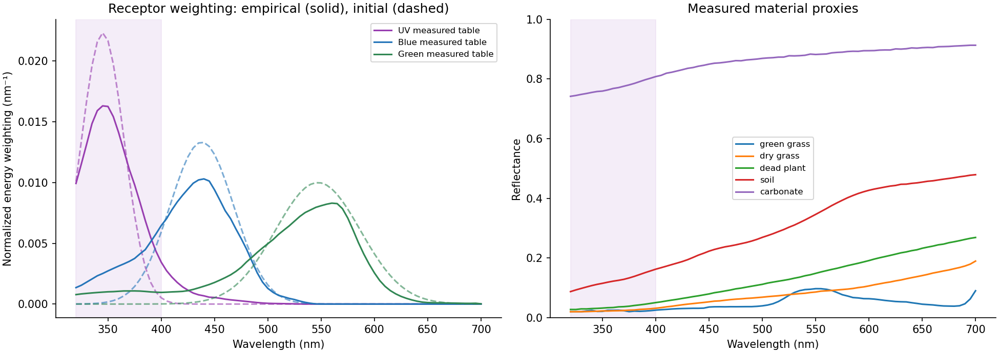
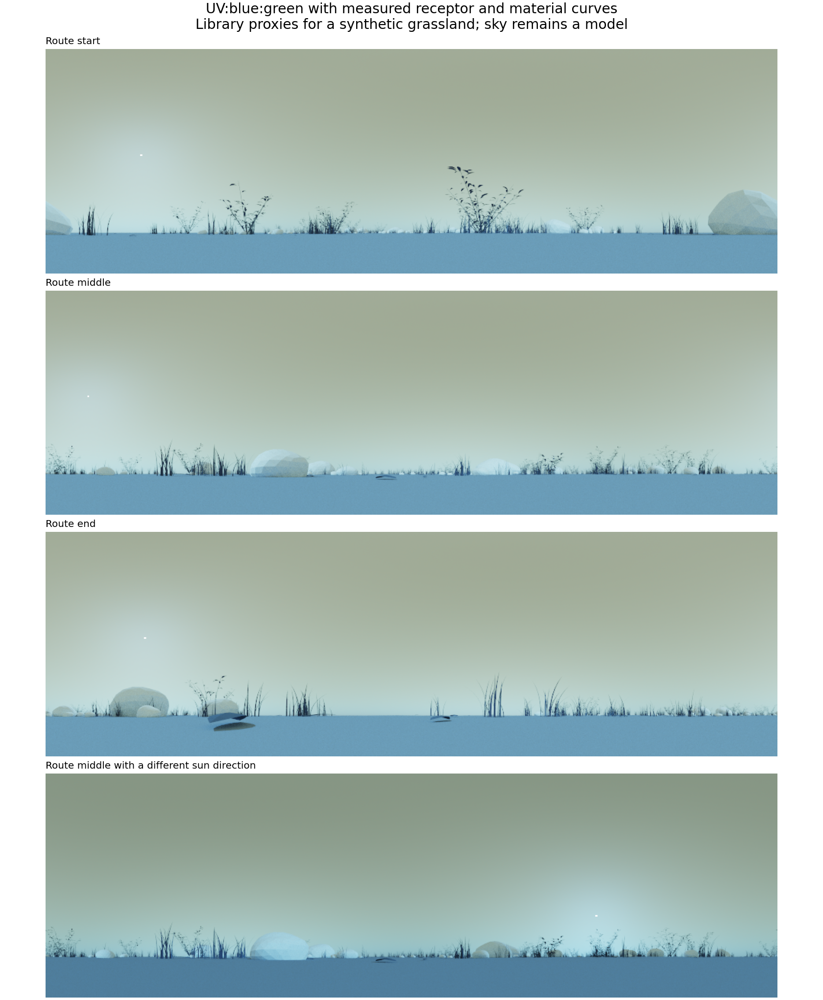

# Empirical spectral calibration: first pass

30 September 2026 · Honeybee UV, blue and green receptors · Mitsuba 3.9.1

We replaced the illustrative receptor curves and material colours with published receptor data and measured reflectance spectra. This makes the inputs traceable to measurements. It does **not** establish that our synthetic grassland reproduces a particular real habitat: the materials are library proxies, and the atmosphere and polarization still need field validation.

The useful finding is that UV still separates sky from terrain in this scene, although the initial illustrative spectra gave considerably stronger separation. We have not run navigation experiments with these new inputs. Nothing was fitted to navigation success, route error or image appearance.



Each panel has the same camera, geometry, sun position and display exposure. The display maps UV receptor output to red, blue to green, and green to blue. These are false colours, not a depiction of an insect's subjective colour experience.

## What changed

| Component | Initial prototype | This calibration |
|---|---|---|
| Receptors | Three Gaussian curves | Published honeybee sensitivity tables distributed by pavo, attributed there to Peitsch et al. (1992) |
| Materials | Hand-selected spectral reflectances | Five measured USGS library samples, assigned to the scene's 12 material groups |
| Illumination | Spectral sunsky model, turbidity 2.5 | Same model and turbidity; ground-albedo input follows the selected soil spectrum |
| Surface scattering | Two-sided Lambertian reflection | Unchanged; no leaf transmission, gloss or measured angular reflectance |
| Polarization | Analytic Rayleigh approximation, maximum degree 0.75 | Uncalibrated; not used in these intensity renders |
| Navigation | Existing RGB trials | Unchanged and separate from this study |

The receptor curves come from a pinned pavo revision, whose release notes explicitly describe replacing its earlier modelled bee sensitivities with empirical data. These are processed, tabulated literature curves, not the original electrophysiology recordings. Their maxima occur at 345, 437 and 557 nm in this table; we use the table rather than move its peaks to textbook values. See the [source and decision record](SOURCES.md).



## Material assignments

| Scene material | Measured library sample | Interpretation |
|---|---|---|
| Grass 0 and 2 | Lawn_Grass GDS91 green | Green-grass proxy; both groups use the same measured curve |
| Grass 1 | Cheatgrass ANP92-11A | **Dry** leaves, stems and seeds, according to the primary sample description |
| Grass 3; litter; weathered twigs | Tumbleweed ANP92-2C Dry | Dead-plant proxy; not a measurement of grass straw, litter or wood from this scene |
| Scrub stems | Cheatgrass ANP92-11A | Dry-vegetation proxy; woody-stem identity is unresolved |
| Grassland earth | Stonewall Playa CU93-52A a11 | Soil/sediment proxy; moisture and mineral composition are not matched to a site |
| Limestone | Calcite CO2004 | Carbonate proxy; the sample contains minor quartz. A bright mineral sample does not establish the reflectance of weathered limestone rocks |

There are no fitted colour multipliers. Several visually different groups now share a measured spectrum. The result therefore also changes the earlier, invented variation between material groups. A future site-specific calibration should replace these assignments with measured local samples, rather than treat this palette as universal.

All selected samples cover 320–700 nm. The green-grass spectrum has three invalid points near 407–411 nm. We bridge that short interval by linear interpolation between valid neighbours, separated by 7.70 nm, and record it in the manifest. No selected material requires UV extrapolation. Other selected curves have no invalid points in this interval.

## From spectra to an image

The renderer transports spectral energy. For each receptor we interpolate its relative sensitivity, multiply by wavelength to convert energy weighting to photon weighting, and normalize the resulting curve to unit area over 320–700 nm:

\[
w_i(\lambda)=\frac{\lambda S_i(\lambda)}{\int_{320}^{700}\lambda S_i(\lambda)\,d\lambda},\qquad
C_i=\int_{320}^{700}L(\lambda)w_i(\lambda)\,d\lambda.
\]

The common photon-conversion constant cancels in this normalization. The outputs are relative, band-weighted radiances; they are **not absolute receptor photon catches**. Receptor abundance, absolute gain, eye optics, adaptation and neural noise have not been calibrated. The UV receptor is not a hard ultraviolet filter: this empirical response table retains a visible-wavelength tail.

The pavo table spans 300–700 nm, but the native sunsky model begins at 320 nm. Before truncation, the fraction of the wavelength-weighted sensitivity integral below 320 nm is 12.12% for UV, 1.82% for blue and 1.30% for green. These are flat-spectral-energy sensitivity fractions, **not estimates of missing response to natural daylight**. Real losses depend on the unmodelled short-wavelength radiance. No extrapolated sky radiance is added.

Material spectra and response functions use a regular 5 nm grid. Each render contains 960 × 294 pixels × 3 channels, covering 360° in azimuth and elevations from +90° to −20°. The camera sits 1 cm above the exported terrain. The same 430,922-triangle scene and three route viewpoints from the earlier prototype are reused. These panoramas have not yet been downsampled or encoded by apiaviz.

Raw `.npy` arrays and `.exr` files retain linear channel values. PNGs use one common exposure and the display curve recorded in [display.json](display.json); there is no per-image white balance or independent channel scaling.

## Render diagnostics

We rendered the four receptor/material combinations at the middle viewpoint, then the fully substituted model at the route start, end and a second sun position. An eighth render repeats the middle view with an independent Monte Carlo seed.

| Middle viewpoint | UV sky/terrain | Blue sky/terrain | Green sky/terrain |
|---|---:|---:|---:|
| Initial curves | 9.20 | 3.36 | 1.29 |
| Measured receptor table only | 7.31 | 3.59 | 1.54 |
| Measured material proxies only | 4.41 | 2.08 | 0.93 |
| Both substitutions | 3.75 | 2.20 | 1.08 |

These are ratios of solid-angle-weighted mean radiance in sky and terrain regions, identified by ray intersections. Sky excludes the immediate solar vicinity, the horizon strip and the zenith. They are descriptive image diagnostics, not recognition accuracy, a navigation benchmark, or a statistical test of biological performance. Because the soil also supplies the sky model's ground-albedo parameter, the material substitution includes that illumination feedback.

For these proxies, the material substitution changes UV separation more than the receptor substitution. The original palette should therefore not be used as evidence for the size of a UV navigation advantage. The calibrated candidate still has higher sky/terrain separation in the UV receptor band than in blue or green at this viewpoint. That supports testing the cue, while leaving its behavioural benefit unresolved.



The [individual channels](channels.png), [numerical diagnostics](diagnostics.csv) and [validation results](validation.json) are saved alongside this note.

## Checks performed

- Both downloaded spectral-library files match their published release checksums. The 24 archived sources have individual SHA-256 records.
- Three selected v7 spectra were independently compared with primary USGS v5 ASCII files for the same samples: 169 in-band points per sample agree within 0.0000005 reflectance units. This checks the transfer through the third-party library mirror; it does not independently validate the original measurements.
- Missing UV coverage and oversized internal gaps are rejected. Reflectances, response ranges and normalization are checked.
- A constant spectral emitter gives each normalized channel a value within 0.00061 of one. Removing input below approximately 400 nm matches independently integrated predictions within 0.00062. The nonzero remaining UV receptor response follows the empirical curve's visible tail.
- The unmodified control reproduces the previous saved middle-view render exactly. Across the two calibrated sampling seeds, regional mean channel radiances change by at most 0.025%. This checks Monte Carlo stability of these means, not material uncertainty or pixel-level convergence.

## What remains empirical work

The next measurements that would materially improve this model are UV–visible reflectances of local green plants, dry plants, bark, soil and whole rock surfaces, including multiple specimens and moisture states. Those measurements should replace the five proxy assignments. Directional reflection and leaf transmission are separate measurements; a single reflectance curve cannot recover them.

The atmospheric radiance and UV polarization need their own calibration. The public Poughon et al. sky dataset provides useful RGB polarization measurements, but not a UV channel. We archived its documentation and did **not** use its RGB measurements to invent a UV polarization gain. Prague sky coefficients are based on atmospheric simulation and would be a modelling improvement, not empirical calibration by themselves.

A defensible follow-up is to acquire co-registered UV/blue/green sky radiance and UV polarimetry with known sun direction, time, viewing direction, instrument response and reference calibration. Fit atmospheric and polarization parameters on some sessions, then assess intensity, degree of linear polarization and polarization angle on held-out sessions with different sun elevations. Angle errors need to be evaluated modulo 180° and omitted where polarization is too weak to define an angle reliably. Keep the fit independent of navigation outcomes.

Until then, the accurate description is **“a spectral renderer using empirical honeybee responses and measured material proxies, with modelled illumination.”** It is not yet a fully field-calibrated insect visual environment.

## Reproduce and locate the work

Run these commands from the repository root. Dependencies are isolated in the existing UV-rendering environment, leaving the environment for the navigation suite unchanged.

```sh
uv pip install --python apiaviz/output/uv-mitsuba/venv/bin/python mitsuba==3.9.1 drjit==1.5.0 numpy==1.26.4 pandas==2.2.3 rdata==1.1.0 xarray==2024.11.0 pyarrow==21.0.0
apiaviz/output/uv-mitsuba/venv/bin/python scripts/uv_mitsuba/fetch_calibration.py --manifest docs/uv-calibration/sources.lock.json
apiaviz/output/uv-mitsuba/venv/bin/python scripts/uv_mitsuba/calibrate.py
apiaviz/output/uv-mitsuba/venv/bin/python scripts/uv_mitsuba/render_calibrated.py
apiaviz/output/uv-mitsuba/venv/bin/python scripts/uv_mitsuba/validate_calibration.py
apiaviz/output/uv-mitsuba/venv/bin/python scripts/uv_mitsuba/calibration_figures.py
```

The environment and geometry export are described in [the original UV prototype](../uv-mitsuba/README.md). Rendering uses two CPU threads, 128 samples per pixel and seeds 20260930 and 20260931. The primary source files, converted full spectra, linear renders, masks and per-render metadata live under `apiaviz/output/uv-calibration/`. The compact curves, manifest, validation and figures are also saved here in `docs/uv-calibration/` so the research record is not dependent on the render cache.

The original rendering functions are temporarily supplied different spectral callbacks inside the new runner; their files and original outputs are unchanged. Each new render records geometry, calibration and relevant script hashes. Source download times are recorded separately from content hashes; a fresh download can change metadata timestamps without changing the spectra.

See [SOURCES.md](SOURCES.md) for citations, source choices and exclusions, and [DECISIONS.md](DECISIONS.md) for the session record.
