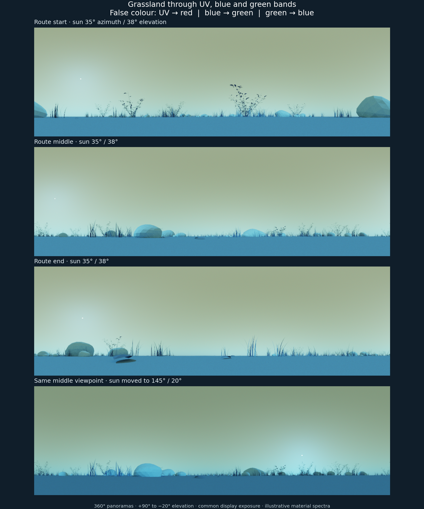
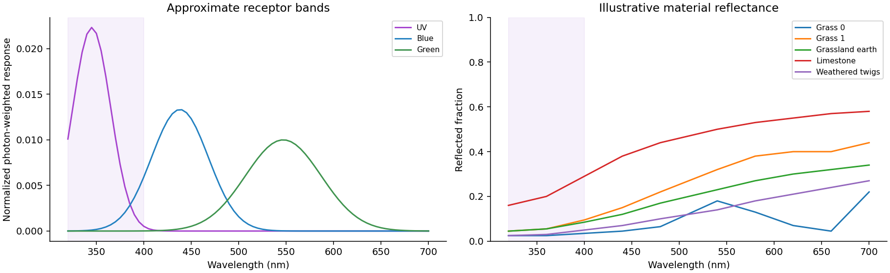
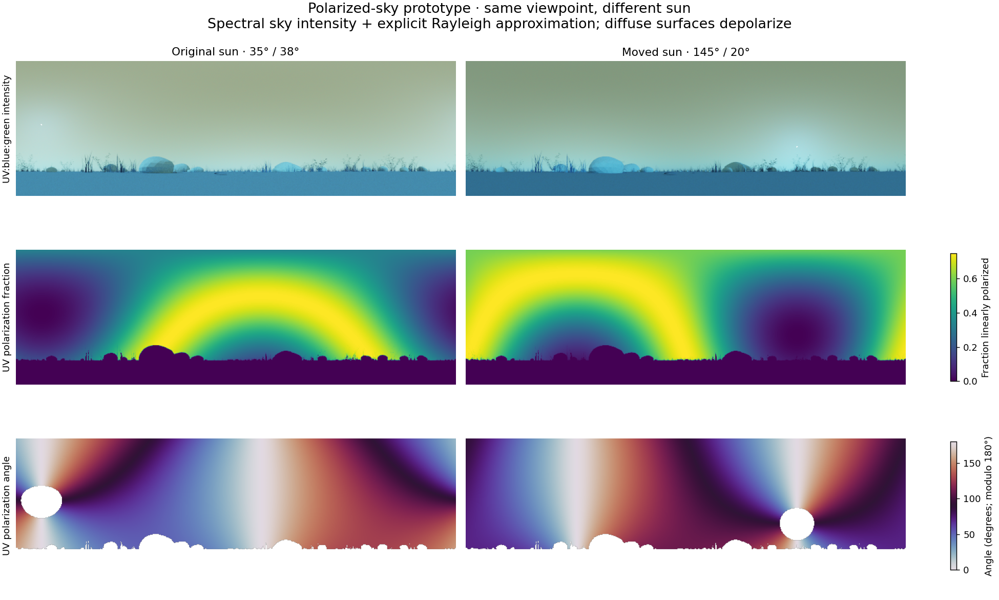

# UV, blue and green panoramas with Mitsuba

**Follow-up, 30 September 2026:** [Empirical receptor and material-proxy calibration](../uv-calibration/README.md) provides measured spectral inputs, controlled comparisons, source records and reproduction commands. The illustrative prototype below is retained as the original reference.

Four spectral panoramas have been rendered from the grassland geometry used by the navigation experiments. They show the route start, middle and end, followed by the middle viewpoint with a different sun position. A second set demonstrates how a modelled sky polarization pattern changes with the sun.

The display mapping is **UV → red, blue → green, green → blue**. These are false-colour visualizations of receptor-band signals, not a claim about the subjective colours an insect sees. All images use the same display exposure and channel gains.



[Start](01-route-start.png) · [Middle](02-route-middle.png) · [End](03-route-end.png) · [Moved sun](04-middle-sun-shift.png) · [Separate channels](channels.png)

## What was rendered

The saved Blender scene was read and exported without changing it. Its evaluated geometry contains 430,922 triangles grouped into 12 materials. The cameras sit 1 cm above the terrain at three teaching-route positions. Each panorama spans 360° horizontally and elevations from +90° to −20°; this includes more sky than the current navigation input so that the polarization pattern can be inspected.

Mitsuba 3.9.1's spectral path tracer and Hošek–Wilkie `sunsky` emitter provide wavelength-dependent sunlight, skylight, shadows, occlusion and diffuse interreflection. The standard sun is at azimuth 35°, elevation 38°; the fourth image uses 145° and 20°. Turbidity is 2.5 in both cases. The sky uses the same illustrative soil spectrum as its ground-albedo input. The emitter is documented in [Mitsuba's source](https://github.com/mitsuba-renderer/mitsuba3/blob/v3.9.1/src/emitters/sunsky.cpp).

The sensor uses `specfilm`, which supports arbitrary spectral response functions without reducing them to human RGB sensitivity. Spectra cover 320–700 nm. Three Gaussian bands have peaks at 344, 436 and 544 nm, with standard deviations 20, 30 and 40 nm. Their peak locations are motivated by honeybee photoreceptors; the Gaussian shapes are approximations, not measured sensitivity curves. Each is photon-weighted and normalized to unit area. The UV tail below 320 nm is omitted. These outputs are relative band responses, not absolute photon counts or calibrated neural excitation. See [spectral-film documentation](https://mitsuba.readthedocs.io/en/latest/src/generated/plugins_films.html#spectral-film-specfilm) and the photoreceptor background in [this honeybee colour-discrimination study](https://pmc.ncbi.nlm.nih.gov/articles/PMC3498261/).

The intensity images have 960 × 294 pixels and 128 samples per pixel. Floating-point receptor outputs are retained as `.npy` and multichannel `.exr` files under `apiaviz/output/uv-mitsuba/renders/`. PNGs use a shared Reinhard-like compression followed by display gamma; the numerical data have no display transform. Exact exposure is recorded in `display.json`.

## Material assumptions

The largest empirical limitation is material calibration. The UV reflectances of the particular grasses, litter, limestone and soil have not been measured. Explicit, smooth illustrative spectra replace Blender's RGB shaders. Living foliage is assigned low UV reflectance and a green reflectance peak; dry foliage and mineral surfaces use different curves. These are documented hypotheses, not measurements inferred from RGB.

Surfaces are two-sided Lambertian reflectors. Procedural RGB texture and bump shaders, leaf transmission, glossy surface polarization and fluorescence are not represented. The geometric silhouettes are preserved, but surface appearance is simplified. Consequently, the images demonstrate a functioning spectral pipeline, not a validated spectral reconstruction of real grassland.



## Polarization experiment

Mitsuba supports Mueller–Stokes polarized transport, but its stock emitters are unpolarized and its standard volume phase functions do not simulate polarized atmospheric scattering. A native `sunsky` therefore does not supply an insect's sky compass simply by selecting a polarized variant. [Mitsuba polarization documentation](https://mitsuba.readthedocs.io/en/latest/src/key_topics/polarization.html)

For the demonstration, a custom emitter retains `sunsky` spectral intensity and adds an analytical Rayleigh angular polarization field. The electric-vector direction is perpendicular to the sun–view scattering plane. The degree of linear polarization is `0.75 sin²(theta) / (1 + cos²(theta))`; theta is angular separation from the sun. The direct solar disk is unpolarized. The factor 0.75 is an explicit illustrative parameter, and the polarization fraction is wavelength-independent. This boundary approximation does not solve atmospheric multiple scattering or model clouds.

The field is supplied to Mitsuba's polarized path tracer, so geometry occludes it and the Lambertian surfaces depolarize reflected light. Four passes extract I, Q, U and V through the same three receptor bands. This custom extraction avoids the stock Stokes AOV's human-RGB conversion. The maps below show the UV band's polarization fraction and angle; white regions in the angle map have less than 2% polarization and therefore no displayed reliable orientation.



The polarization images are 640 × 196 at 128 samples per pixel. Raw arrays are in `apiaviz/output/uv-mitsuba/polarization/stokes-0.npz` and `stokes-1.npz`, with axes `[I/Q/U/V, height, width, UV/blue/green]`. Q is positive along the local increasing-azimuth horizontal tangent. Angles are defined modulo 180° in the documented incoming-light reference frame.

## Checks and next research step

Numerical checks passed: a unit spectral source produces unit normalized band responses; removing wavelengths below 400 nm retains 0.52% of UV, 91.2% of blue and 99.9% of green. Native skylight has zero Q/U. The custom emitter preserves I exactly, has zero polarization toward the sun, reaches 0.75 at 90°, and respects the Stokes magnitude bound. The complete rendered Stokes arrays are finite, obey the bound, and have zero circular polarization. These are numerical/physical consistency checks, not empirical validation.

For navigation research, the next requirements are measured or defensibly sourced material spectra, measured receptor curves for a chosen species, and a calibrated polarized sky model. The sky-compass input should be evaluated separately from terrestrial colour familiarity. A biological sensor model should also account for where polarization-sensitive receptors occur in the eye; full-panorama polarization should not automatically be provided to every ommatidium.

The existing 378-trial navigation suite is unaffected. Its renderer, encoders and caches remain separate from this exploration. New code is in `scripts/uv_mitsuba/`; dependencies are isolated under `apiaviz/output/uv-mitsuba/venv/`. The spectral renders used two CPU threads, rather than adding another job to the GPU render queue.

## Reproduce

From the repository root, with the isolated environment available:

```sh
blender --background --factory-startup --python scripts/uv_mitsuba/export_scene.py -- --environment apiaviz/output/grassland-smoke --output apiaviz/output/uv-mitsuba/geometry
apiaviz/output/uv-mitsuba/venv/bin/python scripts/uv_mitsuba/render.py
apiaviz/output/uv-mitsuba/venv/bin/python scripts/uv_mitsuba/polarization.py
apiaviz/output/uv-mitsuba/venv/bin/python scripts/uv_mitsuba/validate.py
apiaviz/output/uv-mitsuba/venv/bin/python scripts/uv_mitsuba/figures.py
```

The environment uses Mitsuba 3.9.1 and Dr.Jit 1.5.0. `DRJIT_LIBLLVM_PATH` can override the local LLVM path configured in the render script. Geometry metadata records the source Blender scene hash, and each rendering has a JSON sidecar with the sun, camera, spectral curves, random seed and sample count.
