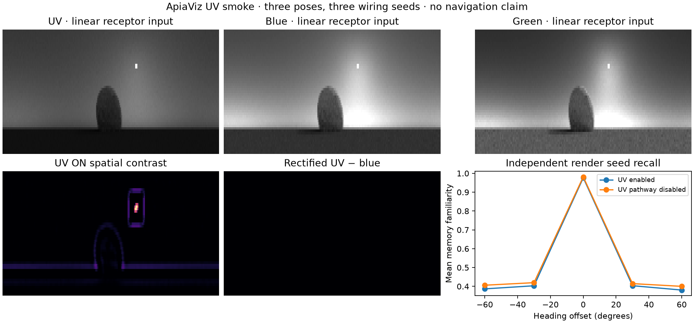

# ApiaViz UV model and smoke tests

30 September 2026. Calibrated linear UV/blue/green render responses now pass through
an ApiaViz front end, spiking code and learned view memory. **Sobel and Ardin were
not extended to UV.** Existing RGB encoders and navigation entry points are unchanged.



## Model

The existing ApiaViz RGB path actually uses green and blue receptors. The new
`ApiaVizUVEncoder` adds UV as a third receptor, with explicit tensor order
**UV, blue, green**. It does not interpret an ordinary RGB image as receptor data
or synthesize UV from RGB. `load_views` verifies the scientific frame labels,
array checksums, calibration hash and camera convention before sampling a
199 × 51 retinal view. Sampling follows the existing navigation ray grid:
−148° to +148° azimuth and +60° to −15° elevation. Azimuth interpolation wraps
at the panorama seam; elevation extrapolation is rejected.

The front end has three streams:

| Stream | Fixed processing | Kenyon cells |
|---|---|---:|
| Visible form | Existing green/blue hex sampling, local adaptation and centre-surround filters | 4,000 |
| Visible colour | Existing linear, rectified green−blue and blue−green differences after hex sampling | 4,000 |
| UV | Hex sampling; local UV adaptation and ON/OFF/low-pass spatial features; both polarities of UV−blue and UV−green | 2,000 |

The seven UV feature planes retain their spatial layout through 8 × 64 pooling.
Each stream uses the existing standardization, seeded sparse projection with ten
inputs per cell, and LIF first-spike competition. Projection seeds are the wiring
seed plus 0, 16 and 32. The existing circuit settings are retained: gain 0.1,
10 ms time constant, 50 ms window, 1 ms time bins and 1 ms inhibition delay.
The nominal trigger fraction is 2.825%; delayed inhibition and simultaneous
spikes can produce higher observed activity. UV activity was 3.52–3.88% here.

The green/blue output codes are **exactly equal** to `RefinementEncoder` with
`method='linear_colour'` for the same green/blue inputs and wiring. Changing UV
does not alter those codes. This is an additive prototype with **10,000 cells**,
not a resource-matched comparison with the original 8,000-cell model. The UV-off
control retains the same allocated populations but suppresses the UV stream;
it consequently has fewer active cells. Future benefit claims need controls
with matched neuron, spike and compute budgets.

Raw inputs are relative band-weighted radiances. There is no gamma, clipping to
[0,1], independent channel scaling or PNG input. One common frozen
`radiance_scale` defaults to 1 for all views/channels. This fixes the units seen
by the existing adaptation epsilon; it is an engineering convention, not a
calibration of receptor gain. Opponent differences remain linear before
rectification. UV spatial adaptation uses the existing nonlinear local adapter.

The analytical filters and seeded wiring are fixed and untrained. The
`SpikeOverlapMemory` **learns teaching views** by storing their active-cell
patterns. Retrieval uses the existing normalized spike-overlap readout. This
does not introduce a claim that spikes outperform a graded implementation.

## Results

All **133 tests pass**, including seven new UV tests covering visible-stream
equivalence, UV sensitivity, pathway ablation, opponent polarity, values above
one, invalid inputs, angular sampling, calibration checks, reproducibility,
checkpoint restoration and learned-memory recall.

The smoke used the existing small synthetic ground-and-rock scene, three poses,
and calibrated receptor/material inputs. Six 360 × 110 panoramas were rendered
at 64 samples/pixel: three teaching views with seed 20260930 and independent
repeats with seed 20260931. The model was tested with wiring seeds 19, 23 and 31.
Every scheduled result is retained in [results.json](results.json).

| Check | Result |
|---|---|
| Synthetic patterns differing only in UV, queried with a one-pixel UV shift | 12/12 identities retrieved correctly |
| Same patterns with UV pathway disabled | All four memories tie exactly for every query |
| Rendered heading recall at −60°, −30°, 0°, +30°, +60° | Taught 0° heading selected in 9/9 checks, both UV enabled and disabled |
| Mean familiarity margin over best wrong heading | 0.565 with UV; 0.553 with UV disabled |
| Roll the UV channel horizontally while holding green/blue fixed | Visible codes unchanged; UV spike overlap falls to 0.421–0.472 |
| Recall after common 0.5× or 2× intensity changes | Finite outputs; familiarity 0.911–0.959, so exposure invariance is not exact |
| Checkpoint restoration and recall | Codes reproduce exactly; encoder and memory fingerprints unchanged |

The rendered result demonstrates functioning, noise-tolerant input-to-memory
plumbing. Both variants already solve this easy heading check. The small margin
change is not evidence of improved route navigation. These are three correlated
poses in one simple scene, not independent environments or closed-loop trials.
The UV-only patterns are constructed diagnostic arrays, not measured stimuli.
Their purpose is to establish that UV information reaches memory and is usable.

In the displayed scene, the positive UV−blue branch is silent because blue
responses exceed UV; the reverse blue−UV branch remains available. This is
expected opponent behavior, not a missing UV channel. Input panels share one
display scale; the displayed images are never fed back into the model.

The calibration still covers 320–700 nm and uses measured material proxies with
modelled illumination. Missing shorter-wavelength sensitivity, unknown absolute
receptor gains and habitat mismatch remain as documented in
[UV calibration](../uv-calibration/README.md). These smoke tests use intensity
only. UV sky polarization remains uncalibrated and is not a model input.

## Use and reproduce

The new code is isolated in `apiaviz/src/uv.py`,
`apiaviz/research/uv_encoder.py` and `apiaviz/research/uv_input.py`:

```python
from apiaviz.research.spectral_input import file_sha
from apiaviz.research.uv_input import load_views
from apiaviz.research.uv_encoder import ApiaVizUVEncoder
from apiaviz.research.spike_overlap import SpikeOverlapMemory

views, metadata = load_views(
    'apiaviz/output/uv-model-v1/frames/00000.json', [0.],
    calibration_sha256=file_sha('docs/uv-calibration/calibration.json'))
model = ApiaVizUVEncoder()
memory = SpikeOverlapMemory(model(views))
familiarity = -memory(model(views))
uv_disabled_codes = model(views, uv_enabled=False)
```

Setting input UV to zero is a dark-UV stimulus, **not** the pathway ablation:
blue−UV and green−UV still carry information. Use `uv_enabled=False` and learn
a corresponding UV-disabled memory for that control.

Exact commands run from the repository root:

```sh
pixi run --locked test
pixi run --manifest-path scripts/uv_mitsuba/pixi.toml --locked python \
  scripts/uv_mitsuba/render_sensor.py \
  --geometry apiaviz/output/studio-sensor-v2/geometry \
  --output apiaviz/output/uv-model-v1/frames \
  --width 360 --height 110 --spp 64 --seed 20260930
pixi run --manifest-path scripts/uv_mitsuba/pixi.toml --locked python \
  scripts/uv_mitsuba/render_sensor.py \
  --geometry apiaviz/output/studio-sensor-v2/geometry \
  --output apiaviz/output/uv-model-v1/repeat \
  --width 360 --height 110 --spp 64 --seed 20260931
pixi run --locked python scripts/smoke_uv_model.py \
  --frames apiaviz/output/uv-model-v1/frames \
  --repeat apiaviz/output/uv-model-v1/repeat \
  --output apiaviz/output/uv-model-v1/model
```

Use fresh output directories on repetition. The geometry fixture is reproducible
with the [earlier integration commands](../collision-uv-integration/README.md).
The ignored output contains raw linear renders, sampled retinal tensors, frozen
source archive, configurations, all three encoder checkpoints and learned
memories. Compact provenance is in [validation.json](validation.json).
No full navigation study or historical run was started. The next behavioral
step is an explicitly spectral camera adapter for bounded continuous navigation,
followed by more varied scenes and resource-matched ApiaViz ablations.
