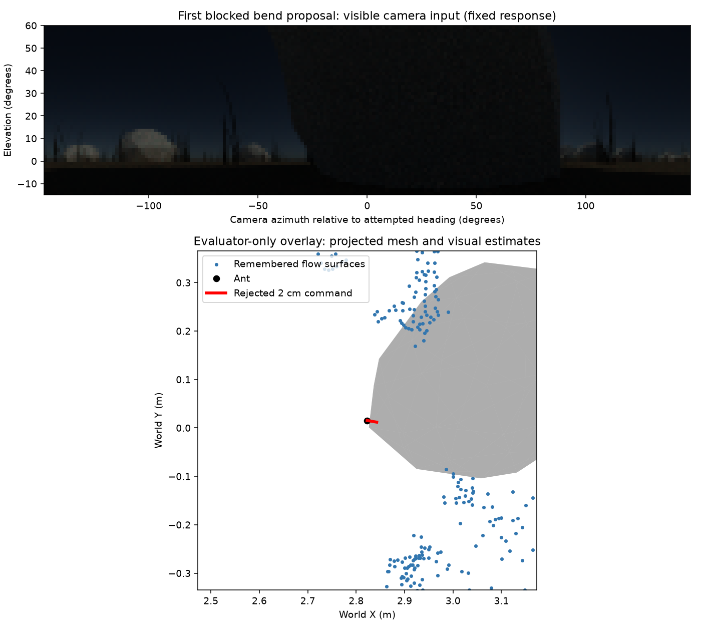
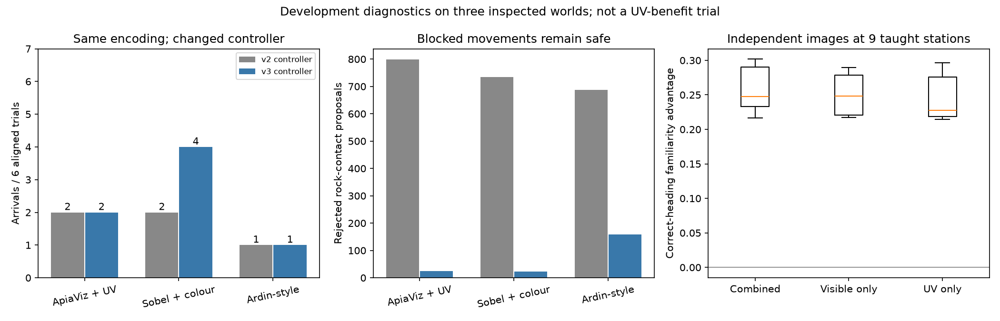
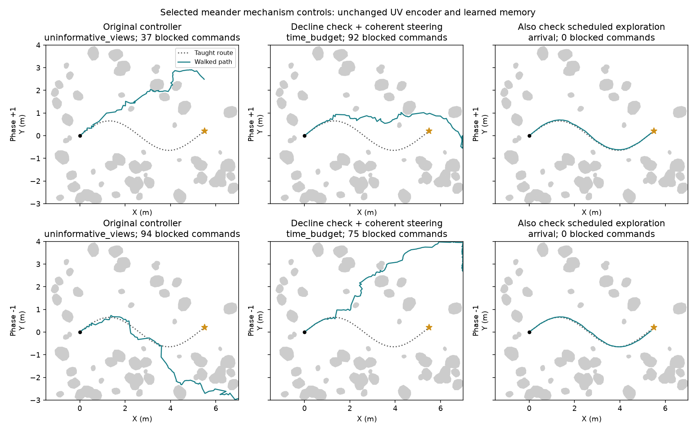

# UV pipeline and rock-encounter investigation — 1 October 2026

This investigation separates whether UV reaches memory, whether memory retrieves
useful directions, and whether the controller turns that evidence into movement.
The v2 failures do not establish that the UV pathway is broken. They also do not
establish a behavioural UV benefit.

## What the complete pipeline does

| Stage | Implementation and finding |
|---|---|
| Spectral acquisition | Mitsuba transports 320–700 nm radiance through the archived empirical honeybee response curves and measured material proxies. Six named bands are rendered together; numeric name prefixes preserve UV, blue, green, visible red, visible green, visible blue ordering. UV sensitivity has a visible tail. No polarization input is used. |
| Camera cache | Raw float32 six-band arrays retain linear radiance and checksums. Teaching and recall have different Monte Carlo seeds; recall uses common random samples across positions. Pose rounding is 10 nm for acquisition/cache identity only. |
| Retinal sampling | Bilinear sampling produces 199 × 51 views over azimuth −148° to +148° and elevation +60° to −15°. Channel order, handedness and wraparound have regression tests. No false-colour PNG enters the encoder. |
| Receptor response | ApiaViz v2 applies the common fixed response `x/(x+1)` after retinal interpolation. Visible cameras apply it before interpolation. These operations do not commute near the sun; neither procedure is an empirically calibrated complete eye model. Raw arrays remain untouched. |
| Spatial sampling | UV uses the same analytical hex-neighbour filter as green and blue, with identical spatial alignment. All front-end parameters are frozen. |
| Visible features | Green/blue mean → local light adaptation → ON, OFF and low-pass form planes. Colour is rectified linear G−B and B−G. Tests confirm exact agreement with the preferred linear-colour frontend. There are no oriented form filters. Changing UV leaves these visible maps and spike codes exactly unchanged. |
| UV features | Local UV adaptation → ON, OFF and low-pass planes, plus four rectified UV/blue and UV/green opponent planes. These are engineering choices, not fitted physiological circuits. |
| Pooling and projection | Each stream is pooled to 8 × 64, standardized as a whole, and passed through fixed seeded sparse wiring. There are 4,000 form, 4,000 colour and 2,000 UV Kenyon cells. |
| Spikes | The same LIF latency competition uses 1 ms bins and a 1 ms inhibition delay. Simultaneous/delayed spikes can exceed the nominal activity budget. UV is active, not an accidentally silent appended channel. |
| Learned memory | Teaching spike patterns are stored. Retrieval binarizes emitted spikes and uses maximum normalized overlap with a taught pattern. This is a graded readout of spiking patterns. Front-end weights are fixed; the downstream view memory learns. Actual spike counts determine stream weighting, not nominal cell counts alone. |
| Route controller | A temporal decline previously triggered a cast before checking whether a useful direction was still visible. Teaching-pairwise calibration is not a calibration of recall noise or the spatial derivative of familiarity. |
| Visual avoidance | Consecutive visible camera images plus commanded motion estimate local surface points. The historical passing-side sign is relative to a changing route request; its penalty is soft. Blocked commands previously translated and expired remembered surfaces despite unchanged images. |
| Physics | The evaluator uses the union of projected rock triangles and a swept 5 mm circular body. Unsafe steps are rejected and charged; trials continue. Releases/kicks are clipped along their requested displacement. Geometry, contact and actual displacement remain unavailable to both policies. |

The rendering/calibration limitations in [the calibration record](../uv-calibration/README.md)
remain: relative responses, missing wavelengths below 320 nm, material proxies,
modelled illumination and no empirically calibrated UV polarization.

## Measurements before changing navigation

`scripts/audit_uv_pipeline.py` evaluated every station in the previous bounded
acquisition check: three stations per world, all three worlds, 64 and 256 samples
per pixel, and independent recall images. Every one of the nine stations prefers
the correct taught heading on the 10° grid with the combined code, visible-only
code, or UV-only code, at both sample counts. At 64 samples, median advantage over
headings at least 20° away is 0.247 for the combined code, 0.248 for visible-only,
and 0.228 for UV-only. Thus UV carries directional information, but does not
improve this already easy exact-station test.

The pooled UV low-pass plane accounts for 83.3% of UV feature energy on average;
the visible low-pass accounts for 86.6% of form energy. UV contributes 67–98 spikes
per view at these stations, versus 154–178 form and 205–231 colour spikes. This is
unequal feature/stream weighting, not equal treatment of seven UV features. No
weights were tuned to make ApiaViz win. Most UV−blue rectified features are zero
for these material/illumination conditions; the opposite polarity is active.

The response/interpolation ordering difference is small when averaged over an
image (mean absolute differences 0.000126–0.000293 at these nine stations), but
the maximum pixel differences are 0.658–0.832 near the bright source. The new
`AlignedReceptorCamera` in `apiaviz/research/aligned_receptor_camera.py` provides
an explicit control that interpolates linear radiances before either response.
Tests confirm matching response order and complete exclusion of UV receptor
bands from the visible path. It requires newly encoded teaching views for
Sobel/Ardin; it is **not enabled** in the v3 controller comparison below. Its
effect on complete-route outcomes is untested.

`scripts/audit_uv_failed_views.py` examines the first ten and every tenth later
macro endpoint in **all six** aligned ApiaViz v2 trials. These retrospective scans
do not count as new navigation outcomes or free observations for a policy.

| Recorded positions | Combined code within 20° of local route tangent | Visible-only | UV-only |
|---|---:|---:|---:|
| Within 5 cm of route, 63 positions | 63 | 63 | 59 |
| Farther from route, 69 positions | 37 | 24 | 28 |

UV helps this off-route retrieval diagnostic. These are correlated positions
from UV-controlled trajectories, not independent trials; a correct local tangent
also need not be the correct direction to return to the route.

The off-route winning template has a median station-index error of 9 for the
combined code, 20 for visible-only and 21 for UV-only (stations are spaced about
10 cm apart). Thus adding UV improves this recorded retrieval diagnostic, but
location aliases remain substantial. The [teaching similarity audit](teaching-aliasing.json)
also shows that UV is less place-specific than form: median UV overlap between
stations separated by more than ten indices is 0.53–0.60 across worlds, versus
0.38–0.45 for form. Strong orientation information alone does not guarantee
reliable recovery to a learned route.

In meander, the old controller starts casting after two moves while just
**0.44 mm from the route**. The subsequent casts cause a much larger departure.
In the two aligned bend ApiaViz trials, **503 and 742** proposed movements are
blocked. Their movement headings reverse by more than 90° on 40 and 52 occasions.
These are recorded commanded reversals, not a count of complete physical orbits.



The first bend contact is a genuine mesh intersection, not the historical
oversized-disc mismatch. The dark rock fills the forward image. Remembered flow
points describe its flanks but omit the smooth front face; the point-risk model
therefore reports a false clear gap. Image texture in the lower view is 8.09
gray levels, sufficient for the deterministic stagnation detector. This does
not make absent frontal flow evidence of free space. A future perception change
must represent that uncertainty or infer surface continuity from images, and
must be tested against genuinely open gaps between separate rocks.

## A real numerical bug, and its limited causal relevance

The flat-field test found that computing `intensity − local_mean(intensity)` in
float32 leaves a small cancellation residual. Whole-stream standardization can
amplify it into spikes despite the absence of any visual structure. A uniform
neutral radiance of 0.1 produces 249 form spikes and 94 UV spikes in v2.

`UVPrecisionEncoder` in `apiaviz/research/uv_precision.py` subtracts a common
numerical reference **before** local averaging. This is algebraically the same
adaptation operation, with improved cancellation. It changes neither receptor
gain nor wiring. All seven tested neutral levels (0 through 1000) now produce
exactly zero contrast and spikes. A UV-only landmark still produces UV spikes,
with the visible streams silent. The correction also agrees more closely with
a double-precision reference.

Across all 144 textured views from the existing acquisition checks, the numerical
correction changes **zero of 1,440,000 emitted/not-emitted spike bits**. It fixes
a genuine edge case; these measurements do not implicate it as the cause of the
recorded route failures. This encoder is an explicit separate control, not a
silent replacement of historical checkpoints or baselines.

## Versioned controller repair

`apiaviz/research/coherent_navigation.py` adds three changes:

1. Sustained familiarity decline requests the existing charged directional scan.
   A supported direction permits continued following; an unsupported scan still
   invokes casting. Thresholds and resource budgets are unchanged.
2. A passing-side commitment is referenced to the encounter's entry course.
   Current route guidance continues to influence steering within ±45° of that
   course. Selection prefers safe headings on the committed side and penalizes
   large changes from the previous movement. Other directions remain available
   if the committed side has no visually clear candidate.
3. The previously isolated image-stagnation control is integrated. Unchanged
   textured camera pairs neither translate nor expire surface memory. Repeated
   stagnation prompts a directional probe. Commitment is released only after
   6 cm of route-clear commands accompanied by changing images.

The navigator never suspends or resets, and learned memory remains live. No
contact callback, obstacle map, route position or nest bearing is added. These
changes are engineering hypotheses under validation, not a guarantee that an
agent can get around every visually ambiguous obstacle. The stagnation detector
is specific to deterministic static acquisitions; noisy cameras, distant texture
and untextured surfaces need separate validation.

The complete-route development check uses all 18 aligned combinations of three
models, three worlds and both phases. It keeps v2 encoders, teaching images,
memory, acquisition, physics and budgets unchanged. It does not test kicks or
authorize another full comparative study. Final outcomes are recorded separately
in `apiaviz/output/coherent-validation-v3/`.

All 18 trials completed and passed their full motion/provenance audits:

| Model | Original arrivals / 6 | First repair arrivals / 6 | Original → repaired blocked proposals | Longest consecutive block sequence, original → repaired |
|---|---:|---:|---:|---:|
| ApiaViz + UV | 2 | 2 | 1,378 → 191 | 742 → 4 |
| Sobel + colour | 2 | 4 | 1,227 → 117 | 568 → 4 |
| Ardin-style | 1 | 1 | 1,261 → 229 | 409 → 4 |

Blocked proposals include both rock contact and field bounds; they are rejected
commands, not penetrations. The first repair substantially reduces the repeated
blocked-command failure mechanism. It does **not** improve ApiaViz arrivals in
this screen, and the prespecified four-of-six aligned gate fails for ApiaViz
and Ardin-style. Sobel improves and passes that aligned gate. No method has
completed a new displacement-recovery check with this controller.

This is not a cost-free repair: ApiaViz uses 7,444 observations over the six
trials versus 7,033 previously, and 1,590.2 versus 1,581.4 simulated seconds in
total. Its failed meander cases run to their time budget. See all paired
movement/cost records in [contact-sequences.json](contact-sequences.json).

Separating rocks from field bounds, ApiaViz rock-contact rejections fall from
798 to 24, Sobel from 734 to 22, and Ardin-style from 688 to 159. This is a
substantial reduction in a specific failure mechanism, not proof of robust
circumnavigation. UV remains confined to route memory; the common avoidance
policy still uses RGB. Smooth frontal surfaces and loss of route guidance
after evasive motion remain important limitations.



All ten report movies decode successfully, in addition to the separate meander
control movie. [The complete paired results](results.json) include trace hashes,
movie hashes, costs and negative outcomes. The local
[matched report](../../apiaviz/output/coherent-validation-v3/report/index.html)
contains its figures and movies. Both validation processes have finished.

## Reproduce

Use fresh output directories; existing protocols and results are frozen.

```sh
pixi run python scripts/audit_uv_pipeline.py --output apiaviz/output/uv-pipeline-audit-v3
pixi run python scripts/audit_uv_failed_views.py --output apiaviz/output/uv-failed-views-v3
pixi run python scripts/validate_uv_precision.py --output apiaviz/output/uv-precision-v3
pixi run python -m apiaviz.research.coherent_validation prepare --output apiaviz/output/coherent-validation-v3
pixi run python -m apiaviz.research.coherent_validation run --output apiaviz/output/coherent-validation-v3 --workers 6
pixi run test
```

The first three commands read existing verified acquisitions and do not render.
The last navigation command runs the bounded development screen and creates
audited traces, figures and movies. The existing `pixi run trials` entry point
remains historical; it is not silently redirected to this controller.

## Additional scheduled-exploration control

Code inspection found a second source of blind casting: the original controller
forces a cast every 12 movements even if a recent scan supports a direction.
The v3 screen deliberately retains that rule. In its completed meander phase +1
case, the ant remains within 3.1 cm of the route over its first eleven movements,
then scheduled casting starts at movement 12. By movement 20 it is 29.2 cm away.
The trial ultimately reaches the time budget, so decline confirmation alone
does not resolve this case.

`ConfirmedExplorationController` is a separate control: scheduled exploration
uses the existing charged scan, follows a supported direction, and falls back
to the original bounded casts when unsupported. It advances the scheduled-check
counter even on a successful scan, avoiding an accidental scan on every later
movement. No threshold, teaching view or encoder parameter is changed.

```sh
pixi run python scripts/validate_confirmed_exploration.py --output apiaviz/output/confirmed-exploration-v4
```

This tests both meander phases with the full original budgets and v3 avoidance.
It is a selected failure-mechanism test, not a comparative performance estimate.

Both cases completed successfully, with **zero blocked proposals**. Each takes
62 macro movements and 6.14 m of actual travel. Phase +1 uses 102.98 simulated
seconds / 565 observations; phase −1 uses 105.74 seconds / 589 observations.
Maximum route deviation at macro endpoints is 6.65 cm and 5.86 cm, respectively.
Both pass the complete motion, budget and provenance audit. Encoder, learned
memory and teaching-image fingerprints exactly match their v2 counterparts.
The selected phase +1 movie also decodes without errors.



This is the complete set of both-phase meander aligned cases for each control,
not a selection of successful trajectories. Trace input hashes are recorded in
[meander-figure-inputs.json](meander-figure-inputs.json). The taught route is
collision-free; these successful follows do **not** validate go-around behaviour
after a displacement into a rock's approach corridor.

See [the verified measurements](scheduled-check-results.json) and the local
[camera/overhead movie](../../apiaviz/output/confirmed-exploration-v4/report/movies/meander-19-apiaviz_uv-aligned-familiarity-1.mp4).
These results support the scheduled-casting failure mechanism. They do not
establish robustness across worlds or an advantage attributable to UV.

The next validation should apply scheduled direction confirmation to all models,
worlds and displacement conditions, with a paired UV-on/off control. A separate
perception control should distinguish unknown frontal depth from visually clear
space and test genuine open gaps between rocks. Neither step should be replaced
by another 378-trial run of a controller that has failed its development gate.

Compact stage, retrieval and numerical results are in [pipeline-results.json](pipeline-results.json).
The final **168-test standard suite passed**, including new checks for exact visible-path
equivalence, UV-only signal survival, neutral-field silence, precision, charged
direction checks, entry-referenced passing side and continuous motor feedback.
