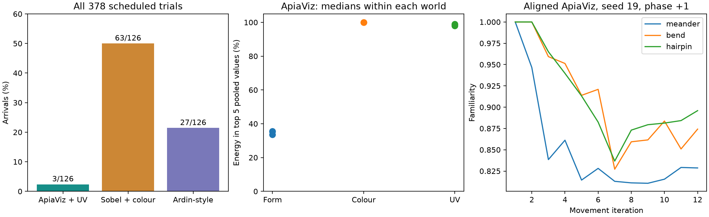

# Completed UV study: failure diagnosis

1 October 2026. The full study completed all 378 scheduled trials. All saved
trace hashes match the final audit. This analysis reads those traces,
checkpoints, teaching images and cached camera frames; it does not rerun
navigation or render new images. Original results and the frozen protocol remain
unchanged.

| Model | Arrivals / all trials | Arrivals / aligned releases |
|---|---:|---:|
| ApiaViz + UV | 3 / 126 (2.4%) | 0 / 18 |
| Sobel + colour | 63 / 126 (50.0%) | 10 / 18 |
| Ardin-style | 27 / 126 (21.4%) | 5 / 18 |

ApiaViz's 123 failures comprise 68 `uninformative_views`, 44 `time_budget` and
11 `step_budget` outcomes. Of the 68 unsupported terminal scans, 67 fail the
directional contrast threshold; 40 of these also have competing peaks. One fails
only the competing-peak criterion. The median route distance at these terminal
scans is 1.01 m. Sobel has nine unsupported terminal scans, all because of
competing peaks, rather than insufficient contrast.

## Measured input-processing problem

ApiaViz receives raw spectral responses. Most pixel values are around 0.1,
but the brightest teaching pixels reach 4,839 in the green band. The linear
G−B and UV-opponent branches have no saturating receptor response before spatial
pooling and whole-stream standardization. Local adaptation exists in the form
branch, but does not protect these linear opponent branches. Only about
0.027–0.032% of teaching pixels have any channel above one.

Despite occupying so little of the image, bright features dominate the pooled
representation. The table gives the median fraction of total squared pooled
feature magnitude in the five largest feature values, across teaching views:

| World | Form | Colour | UV |
|---|---:|---:|---:|
| Meander | 33.6% | 99.93% | 98.64% |
| Bend | 35.4% | 99.90% | 97.94% |
| Hairpin | 35.7% | 99.95% | 99.06% |

The tiny bright source is the modeled sun. Whole-stream standardization does
not remove this concentration. This is evidence of an unsuitable transfer from
high-dynamic-range radiance to the opponent feature representation: landmark
variation has very little magnitude compared with the bright source. Feature
energy is not itself a measure of navigation information, so it does not prove
that every failed decision is caused by the sun.

The baselines receive the visible camera's bounded `x/(1+x)` response. That
input difference was explicit in the frozen protocol, but its consequences for
ApiaViz's linear opponent paths were not adequately checked before the study.
This run therefore cannot isolate the effect of adding UV to an otherwise
identical acquisition pipeline, or establish that UV information is harmful.

As a diagnostic only, applying the same bounded response independently to the
three raw receptor values, before the existing frozen ApiaViz front end, reduces
the top-five concentration to approximately 3% in colour and 9–10% in UV. This
probe retains the saved raw arrays. It is neither a fitted physiological model
nor evidence of corrected closed-loop success.

## Rendering noise triggers false evidence of leaving the route

The camera key and Monte Carlo seed depend on exact floating-point XY values.
Walking arithmetic produces positions differing from the corresponding teaching
station by 2.8–5.6 × 10⁻¹⁷ m. Those physically equivalent positions get different
keys and seeds, and therefore different noisy images at 64 samples per pixel.

For aligned, positive-phase, seed-19 ApiaViz on the straight start of the hairpin,
the ant remains on the taught line through its first three moves. Its recorded
familiarity falls from approximately 1.000 to 0.965 at 20 cm and 0.940 at 30 cm.
Re-encoding the saved arrays reproduces this drop. At the 30 cm station, the
colour-stream same-view spike similarity is only 0.911; the form and UV streams
are 0.961 and 0.971. Thus this is not solely a malfunction in the added UV cells.
Suppressing the UV stream still gives only 0.934 total similarity there.

The controller interprets two declines as evidence to start casting at movement
iteration four. The bend example also starts casting at iteration four while
still on its straight taught segment. This establishes a concrete early failure
mechanism before rock contact in these representative cases. It does not prove
that all later divergence is caused by render noise.

The bounded-response diagnostic improves the hairpin 30 cm same-view match from
0.940 to 0.977. Remaining variation is not eliminated. The diagnosis sampled
seed 19 in all three worlds and found four suitable same-pose/different-key pairs
in the bend/hairpin aligned traces; it is not a renderer convergence study.
Different positions legitimately need different views, but numerical roundoff
should not decide whether an effectively identical acquisition is re-sampled.

## Contact and execution

All 126 ApiaViz trials contain blocked proposals. Of 30,513 blocked proposals,
22,269 (73%) are field-boundary blocks and 8,244 are rock-contact blocks. These
are rejected commands, not fatal collision outcomes. The runs continue to visual
termination or their budgets. This pattern is consistent with substantial route
loss and repeated attempts to move beyond obstacles/bounds; it is not evidence
that displacement was allowed to put an ant inside a rock.

The first serial ApiaViz trial already failed with `uninformative_views` before
the parallel handover. The earlier six-trial serial/parallel comparison matched
scientific results and decisions exactly. The saved scientific sources and
original serial result were preserved. There is no evidence here that parallel
scheduling explains the poor result. The six-trial smoke test verified software
execution, not successful navigation: all its trials stopped at four movement
iterations. That was an inadequate readiness gate for launching the full study.

## Required next checks

1. Specify and test a receptor response/adaptation stage that handles the
   modeled illumination's dynamic range before colour and UV opponency. Preserve
   the raw linear arrays and keep the biological calibration claims limited to
   the evidence available.
2. Fix physically equivalent pose acquisition and measure rendering repeatability
   at the relevant positions/headings, including the sun. Any pose canonicalization
   must have an explicit tolerance much smaller than body/movement scales; assess
   sampling noise separately rather than merely hiding it in a reused image.
3. Measure directional and translational familiarity stability on held-out
   acquisitions. The teaching pairwise spread used for controller calibration
   is not a measurement of recall/render noise. Do not simply relax the stopping
   threshold until this run appears successful.
4. Run a small, separately versioned set of complete aligned routes and then
   displaced routes for every model, with matched controls for response mapping
   and UV on/off. Keep every outcome. Validate collision blocking alongside
   route following before scheduling another full matrix.

No corrected navigation success rate has yet been measured, and no replacement
378-trial study was launched as part of this diagnosis.



The compact [diagnosis data](diagnosis.json) includes protocol/audit/script hashes,
failure classifications, representative decisions, feature measurements and
same-pose probes. Reproduce from the repository root with a fresh output:

```sh
pixi run python scripts/audit_uv_trial_failures.py \
  --output apiaviz/output/uv-trials-v1-diagnosis
```

The current worktree now contains v2 corrections. This historical command must
use the matching archived v1 scientific sources; its source check intentionally
rejects running the v1 analysis against changed experiment code. The subsequent
[v2 validation](../../uv-v2-validation/README.md) preserves this diagnosis and
reports the corrected complete-route results separately.
