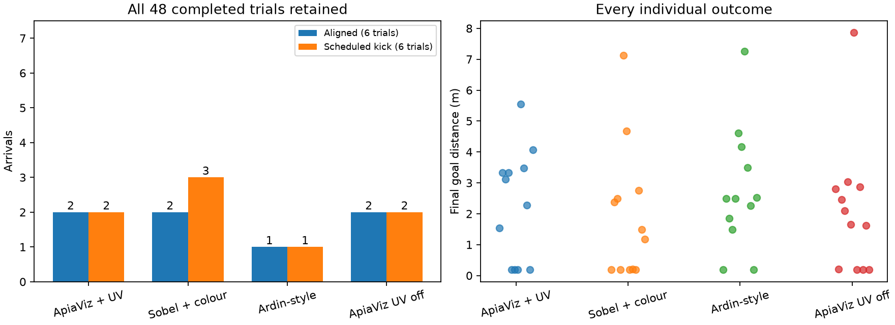
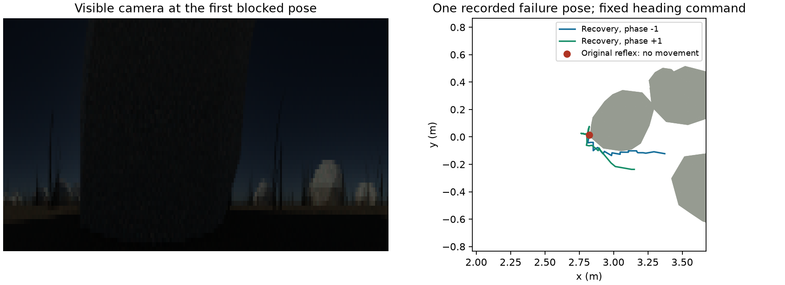

# Corrected UV acquisition and complete-route validation

1 October 2026. Follow-up to the [failed v1 study](../uv-trials/diagnosis-2026-10-01/README.md).
The original results and protocols are preserved. This work introduces explicit
v2 options; historical v1 response/key behavior remains available in code.

## Changes

ApiaViz v2 applies a fixed receptor response `x/(x+1)` to raw UV/blue/green
radiances **before** the form, colour and UV feature branches. The half-response
is shared across channels and acquisitions; it is not fitted per image or to
navigation outcomes. It uses the existing visible camera's fixed half-response
as an engineering convention, not an empirical honeybee adaptation model.
The raw arrays remain linear, separately archived and unchanged. Baselines
remain visible-only; neither receives a UV channel or a UV-derived display.

The v2 camera canonicalizes camera positions to eight decimal places in metres
(10 nm grid, at most 7.1 nm Euclidean rounding). Physics and trace positions are
unchanged. This is tiny compared with the 5 mm body and 5–20 mm movement strides;
it does not snap the navigator to teaching stations. A common Monte Carlo seed
is used throughout each acquisition pass instead of hashing exact floating-point
positions into unrelated seeds. Shared-position cache locks use the same
canonical key in workers, provenance records and movie lookup.

Teaching and recall now use **different seeds**, 20261001 and 20261002. The
teaching bank and its raw frames are frozen as environment assets; the recall
camera is never used to recreate teaching images. All models receive the same
teaching poses, with co-registered UV/visible bands, and share the controller,
learning rule, acquisition geometry, budgets, collision handling and evaluation.
The controller thresholds and policy logic are unchanged.

## Checks before route validation

- Regression tests cover the bounded response before every opponent branch,
  preservation of raw input, explicit UV ablation, absence of UV in baselines,
  canonical positions, independent seed selection, frozen teaching-bank checks
  and a readiness check that rejects arrivals before a scheduled kick.
- Acquisition probes use three stations in each original world, two independent
  seeds, and 64 versus 256 samples per pixel. Roundoff-equivalent poses give
  identical images without a second render. At these nine stations, 10 μm
  translations under common sampling preserve the ApiaViz spike code exactly.
- Independent seeds remain a more demanding check. At 64 samples, same-pose
  code-similarity medians are 0.979 ApiaViz, 0.980 Sobel and 0.908 Ardin-style;
  minima are 0.969, 0.974 and 0.739. At 256 samples the medians are 0.986, 0.990
  and 0.953, with minima 0.969, 0.980 and 0.795. These are nine diagnostic poses
  with wiring seed 19, not universal noise bounds. Rendering convergence is not
  claimed. The route validation retains 64 samples and tests independent recall
  rather than masking the residual variation through identical teaching pixels.
- A small integration fixture completes all twelve scheduled runs with arrival
  and passes movement/accounting audits. Six movies decode successfully. It
  deliberately does **not** pass readiness: its short route ends before the
  scheduled kick and it lacks the required three-world matrix.

The [acquisition record](acquisition-validation.json) includes measurements and
source hashes. The small fixture is local at
`apiaviz/output/uv-v2-engine-check2/`. The older `engine-check1` preparation is
preserved but was superseded before navigation; it inherited the old four-move
limit, which the corrected preparation now explicitly overrides.

The additional [placement audit](placement-validation.json) passes 11,952
20 mm movement/50 cm displacement proposals across the three actual worlds.
It samples field edges, teaching stations and all rock bounding boxes, with
eight directions at each valid anchor. There are 1,462 proposals with a clear
endpoint but an obstructed swept path; the safeguard clips these correctly.
This checks evaluator geometry, not visual avoidance or route success. Raw
placement records remain under `apiaviz/output/uv-v2-placement-audit/`.
All 209 complete [taught route segments](route-validity.json) are also clear
under the same swept 5 mm body/mesh model; none of the three routes requires
walking through an evaluator obstacle.

## Prespecified complete-route matrix

The primary validation is **36 trials**: three original full-length routes ×
one wiring seed (19) × two initial search phases × aligned/kick-right scenarios
× ApiaViz/Sobel/Ardin. A separate **12-trial UV-off control** uses the same corrected
ApiaViz visible stream, training, geometry and controller, with the 2,000 UV cells
allocated but silent during both teaching and recall. It is a pathway ablation,
not a matched-active-spike comparison. Retain all outcomes in both conditions.

Trials use the normal ceilings: 200 movement iterations, 360 simulated seconds,
2,600 observations, and a requested 50 cm kick before iteration 36. The same
mesh/body collision blocking and safely clipped placements apply. Full requested
and applied doses, blocked decisions, and time/view/movement accounting are
audited. No obstacle geometry or contact information is passed to policies.

The [plan](plan.json) was fixed before corrected full-route outcomes. Its
method-neutral readiness thresholds require, for **each** model, at least four
arrivals among six aligned trials and two arrivals **after a full applied kick**
among six scheduled kick trials, together with completion and a valid audit.
An early arrival before the kick, or a shortened/skipped kick, cannot pass the
displacement criterion. Failing the gate is a result to retain, not a reason to
tune thresholds until ApiaViz wins. Nothing automatically starts a larger study.

These are development worlds already inspected during diagnosis. One wiring
seed and two search phases are not independent environments. Passing this gate
would establish limited engineering readiness, not a held-out comparative result.

## Completed route results

All 48 scheduled trials completed and passed the physics, placement, budget,
source/checkpoint/camera provenance and no-reset audits. All outcomes are retained.

| Condition | All arrivals / 12 | Aligned arrivals / 6 | Arrivals after full kick / full kicks applied |
|---|---:|---:|---:|
| ApiaViz + UV | 4 | 2 | 2 / 3 |
| Sobel + colour | 5 | 2 | 2 / 4 |
| Ardin-style | 2 | 1 | 1 / 4 |
| ApiaViz UV off | 4 | 2 | 2 / 6 |

**Neither validation arm passes readiness.** Every condition falls below the
prespecified four-of-six aligned-arrival requirement; Ardin-style also misses
the full-kick-arrival requirement. Sobel's fifth arrival followed a safely
shortened 6.2 cm kick, so it does not count as full 50 cm displacement recovery.
Different trajectories produce different applied doses; the conditional
full-dose rates are descriptive and are not matched causal comparisons.

In the matching twelve historical tasks per model, arrivals were 0 ApiaViz,
6 Sobel and 2 Ardin-style. The corrected values are 4, 5 and 2. The scenes,
wiring seed, phases and scheduled scenarios match, but receptor response and
acquisition changed together. This supports an improvement of the combined
ApiaViz input/acquisition pipeline in this development subset; it does not
isolate a benefit from UV or establish generalization.

UV-on and UV-off each arrive four times, in **entirely different cases**: four
UV-on-only arrivals, four UV-off-only arrivals, and four joint failures. The
common total conceals strong sensitivity to the pathway and initial search
phase. Removing UV does not resolve the navigation problem. The remaining
failures are budget exhaustion or unsupported visual decisions, rather than
fatal collision exceptions. The separately tested stall-recovery control below
addresses one concrete mechanism; complete-route validation of that controller
variant remains necessary. Do not promote this pipeline to another 378-trial
study on the basis of these results.

The [compact results and paired cases](results.json) retain the readiness rules,
protocol/audit hashes, artifact checks and movie verification. The figure shows
all scheduled outcomes, including shortened perturbations; full-dose counts are
separated in the table above.

All report artifact hashes and all **26 selected trial movies** verify and
decode. The eight UV-off movies were additionally exported and decoded with
explicit UV-off labels; the [presentation check](labelled-report-validation.json)
confirms that the re-export preserves every numerical statistic. Saved
checkpoints have identical encoder tensor weights and visible teaching spike
patterns across UV-on/off. At one cached independent recall view per world,
visible codes also match exactly and the off condition's UV cells remain silent.

Local complete reports:

- [Primary trial report, figures and 18 movies](../../apiaviz/output/uv-validation-v2/report/index.html).
- [Explicitly labelled UV-off report, figures and eight movies](../../apiaviz/output/uv-validation-v2-uv-off-labelled/report/index.html).

These links require the local artifacts; a repository clone does not include
the large raw camera arrays, checkpoints or movies.



## Commands and artifacts

```sh
pixi run validate-uv prepare
pixi run validate-uv run --workers 6
pixi run validate-uv assess
```

The default output is `apiaviz/output/uv-validation-v2/`. `prepare` verifies and
copies the existing study's geometry, then acquires new teaching and preview
images. `run` owns six workers and generates the complete report, figures and
movies. `readiness.json` records the pass/fail result separately from successful
software completion. Inspect that boolean; a completed run is not by itself a
passing validation. Source/protocol hashes prevent mixing code on resume.

Prepare the UV-off control from the primary validation's frozen environment:

```sh
pixi run validate-uv prepare --source apiaviz/output/uv-validation-v2 \
  --output apiaviz/output/uv-validation-v2-uv-off --uv-off
pixi run validate-uv run --output apiaviz/output/uv-validation-v2-uv-off --workers 6
```

This reuses the identical independent teaching bank and geometry, without copying
completed trial/checkpoint state. Reports live under each output's `report/`.
For this execution, `scripts/reuse_uv_validation_frames.py` also copied 7,087
checksum-verified recall frames referenced by completed primary trials into
the UV-off cache (three were already present). Camera settings and geometry
match exactly; per-pose locks protect concurrent workers. The local
`uv-validation-v2-uv-off/cache-reuse.json` records every source frame and trace.
This affects rendering/cache costs, so wall times between arms are not a cold
rendering benchmark. Encoding time and sensory/movement budgets are reported
separately.
The original `pixi run trials` task remains the v1 entry point and is not the
command for this corrected validation. Do not launch another 378-trial suite
until the corrected validation has been inspected.

## Separately tested visual-stall recovery control

The first corrected bend/ApiaViz/positive-phase aligned trial exposed another
failure mechanism. When blocked commands leave the camera position unchanged,
the original reflex obtains zero supported flow points, eventually discards its
surface memory using commanded odometry, and repeatedly calls the direction
clear. Physics prevents penetration, but the policy makes no progress.

`VisualStallRecovery` is an explicit additional control, **not part of the
36+12 input-validation matrix**. It recognizes two consecutive unchanged,
textured RGB image pairs after commanded movement, preserves visual surfaces
while stationary, and probes a persistent passing direction. A second failed
direction continues the same turning sense; sustained image change returns to
the base reflex. It receives only camera images and commanded heading/distance.
It does not receive contact, successful displacement, rock geometry, or a route
reset. The maximum pixel-change tolerance is 1e-7 on normalized RGB; mean
within-row grayscale standard deviation in the lower view must be at least two
8-bit levels. This is a narrow
detector for the present static deterministic camera, not a validated detector
for noisy or dynamic real-world images.

The [replay](stall-replay.json) uses the first saved blocked pose and the same
archived visual surface memory for both policies, with ten 10 cm commands and
both passing-side phases. The original reflex remains stationary with 50 blocked
proposals in each phase. Recovery moves 0.567/0.414 m away, walking 0.780/0.870 m
with 14/10 blocked proposals. All swept movements pass the mesh/body audit.
Recovery uses 150/105 observations and 25.83/23.42 simulated seconds, versus
51 observations and 12.55 seconds for the stationary original. All four outcomes
are retained. This is a selected-failure reflex replay with a fixed desired
heading; escaping this pose is not evidence of reaching a learned route's goal.
The control remains separate pending complete-route evaluation.
The current detector is `textured-image-stall-recovery-v2`: texture is the mean
within-row grayscale standard deviation in the lower half of the view. A smooth
elevation/horizon gradient alone cannot trigger it. A regression test first
demonstrated that the [v1 detector](stall-replay-v1.json), which used overall
standard deviation, could falsely call such a gradient textured. V2 corrects
that case and passes all tests. Replaying the same four conditions with the
retained raw camera arrays produces exactly the same paths, costs and escape
outcomes as v1, so the figure applies to both. Both local replay directories
retain their frozen source archives and protocols.
`apiaviz.research.stall_navigation.evaluate` provides the opt-in continuous
navigation entry point. Its `RecoveryFeedback` adapter preserves commanded
movement feedback, records recovery as visual steering and never suspends or
resets the route navigator. Use a fresh protocol/output for that control; neither
current validation arm silently switches to it. The adapter has integration
checks for motor-command accounting and restoration of scoped bindings after
an evaluator error, but its full-route performance has not been established.



```sh
pixi run python scripts/validate_visual_stall_recovery.py \
  --study apiaviz/output/uv-validation-v2 \
  --trial apiaviz/output/uv-validation-v2/trials/bend-19-apiaviz_uv-aligned-familiarity-1.json \
  --output apiaviz/output/visual-stall-replay-v2
```

Use a fresh output directory when repeating the replay. Four focused tests cover
direction persistence, visual-memory retention, texture/change discrimination,
and returning from recovery. Together with the adapter checks, the standard
suite passes all **155 tests**.

The final paired summary can be reproduced from completed outputs with:

```sh
pixi run python scripts/summarize_uv_validation.py \
  --primary apiaviz/output/uv-validation-v2 \
  --uv-off apiaviz/output/uv-validation-v2-uv-off \
  --output apiaviz/output/uv-validation-v2-summary
```

Use a fresh output directory for another summary export. The explicit UV-off
presentation uses `scripts/render_uv_off_report.py` with `--study` set to the
UV-off study and a fresh `--output`. It creates a presentation directory with
links to frozen input artifacts; it is not a new experiment execution directory.
