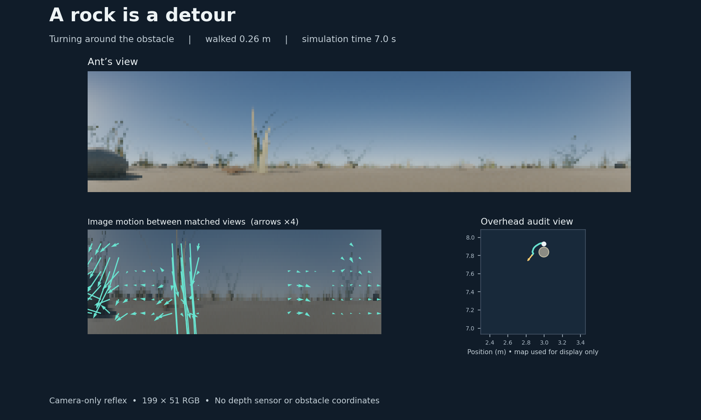
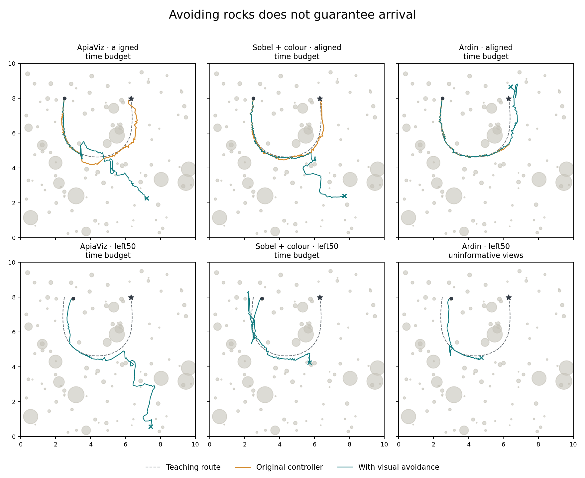

# Camera-only rock avoidance

The ant now has an experimental local visual reflex that can steer around an approaching rock. It is not promoted to the exhaustive study: local avoidance works, but full-route homing regresses in the reference smoke. It uses the same 199 × 51 RGB views as the navigation experiment. It receives no obstacle coordinates, rendered depth, object labels, rangefinder or contact signal. The original fixed-step controller and its results remain intact.

[Watch the rock detour](rock-detour.mp4)



## How it works

A short movement provides two images taken at the same heading. Classical optical flow measures how features move between those images. The controller combines that motion with its own commanded movement to estimate nearby surfaces. It excludes the sky and ground below the horizon, rejects inconsistent matches, and avoids relying on pixels directly ahead where forward-motion parallax is weak. No component is trained.

The initial movement is 5 mm. Subsequent movements are at most 2 cm, with another image after each one. When nearby visual surfaces obstruct the intended direction, the ant turns toward a clearer direction. A short-lived memory of those surfaces and a preference for the previously chosen passing side reduce repeated turns back toward the obstacle. Surface estimates expire after 12 cm of travel.

The route controller still requests a heading every 10 cm of accumulated walking. The reflex can redirect the intervening movements. The first integration restarted the navigator after a detour. A tested alternative preserved its direction, search phase and scheduled checks while discarding the pending comparison. That alternative was rejected: its cast counter depends on completed comparisons, so repeated invalidations can trap it in a search state. The reference implementation therefore retains the full transient-state restart. This prevents the detour from being treated as evidence about an action that was not executed. Its mushroom-body memory is unchanged. Every additional image, turn and movement counts against the existing sensory and time budgets.

This is an engineering implementation inspired by visual motion control. Honeybee experiments support roles for retinal expansion and optic flow in collision avoidance; they do not validate this particular optical-flow algorithm, distance calculation or local surface memory as an insect neural circuit. See [Singh and colleagues, 2024](https://pmc.ncbi.nlm.nih.gov/articles/PMC10973882/).

## Completed local check

The test starts at the hairpin route's 50 cm lateral release, facing −98°. Its first straight 10 cm action intersects a rock under the existing physics rule. With the visual reflex, the ant completes 1 m of walking in 57 substeps, passing the rock and continuing forward. All executed segments pass the unchanged collision check. The movement and sensor events reproduce exactly when replayed from cached images. A matched-substep control, with the same images and movement sizes but evasive steering disabled, collides after 2.5 cm. Smaller steps alone do not account for the successful detour. Parameters were developed using this starting rock, so this is a development demonstration.

The video shows one frame per executed substep, at six frames per second. Playback speed therefore varies; the displayed simulation clock includes sensing and turning. The image is mirrored for a conventional left/right display; the numerical input is unchanged. The overhead map is for inspection only and is not provided to the reflex. Arrows show image motion between the actual matched-heading images, magnified fourfold.

## Route comparison

A completed six-trial protocol evaluated the familiarity controller on the hairpin scene, with aligned and 50 cm displaced releases, using ApiaViz, Sobel + colour and Ardin. It uses wiring seed 19 and the positive initial controller phase. The protocol, source archive and hashes are saved in `apiaviz/output/visual-avoidance-smoke-v2/`. The completed reference runs avoid rock collisions but produce no arrivals, compared with two arrivals in the six historical runs. Frequent restarts, changed trajectories and extra sensing costs are plausible contributors; this comparison does not isolate their individual effects. The narrower-reset variant in `apiaviz/output/visual-avoidance-continuity/` was stopped after its first completed trial exposed the search-state problem described above. That trial reached the field boundary and is retained. A final, limited two-trial ApiaViz check in `apiaviz/output/visual-avoidance-near/` reduces only the obstacle lookahead from 16 cm to 8 cm, retaining the reference restart behavior. All completed outcomes are reported below, including failures.

The earlier 181 completed trials remain preserved in `apiaviz/output/controller-full/`, with that experiment paused. They are not pooled with avoidance trials. The historical comparison changes the movement sampling and transient-state resets as well as adding avoidance; it is not an isolated test of the reflex. Identical teaching images, encoder parameters and mushroom-body memories are checked by hashes.

## Limits and next experiment

Low-texture rocks, thin stems, render noise and terrain undulations can produce missing or misleading flow. The first 5 mm movement has no preceding motion estimate. The unchanged collision model uses conservative rock discs, which can extend beyond the visible mesh. Collisions therefore remain possible and are recorded as failures; the reflex never uses a collision check to select an escape direction.

The next step is to improve the handoff between the reflex and route controller, using a route-level matched-sampling reflex-off control to separate sensory costs from steering effects. Both passing phases, multiple wiring seeds and independent environments should follow once homing is useful. The local matched-substep check already tests whether evasive steering is needed at the starting rock. Dense teaching every 10 cm is unchanged; this work does not answer whether that teaching regime makes route recognition too easy.

## Reproduce

Start the saved hairpin Blender worker, then use the repository Python environment:

```sh
blender --background --factory-startup --python apiaviz/research/grassland_world.py -- --output apiaviz/output/navigation-regime/hairpin --resume

python -m apiaviz.research.avoidance_experiments prepare --world hairpin --output apiaviz/output/my-avoidance-run
python -m apiaviz.research.avoidance_experiments run --output apiaviz/output/my-avoidance-run
python -m apiaviz.research.avoidance_experiments report --output apiaviz/output/my-avoidance-run
python -m apiaviz.research.avoidance_audit --output apiaviz/output/my-avoidance-run
python -m unittest discover -s tests -p test_visual_avoidance.py -v
```

Omit `--world hairpin` when preparing to include all three existing development worlds (18 trials). Each selected world needs its renderer worker. Use a fresh output directory after changing implementation or protocol.


## Completed route results

All comparisons below use the same 91 teaching images, frozen encoder parameters and mushroom-body memories. These are development results from one scene, one wiring seed and one initial controller phase. They do not establish statistical significance.

| Input | Release | Original outcome | Avoidance outcome | Walked (m) | Returned to route | Views |
|---|---|---|---|---:|---|---:|
| ApiaViz | aligned | arrival | time_budget | 14.90 | — | 1912 |
| ApiaViz | left50 | rock_collision | time_budget | 14.50 | yes | 1973 |
| Sobel + colour | aligned | arrival | time_budget | 13.48 | — | 1931 |
| Sobel + colour | left50 | rock_collision | time_budget | 15.10 | yes | 1866 |
| Ardin | aligned | uninformative_views | time_budget | 13.88 | — | 1910 |
| Ardin | left50 | rock_collision | uninformative_views | 6.80 | yes | 1298 |



The reflex can remove an immediate collision without solving homing. It also increases visual sampling and turning costs, and its detours change the views encountered by the route controller. A return to the route means three successive macro-step endpoints within 10 cm; it does not imply a later arrival.

Two additional development checks are retained rather than discarded:

| Variant | Input/release | Outcome | Walked (m) | Final nest distance (m) |
|---|---|---|---:|---:|
| Preserve motor state (rejected) | ApiaViz / aligned | field_boundary | 15.50 | 7.69 |
| 8 cm lookahead | ApiaViz / aligned | time_budget | 16.80 | 4.53 |
| 8 cm lookahead | ApiaViz / left50 | time_budget | 15.30 | 6.16 |

The motor-state variant was stopped after exposing a search-state problem; its incomplete protocol is marked rejected. The shorter-lookahead protocol was limited to two ApiaViz trials before running it. Neither should be pooled with the six reference trials or the earlier 181-trial study.

## Verification

Eight new targeted tests and 21 existing controller tests passed. The six reference trials passed an independent audit of 3,997 executed movement segments, 10,890 observations, sensory and movement timing, frozen source/scene hashes and cached camera images. Both shorter-lookahead trials passed the same checks. The local 1 m trajectory reproduced exactly from cached images. These checks establish accounting and reproducibility; the route results above remain unsuccessful homing trials.
