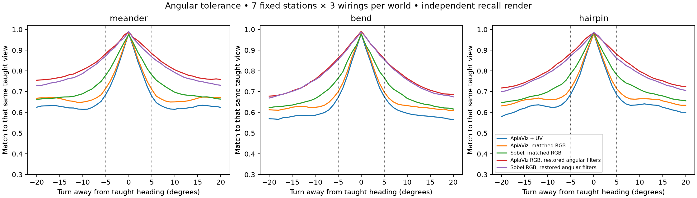
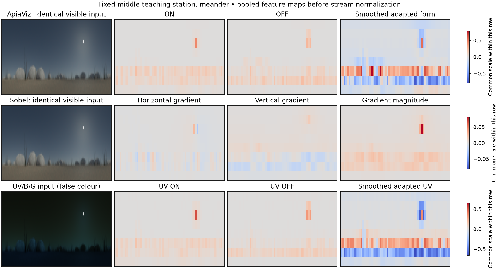
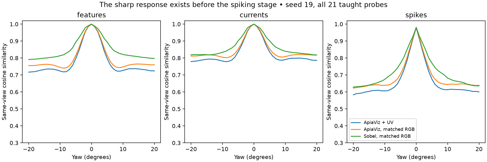
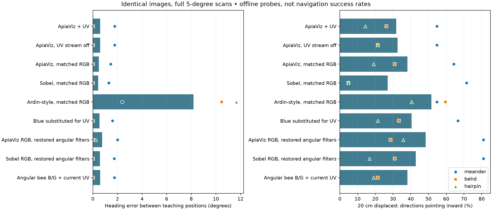

# Why the current UV ApiaViz is struggling

1 October 2026. Matched visual-response experiments; no new navigation trials.

**The UV integration failed to preserve an earlier improvement: filters whose
size stays fixed in visual degrees.** It substituted the original pixel-sized
filters at the finer retinal resolution. Controlled image tests now show that
this makes the familiarity response much narrower and less tolerant of movement.
The current UV stream further sharpens that response. A controller sampling
headings ten degrees apart can therefore miss useful matches, and an animal
slightly beside the route can lose its correct-place match.

There is a second, separate problem: **matching the taught direction is not the
same as steering back to the taught path.** UV sometimes improves the former
while worsening the latter. The current memory/readout treats the extra UV code
as more view-matching evidence; it does not independently interpret UV as a
compass or infer the route's lateral position. These experiments identify
measurable mechanisms, rather than establish a complete-route repair.

## What was lost between the working system and UV

The [earlier navigation protocol](../navigation-experiments/protocol.json) and
[cancelled continuous-navigation protocol](../route-continuous-full/archive/protocol.json)
both specify `linear_colour: angles` and `sobel_colour: angles`.
`regime_experiments.py` and `route_full.py` load that choice through
`grassland_resolution.load_model`, selecting `AngularEncoder`.
The UV factory instead constructs `ApiaVizUVEncoder` and `RefinementEncoder`,
both using the original pixel kernels. It does not carry forward the angular
mode. This was a substantive integration omission that the earlier audits missed.

At 199 × 51 input, the pixel kernels cover about 2.7 times less horizontal angle
and 2.9 times less vertical angle than at the original 74 × 18 input. Angular
filtering preserves the earlier footprint, including sampling, adaptation and
contrast stages. It is an existing numerical approximation, not a new fitted
biological model. Sobel's filtering convention also changed in the UV trials.

Other changes accompanied UV: new scene generation and spectral rendering,
different blue/green spectral sensitivities, and different controller revisions.
Thus the old versus current arrival rates cannot isolate UV. The current
UV-stream-off model still receives bee blue/green responses, rather than the
earlier RGB camera's green/blue bands.

The historical successful aligned-route result is real: the
[pre-UV experiments](../navigation-experiments/INTERPRETATION.md) report all 27
aligned/heading-offset trials succeeding for each method with exhaustive scanning.
Those same experiments also documented poor displacement recovery and a later
active-controller regression, including ApiaViz arrivals falling from 14/27 to
3/27 in the matched controller comparison. The new UV work inherited a control
problem as well as introducing the filter-scale omission.

## The controls

We fixed seven evenly spaced teaching-station indices in each of three worlds.
At each station we used its taught position, the midpoint to its next station,
and both 20 cm lateral offsets: **84 positions**, all verified outside rocks.
Every model received the same corresponding images, with independent teaching
and recall Monte Carlo seeds, and wiring seeds 19, 31 and 43.

The initial 12 conditions isolate RGB versus bee blue/green, UV addition/removal,
blue substituted for UV, 8k versus production 10k baselines, and a common image
reduction. Five separate follow-up conditions restore the previously used
angular implementation. Three subsequent UV component removals test the measured
feature imbalance. This gives **5,040 pose–seed–condition records**, plus the
separate processing-stage diagnostic. These are correlated image probes, not
5,040 trials or independent environments.

The clean frontend comparison gives ApiaViz, Sobel and Ardin-style exactly the
same RGB images, 8,000 cells, projection matrices and spike timing. Production
10,000-cell Sobel and Ardin controls remain available separately. UV additions
retain 8,000 visible cells and add 2,000 UV cells, so UV on/off is not a
fixed-total-resource comparison. Every condition learns its own memory from
the same teaching poses. Neither Sobel nor Ardin receives UV.

Heading retrieval uses a full-circle 5° grid anchored to each world's initial
heading, and both interleaved 10° grids. Dense ±20° sweeps around the taught
heading measure angular tolerance only; their route labels do not enter heading
selection. Inward steering means a hypothetical 10 cm step reduces distance to
the route. These projections are not executed movements or collision-checked
paths, and a tiny reduction is not successful recovery.

## 1. The missed heading peak is a general sensitivity problem

A familiarity peak is the heading at which the current image best matches a
taught image. At the previously inspected 45° bend, the controller tested 40°
and 50° and missed the much stronger match between them. The new fixed-position
matrix shows this is not just one selected bend.

| Condition | Mean taught-position heading error, 10° scan | Same test, 5° scan | Mean match lost after a ±5° turn |
|---|---:|---:|---:|
| Current ApiaViz + UV | 10.20° | 0.24° | 0.299 |
| ApiaViz, bee B/G, UV stream off | 7.98° | 0.24° | 0.281 |
| ApiaViz on matched RGB | 5.29° | 0.24° | 0.271 |
| Sobel on matched RGB, 8k | 7.82° | 0.24° | 0.202 |
| Restored angular ApiaViz on RGB | 1.76° | 0.24° | 0.112 |
| Restored angular ApiaViz on bee B/G + unchanged UV stream | 1.76° | 0.24° | 0.161 |
| Restored angular Sobel on RGB | 1.80° | 0.35° | 0.124 |

Each row includes 21 positions × three wirings. The match starts near 0.98–0.99
at the exact taught heading. The 5° loss averages left and right turns against
that same stored view, rather than changing which teaching view is retrieved.
Lower angular sensitivity makes coarse sampling more reliable, but may also
make different places less distinct; broader is not automatically better.

The angular ApiaViz + UV condition changes only its visible spatial filtering;
the bee receptor values, visible wiring, UV code, memory rule and query images
are retained. This is direct evidence that the omitted implementation matters.
It is still an offline comparison, not a measured increase in arrivals.



Moving between teaching positions also affects current ApiaViz more strongly.
At the halfway point, its correct-station overlap averages **0.832**, versus
**0.895** for matched Sobel. Restoring angular visible filtering with UV retained
raises it to **0.900**. At 20 cm lateral offsets these values are **0.713**,
**0.798** and **0.801**, respectively. This gives Sobel more tolerant view matches
under the current pipeline; it does not prove that every downstream steering
decision is better.

## 2. Where the sensitivity comes from

The sharpness is already present before random wiring and spikes. With matched
RGB inputs, a 5° turn reduces ApiaViz's form-feature cosine by **0.363**, versus
**0.206** for Sobel. This is a fixed-front-end difference, not evidence of broken
mushroom-body learning. Through the full processing chain, both methods reproduce
independently rendered exact views well: mean final repeat overlaps are **0.981**
for RGB ApiaViz, **0.978** for UV ApiaViz and **0.980** for Sobel, at seed 19.
Rendering variability is much smaller than the measured 5° effect here.

ApiaViz's locally adapted form representation differentiates places strongly
at the exact learned view, but tolerates small image transformations less well.
Sobel applies Gaussian smoothing followed by directional gradients and magnitude.
On this stimulus bank its response changes more gradually. The comparison is a
measured distinction between these implementations; it is not a general claim
that local adaptation or spiking is harmful.



All maps are from the fixed middle meander teaching station. The sun is visibly
present in the input and features. Maps share a colour scale within each row;
their absolute gains differ across rows. These are feature displays, not new
policy inputs. Visible display uses a fixed sRGB transfer; UV false colour shows
the bounded receptor responses directly.



As an implementation identity check, the current UV encoder's visible spike bits
are exactly equal to the existing pixel-filter linear-colour model when both
receive the same bounded bee green/blue bands, on every teaching image in all
three worlds at seed 19. The visible input bands and filter convention changed;
there is no extra channel-order or visible-wiring discrepancy in this check.

## 3. Why UV is not yielding the expected navigation benefit

The UV pathway is active and has directional information. It is also not a
balanced combination of its intended seven feature planes. Across the three
worlds, about **85%** of squared, centered, pooled UV feature energy lies in the
smoothed adapted UV plane, about **8.5%** in UV ON/OFF, and only about **6%** in
the four UV/B and UV/G opponent planes. Stream normalization does not separately
balance those planes. These are input-energy fractions, not causal contribution
or information fractions.

The separate component removals below establish why simply deleting the dominant
plane is not an adequate repair. All retain the same 10,000 cells and wiring,
rebuild the teaching memory, and change only which UV feature planes survive.

| UV processing, existing visible filters | Off-route heading error | Inward projections / 126 |
|---|---:|---:|
| Current seven-plane UV stream | 17.79° | 40 |
| UV spatial planes only; remove opponents | 13.71° | 42 |
| UV opponent planes only; remove spatial planes | 20.73° | 49 |
| Remove only smoothed UV plane | 14.41° | 38 |

Removing only the dominant plane does not improve inward steering. Keeping only
opponents produces more inward choices but poorer tangent alignment. No removal
provides a uniformly better representation. These are follow-up diagnostics
motivated by the measured imbalance, not variants selected for deployment.
The complete [removal results](uv-components.json) retain each world and phase
of the angular grid; zeroing planes also changes stream normalization and
competition, which limits a purely per-plane causal interpretation.

Most importantly, useful UV heading information can conflict with route recovery:

| Restored visible angular filtering | Off-route heading error | Inward projections / 126 |
|---|---:|---:|
| ApiaViz bee B/G, no UV stream | 10.86° | 62 |
| Same model + current UV stream | **9.27°** | **48** |

Adding UV improves tangent error on 26 matched probes, worsens three, and leaves
97 unchanged. Nevertheless, the projected next position gets closer to the route
in only eight changed cases and farther in 20; mean route distance increases by
3.06 mm relative to the no-UV choice. The inward counts by world are 30→31 for
meander, 15→9 for bend, and 17→8 for hairpin, each out of 42 paired probes.

An ant 20 cm to the side can accurately face along the path and stay 20 cm to
the side. A better compass-like heading cue does not necessarily tell it which
way to turn to rejoin the path. This operational distinction explains why
better directional fidelity has not automatically improved arrival rates.
These trials use UV intensity/opponency, not polarized-sky compass processing.

The unmodified current UV/no-UV comparison is largely unchanged: heading error
17.79°/17.64°, inward choices 40/41. Keeping original RGB and adding UV improves
heading error from 20.86° to 16.46° while reducing inward choices from 48 to 41.
Replacing UV with blue yields 18.35° and 51 inward choices. Thus these scenes do
not show a reliable incremental recovery advantage for the UV spectrum under
the current encoder/readout. This is not evidence that UV cannot help a different
processing or navigation mechanism.



Ardin remains substantially worse at exact directional retrieval here: its
matched 8k model has 11.97° taught-position error against 0.24° for ApiaViz/Sobel
on the 5° grid. Its 65/126 inward choices do not establish effective recovery;
large inaccurate turns can also point inward by chance. Likewise, the current
Sobel model's 34/126 inward count shows that its higher recorded arrival rate
is not evidence of a general restoring mechanism.

## Concrete repair priorities and limits

1. Restore and explicitly version the earlier angular-filter convention in the
   trial path, with matched Sobel controls. Retaining current UV while restoring
   the visible branch already repairs much of the measured view tolerance.
2. Validate heading sampling against those response widths, including scan-grid
   phase and paid observation/rotation costs. The 5° diagnostic is not a free
   improvement to the existing controller's budget.
3. Separate evidence for orientation from evidence for translational recovery.
   Evaluate UV integration on both, including how view matches change during
   commanded motion. Increasing UV weight or deleting one plane is not supported
   as a complete repair by these controls.

The most recent complete-route comparison remains 1/6 UV ApiaViz, 3/6 Sobel and
2/6 Ardin. These new experiments explain a lost implementation feature and
measure the associated sensory effects; they do not assign a causal percentage
of those six-route failures or establish restored navigation superiority.
The previous zero-contact hairpin failures and frontal-flow blind spot remain
separate controller/avoidance issues. Trial defaults and frozen historical
records are unchanged. No cancelled/paused/full study was resumed.

## Verification and reproduction

All 84 raw-frame hashes and cache contracts pass. Angular and component controls
use exactly the same raw inputs and teaching-bank hashes as the main controls.
All 84 positions pass the existing 5 mm body/mesh check. All encoder fingerprints
remain unchanged within each control. Component-removal checks preserve visible
spike bits for every teaching view and all three seeds. The standard suite passes
**184 tests**, including new checks for probe balance, interleaved-grid peak
aliasing, and distinguishing tangent alignment from inward movement.

[Compact results and audit](results.json) include every world, both 10° grid
phases, paired changes, per-plane energies, cell activity, stage diagnostics and
input hashes. The large per-heading matrices and raw arrays remain under
`apiaviz/output/visual-response-controls-v1/`, with separate angular, stage and
component output directories. All jobs finished normally.

Use fresh output paths to reproduce:

```sh
pixi run python scripts/visual_response_controls.py --output apiaviz/output/visual-response-controls-FRESH
pixi run python scripts/visual_angular_controls.py --source apiaviz/output/visual-response-controls-FRESH --output apiaviz/output/visual-angular-controls-FRESH
pixi run python scripts/visual_response_stages.py --source apiaviz/output/visual-response-controls-FRESH --output apiaviz/output/visual-response-stages-FRESH
pixi run python scripts/visual_uv_component_controls.py --source apiaviz/output/visual-response-controls-FRESH --output apiaviz/output/visual-uv-component-controls-FRESH
pixi run python scripts/summarize_visual_response_controls.py --source apiaviz/output/visual-response-controls-FRESH --angular apiaviz/output/visual-angular-controls-FRESH --stages apiaviz/output/visual-response-stages-FRESH --output apiaviz/output/visual-response-report-FRESH
pixi run python scripts/summarize_uv_component_controls.py --source apiaviz/output/visual-response-controls-FRESH --components apiaviz/output/visual-uv-component-controls-FRESH --output apiaviz/output/visual-response-report-FRESH/uv-components.json
pixi run test
```

The first job renders missing probes in isolated caches and uses three ordinary
worker processes, two Torch threads each. Later controls read verified caches
without launching renderers. Three previously inspected worlds and three seeds
support this development diagnosis, not population-level significance or an
independent test of superiority. Smaller images, RGB+UV hybrids, stream-only
readouts and component removals are explicitly separate controls.

## Biological interpretation and the user's navigation objective

Follow-up on 1 October: the user clarified that precise retracing is not the
objective. Useful direction and reaching the destination matter; lateral error
is a diagnostic, not an automatic failure. The inward-projection counts above
must therefore not be treated as success rates or used alone to choose a model.
Both recent UV hairpin paths passed within 23.34 cm of the nest, outside the
existing 20 cm arrival radius, then departed. Persistent offset can explain
these particular misses, but it does not establish that the radius is biologically
appropriate or explain every failed trial. Arrival, closest approach, useful
progress and terminal searching should be reported separately. No evaluator
threshold has been changed by this clarification.

The angular-filter correction has a biologically defensible principle: a visual
receptive field covers an angle in the external world. Changing an image raster
should not silently change the eye/circuit being modelled. Intracellular
[honeybee measurements](https://pmc.ncbi.nlm.nih.gov/articles/PMC5382694/) characterize
photoreceptor receptive fields in degrees, with differences across the eye.
Those measurements are primarily green-sensitive receptors. They do not validate
our entire spatial filter stack, set its UV receptive-field widths, or establish
the right parameters for a particular ant species. Our restored angular kernels
preserve an earlier engineering model; empirical calibration remains separate.

The UV front end is already graded in the computational sense. It maps radiance
through a fixed saturating response, averages neighbouring samples, constructs
continuous contrast and colour-opponent maps, and feeds continuous currents to
the spiking KC model. The final memory discards amplitudes/timings and compares
which cells fired. Graded floating-point calculations are not themselves a
physiological membrane-potential model: the current front end has no persistent
photoreceptor adaptation state or receptor-specific temporal integration.

[Bumblebee intracellular recordings](https://journals.plos.org/plosone/article?id=10.1371/journal.pone.0025989)
show continuous receptor voltage responses, changes with light adaptation, and
different response speeds for green, blue and UV receptor classes. This supports
testing graded dynamics before the KC stage, with parameters tied to a declared
species and lighting condition. It does not imply that the complete insect
visual pathway should be nonspiking.

There is direct evidence for UV helping ant orientation: blocking UV impaired
panorama-based orientation in *Melophorus bagoti* in
[Schultheiss et al. (2016)](https://doi.org/10.1016/j.anbehav.2016.02.027).
That experiment supports a useful UV signal but does not identify all intervening
neurons or validate our seven-plane implementation. In honeybees,
[Mota et al. (2024)](https://journals.plos.org/plosone/article?id=10.1371/journal.pone.0310282)
recorded combined spectral, spatial and temporal response properties in the
anterior optic tract, including UV excitation opposed by blue/green. These are
recordings from a particular higher visual pathway, not a direct specification
of mushroom-body input circuitry. Species and pathway differences must remain
explicit when transferring those constraints.

One additional code check clarifies the 85% feature-energy finding: the UV
smoothed-plane kernel is normalized to unit L2 norm, and its weights sum to
**3.48057**, rather than one. This amplifies a spatially constant signal at
that filter's input by that factor. The input is locally adapted UV contrast,
so this is not a claim that uniform incident illumination survives adaptation.
The opponent planes use direct differences on a different computational scale.
Consequently, squared feature energy reflects arbitrary relative gains as well
as scene structure. It is neither photon energy nor the fraction of biological
information carried by a channel. The removal controls already show that deleting
this plane alone does not solve the behavioural problem.

A physiologically constrained follow-up should first validate angular footprint,
graded intensity-response curves, background/temporal adaptation and opponent
responses using controlled stimuli independent of navigation outcomes. Then
compare graded-current and binary-spike readouts on identical adapted inputs,
retaining shared teaching, wiring and budgets where applicable. Finally test
UV benefits under changed illumination as well as lateral displacement: the
existing fixed-illumination probes do not test illumination robustness.
[Differt and Möller (2015)](https://pubmed.ncbi.nlm.nih.gov/26113191/) found local
sky/ground separation methods more effective than global ones in day-long
UV/green scene measurements, with only marginal gains from UV/green over UV-only
for global separation. This supports testing the processing operation and
illumination conditions rather than assuming that an extra spectral channel
must improve every task. These are proposed controls, not completed new trials.
